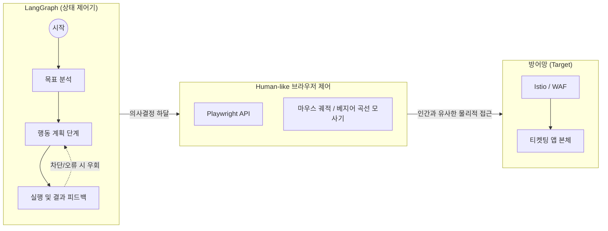

# 공격 에이전트

방어 시스템을 검증하기 위해 자체 AI 공격 에이전트(Red Team)를 구축했습니다. 단순 API 부하 도구가 아니라 실제 브라우저를 제어해 사람처럼 행동하는 지능형 봇입니다.

---

## 아키텍처

---

## 핵심 모듈

| 핵심 모듈 | 적용 기술 | 목적 및 효과 |
|---|---|---|
| **자율형 워크플로우** | LangGraph | 단순 매크로처럼 순서를 외우는 것이 아니라, 막히거나 캡챠가 뜨면 스스로 상황을 파악해 우회/재시도 경로를 결정 |
| **행동 모사 (Humanizer)** | Playwright + 궤적 수학 모델 | 기계적 클릭(순간 이동 좌표) 대신, 사람과 동일한 마우스 포물선 궤적, 미세한 떨림, 타이핑 지연(Dwell Time)을 수학적으로 모사 |
| **적대적 자가 검증** | Red vs Blue 구조 | AI 공격망이 끊임없이 진화하며 방어망을 테스트하는 자가 침투 테스트 체계 |

---

## 왜 지능형 공격 에이전트가 필요한가

기존 JMeter 같은 부하 도구로 초당 수만 번 API를 호출하는 단순 봇은 WAF에서 차단됩니다. 진짜 위협은 **사람의 행동을 정교하게 흉내 내는 지능형 봇**입니다.

이 공격 에이전트를 막기 위해서는 IP 차단이나 정적 룰셋이 아닌, **행동 패턴 기반의 실시간 분석과 AI 사후 학습**이 반드시 필요합니다.
