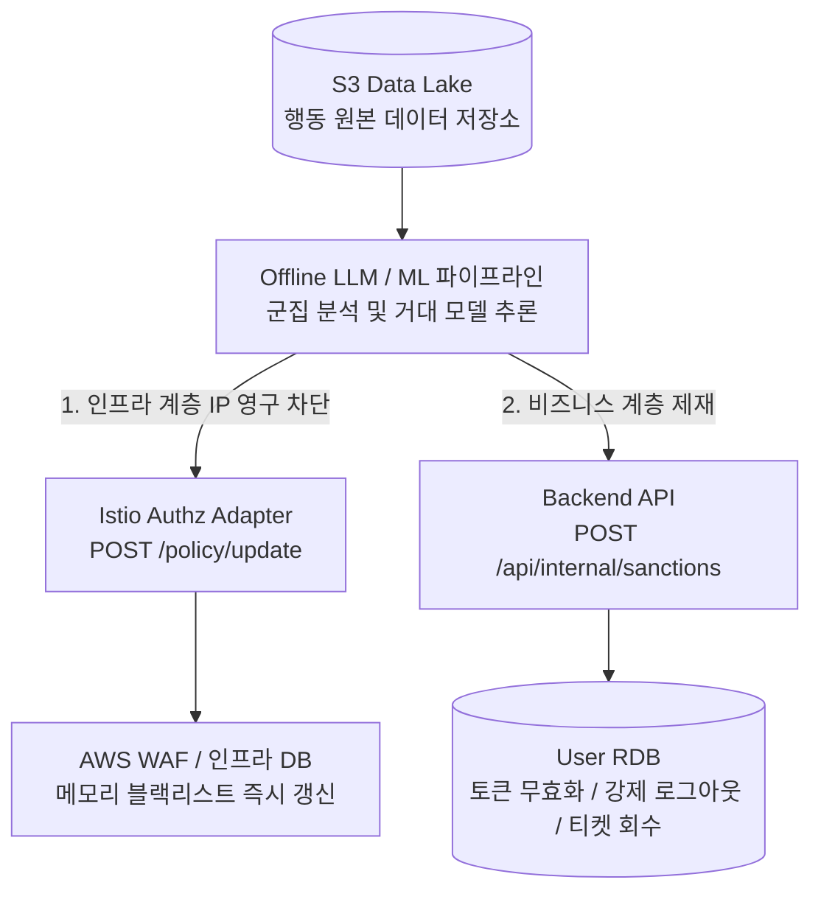

# Control Plane

실시간 방어망을 통과한 신종 봇들은 결국 S3 Data Lake에 방대한 행동 데이터를 남깁니다. 오프라인 AI 파이프라인이 이 데이터를 분석해 새로운 봇 패턴을 탐지하고, 탐지 결과를 인프라 계층과 비즈니스 계층에 자동으로 하달합니다.

---

## 비동기 사후 제어 흐름

---

## 제어 정책

| 제어 정책 | 타겟 | 작용 방식 | 목적 |
|---|---|---|---|
| **인프라 락 (Lock)** | Istio Adapter & WAF | API 통신으로 IP 블랙리스트 즉시 캐싱 갱신 | 반복 공격을 첫 번째 관문에서 최소 비용으로 영구 차단 |
| **비즈니스 락 (Lock)** | Backend API (Spring Boot) | 봇 판정 세션 ID 전송 (멱등성 보장 API) | 이미 티켓을 점유한 악성 유저의 세션 종료 및 재고 회수 |

---

## 관심사 분리 원칙

AI 시스템은 **판별만 담당**합니다. 실제 제재 집행은 각 도메인 시스템이 주도합니다.

- **인프라 계층** (Istio/WAF): IP 레벨 차단, 네트워크 접근 제한
- **비즈니스 계층** (Backend API): 사용자 계정 세션 종료, 보유 티켓 회수

이를 통해 AI 방어 시스템이 인프라나 백엔드 코드에 직접 침투하지 않으면서도, 전체 시스템에 걸쳐 일관된 제재를 적용할 수 있습니다.
