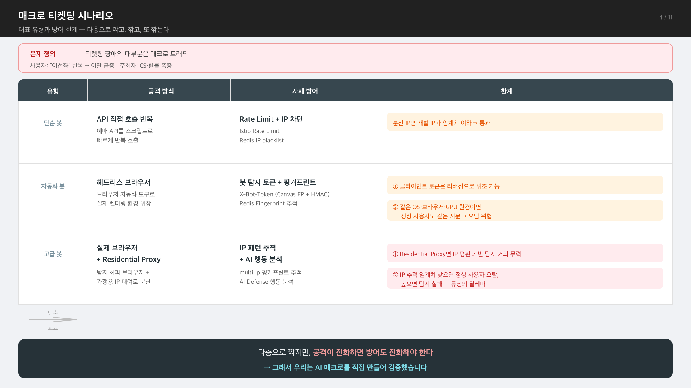

# 4장 — 매크로 티켓팅 시나리오: 대표 유형과 방어 한계

> **전달 메시지**
> "매크로는 한 가지가 아닙니다. 유형마다 방어했지만, 각각 한계가 있습니다.
> **다층으로 깎고, 깎고, 또 깎아도 — 공격이 진화하면 방어도 진화해야 합니다.**"

---

## 슬라이드 시각화 초안

> **단순 참고용입니다** — 디자인은 자유롭게 작업해주세요. 내용이 많다면 슬라이드를 더 쪼개주셔도 됩니다.
> 편집용 원본: [final_04.svg](../images/final_04.svg)

---

## 슬라이드에 담을 내용

### ① 문제 정의 (2줄)

- 티켓팅 플랫폼 장애의 대부분은 매크로 트래픽
- 사용자 피해: "이선좌" 반복 → 이탈 급증 / 주최자 피해: CS·환불 폭증

### ② 대표 매크로 3유형 + 자체 방어 + 한계

| 공격 방식 | 자체 방어 | 한계 |
|---------|---------|------|
| API 직접 호출 반복 | Rate Limit + IP 차단 | 분산 IP면 임계치 이하로 통과 |
| 헤드리스 브라우저 자동화 | 봇 탐지 토큰 + 핑거프린트 | 토큰은 리버싱으로 위조 가능 · 같은 환경이면 정상 사용자도 같은 지문 → 오탐 위험 |
| 실제 브라우저 + Residential Proxy | IP 패턴 추적 + AI 행동 분석 | Residential Proxy면 IP 평판 무력 · IP 추적 임계치가 낮으면 정상 사용자 오탐, 높으면 탐지 실패 |

핵심 메시지: **"공격이 다양하니 방어도 다계층 — 하지만 각 계층마다 한계가 존재한다"**

### ③ 다음 장 전환 브릿지

> "다층으로 깎지만, 공격이 진화하면 방어도 진화해야 한다
> — 그래서 우리는 **AI 매크로를 직접 만들어** 검증했습니다."

→ 5장(AI 매크로 공격 — 공격자가 되어본다)으로 연결

---

## 참고 문서
- 원본: 보안팀 매크로 유형 분석 자료 (T0/T2/T3 매트릭스 + AWS WAF 보완안)
