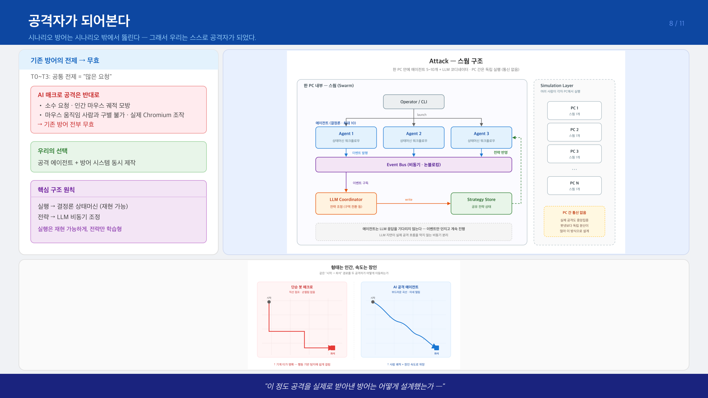
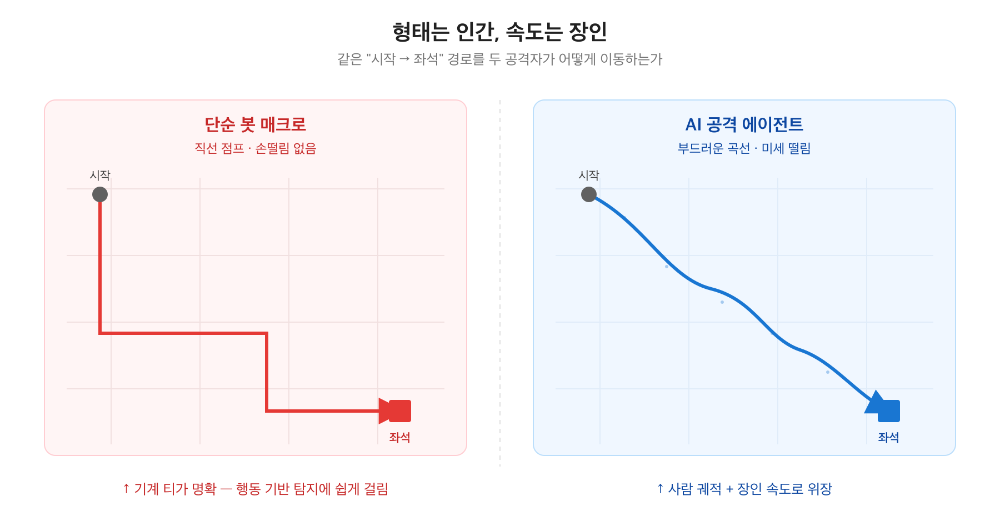
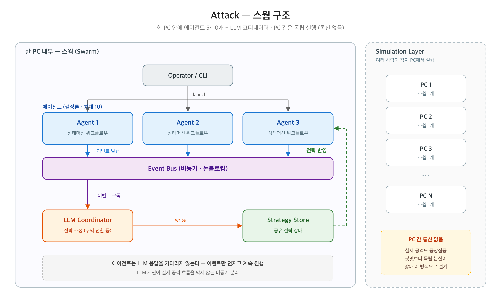

# 8장 — 공격자가 되어본다

> **전달 메시지**
> "기존 보안은 '봇은 많이, 빠르게 움직인다'는 전제로 설계됐습니다.
> 우리가 만든 AI 매크로는 정반대입니다. 그래서 우리는 **직접 공격 도구를 만들어** 검증했습니다."

---

## 슬라이드 시각화 초안

> **단순 참고용입니다** — 디자인은 자유롭게 작업해주세요. 내용이 많다면 슬라이드를 더 쪼개주셔도 됩니다.
> 편집용 원본: [final_08.svg](../images/final_08.svg)

---

## 슬라이드에 담을 내용

### ① 기존 방어의 맹점

기존 보안(Rate Limit, IP 평판, Fingerprint)은 공통 전제를 가집니다:
**"봇은 빠르고, 많이 클릭하고, 기계적으로 움직인다."**

AI 매크로 공격은 반대입니다:
- 요청 수가 적고, 마우스 움직임과 클릭 패턴이 사람과 구별되지 않습니다
- Playwright로 실제 Chromium 브라우저를 조작 — HTTP 직접 호출이 아니라 실제 DOM 이벤트가 발생
- → 기존 방어 시그널이 전부 무효

### ② 우리의 선택: 공격과 방어를 동시에 만든다

| 구성 | 역할 | 스택 |
|------|------|------|
| AI 공격 에이전트 | 티켓팅 숙련자 모방 자동 예매 | LangGraph + Playwright |
| AI Defense | 실시간 탐지 + LLM 사후 판단 + 방어 정책 개선 | FastAPI + Redis + ClickHouse |

### ③ 공격 에이전트: 형태는 인간, 속도는 장인

에이전트는 실제 사용자 조작과 유사한 마우스 궤적을 합성합니다 (베지어 곡선 + 미세 변동 주입).
VQA(보안 퀴즈)는 LLM·비전 모델 없이 **결정론 규칙**으로 풀이합니다 — DOM 요소 좌표를 직접 읽어 거리·타이밍 윈도우를 맞춰 드래그합니다. (LLM 추론이 끼어들면 수십 ms 타이밍 윈도우를 놓칩니다.)

### ④ 스웜 구조: 에이전트 N개 독립 실행 + LLM 코디네이터

각 에이전트는 독립적인 상태머신(FlowState)으로 예매 1회를 수행합니다.
에이전트들의 이벤트(좌석 확보, 차단, VQA 결과)는 Event Bus를 통해 LLM 코디네이터로 전달되고,
코디네이터는 스웜 전체의 구역 전략을 비동기로 조정합니다.

- **실행** → 결정론 상태머신 (재현 가능)
- **전략** → LLM 비동기 조정

### ⑤ 다음 장 전환

> "이 공격을 실제로 받아낸 방어 시스템은 어떻게 설계했는가 —"

---

## 참고 문서
- [03_ATTACK_AGENT.md](../03_ATTACK_AGENT.md) — 스웜 구조, 비동기 분리
- [02_ATTACKER_SCENARIO.md](../02_ATTACKER_SCENARIO.md) — 공격 시나리오
- 기술 상세: [/ai/reference/attack/](../../reference/attack/)
