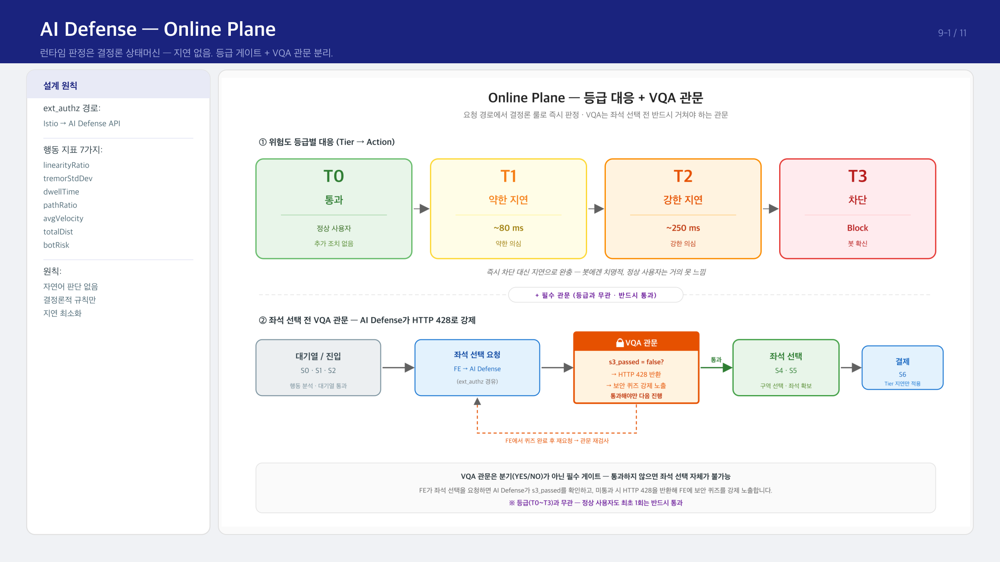
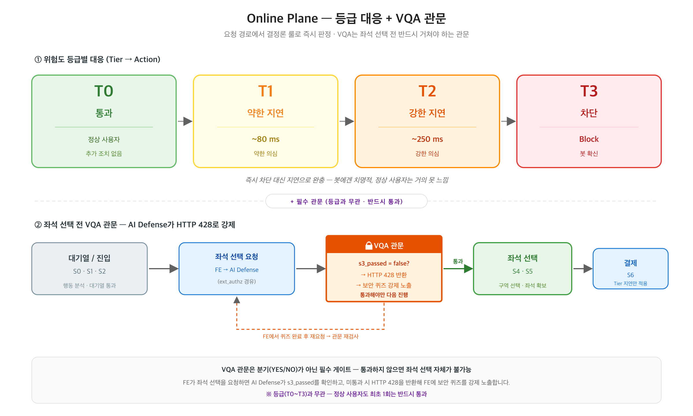

# 9-1장 — AI 방어: 실시간 탐지 (Online Plane)

> **전달 메시지**
> "요청이 들어오는 순간 결정론 룰 엔진이 판별합니다.
> 실행은 빠르게, 판단(LLM)은 사후에."

---

## 슬라이드 시각화 초안

> **단순 참고용입니다** — 디자인은 자유롭게 작업해주세요. 내용이 많다면 슬라이드를 더 쪼개주셔도 됩니다.
> 편집용 원본: [final_09-1.svg](../images/final_09-1.svg)

---

## 슬라이드에 담을 내용

### ① ext_authz 경로

Istio가 중요 API 호출(대기열 진입, 좌석 선택 진입)을 AI Defense API로 포워딩합니다.
AI Defense는 요청마다 행동 지표 7가지를 계산해 위험 점수를 산출하고, 결과를 즉시 반환합니다.

포워딩 대상:
- `/ai/precheck` — 대기열 진입 시점
- `/ai/evaluate` — 좌석 선택 진입 시점

### ② 5가지 마우스 행동 feature (+ 외부 검증 점수)

클라이언트에서 수집한 마우스 telemetry로 5가지 feature를 계산해 위험 점수를 산출합니다.

- 손떨림 표준편차 (`tremorStdDev`) — 봇은 미세 떨림이 없어 기준선에 정확히 맞음
- 마우스 직선도 (`linearityRatio`) — 1에 가까울수록 시작점↔끝점 직선 = 기계적
- 평균 속도 (`avgVelocity`) — 사람 범위(50~1500 px/s) 밖은 비정상
- 머뭇거림 시간 (`dwellTime`) — 사람은 클릭 전 hesitation이 있고, 봇은 거의 0
- 경로 비율 (`pathRatio`) — 총 이동거리 / 직선거리 비율

선택 입력으로 **외부 인간 검증 점수**(Turnstile 등)를 가산할 수 있습니다. 없으면 fail-open 처리.

### ③ T0~T3 등급별 대응

| 등급 | 의미 | 조치 |
|------|------|------|
| T0 | 정상 | 통과 |
| T1 | 약한 의심 | 응답 ~80ms 지연 |
| T2 | 강한 의심 | 응답 ~250ms 지연 |
| T3 | 봇 확신 | 차단 (Block) |

즉시 차단 대신 지연으로 완충하는 이유: 봇에게 ~250ms는 치명적이지만, 정상 사용자는 거의 못 느낍니다. 오탐(정상 사용자 차단)을 줄이는 핵심 설계입니다.

### ④ 보안 퀴즈 관문 (독립 게이트)

대기열을 통과한 후, **좌석 선택 단계로 넘어가기 전**에 보안 퀴즈를 통과해야 합니다.
T0~T3 등급과 무관하게 적용되는 별도 관문입니다.
통과하지 못하면 HTTP 428을 반환해 퀴즈 화면을 강제로 노출합니다.

### ⑤ 실행과 판단의 분리

LLM을 런타임에 두면 추론 시간만큼 모든 요청이 지연됩니다.
티켓팅처럼 동시 요청이 폭증하는 상황에서 이는 정상 사용자에게도 영향을 줍니다.
그래서 **실행(런타임)은 결정론 상태머신으로 빠르게**, **판단(LLM)은 오프라인에서 정확하게** — 역할을 분리했습니다.

---

## 참고 문서
- [04_DEFENSE.md](../04_DEFENSE.md) — §4.4 런타임 4단 파이프라인
- 기술 상세: [/ai/reference/defense/](../../reference/defense/) — 03-runtime-pipeline, 04-risk-scoring, 05-tier-action, 07-vqa-gate
