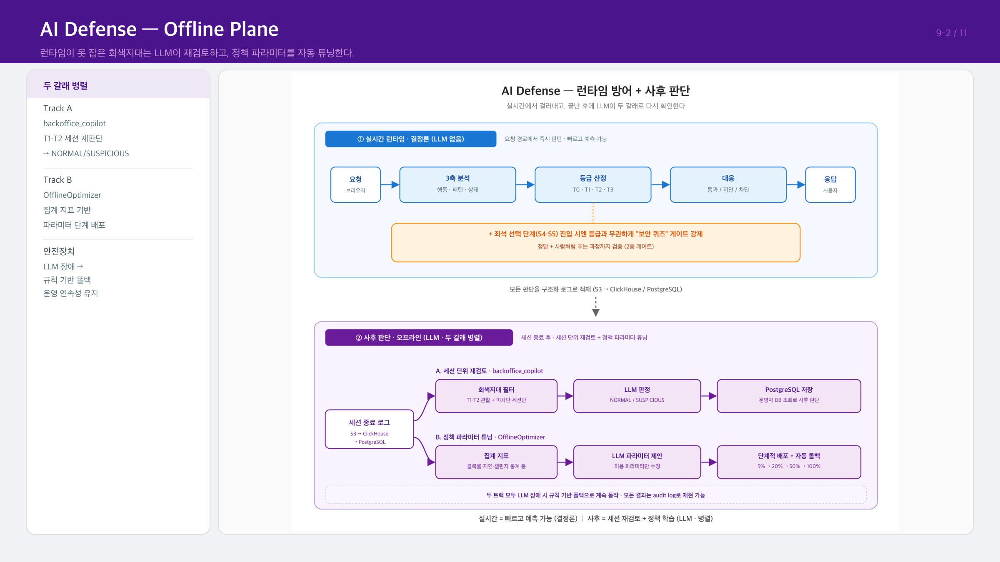
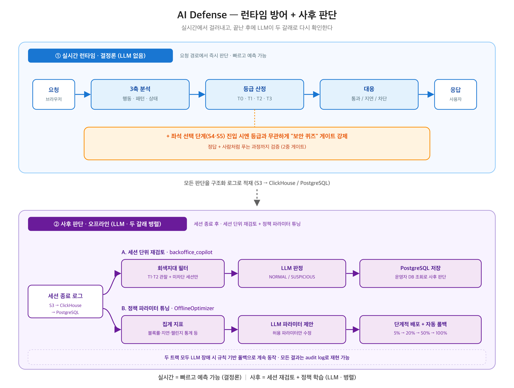

# 9-2장 — AI 방어: 사후 판단 (Offline)

> **전달 메시지**
> "실시간으로 못 잡은 회색지대 세션은 나중에 LLM이 다시 봅니다.
> 그리고 탐지 기준 자체를 자동으로 개선합니다."

---

## 슬라이드 시각화 초안

> **단순 참고용입니다** — 디자인은 자유롭게 작업해주세요. 내용이 많다면 슬라이드를 더 쪼개주셔도 됩니다.
> 편집용 원본: [final_09-2.svg](../images/final_09-2.svg)

---

## 슬라이드에 담을 내용

### ① 왜 사후 판단이 필요한가

실시간 탐지(Online)는 규칙 기반이라 빠릅니다. 하지만 T1·T2처럼 애매하게 통과한 세션 —
차단하기엔 증거가 부족하고, 정상으로 보기엔 찜찜한 — 은 그냥 넘어갑니다.
이 회색지대를 사후에 LLM이 재검토합니다.

### ② 감사 로그 파이프라인

모든 세션의 행동 기록은 실시간으로 저장됩니다.
`S3 → ETL → ClickHouse / PostgreSQL` 구조로 쌓이며, 두 갈래 오프라인 트랙이 이 데이터를 사용합니다.

### ③ Track A — backoffice_copilot: 세션 단위 재검토

T1·T2이면서 차단되지 않은 세션을 필터링해 LLM이 다시 판단합니다.

- 입력: 세션 전체 행동 로그 (클릭 패턴, 이동 궤적, 타이밍 등)
- LLM 판단: `NORMAL` (정상) 또는 `SUSPICIOUS` (의심)
- 결과: PostgreSQL에 저장 → **운영자가 DB를 확인해 사후 조치 판단**
  (※ 현재 백오피스 자동 연동은 미구현 — PostgreSQL 수동 조회 기반)

실시간으로 판단하기 어려웠던 미묘한 패턴도, 세션 전체 맥락을 보면 LLM이 잡아낼 수 있습니다.

### ④ Track B — OfflineOptimizer: 탐지 기준 자동 튜닝

탐지 파라미터(임계값 등)를 사람이 수동으로 조정하는 대신,
누적된 공격·탐지 데이터를 보고 LLM이 개선안을 제안합니다.

- 새 파라미터를 바로 전체에 적용하지 않고 **5% → 20% → 50% → 100%** 순서로 단계 배포
- 탐지 성능이 나빠지면 자동 롤백
- 공격 패턴이 진화해도 방어 기준이 자동으로 따라갑니다

### ⑤ 안전장치

두 트랙 모두 LLM 장애 시 규칙 기반 폴백으로 자동 전환되어 운영이 중단되지 않습니다.
모든 판단과 정책 변경 이력은 audit log로 보존됩니다.

---

## 참고 문서
- [04_DEFENSE.md](../04_DEFENSE.md) — §4.9 오프라인 최적화, §4.10 사후 검토 (backoffice_copilot)
- 기술 상세: [/ai/reference/defense/](../../reference/defense/) — 09-offline-optimizer, 10-post-review, 11-observability
