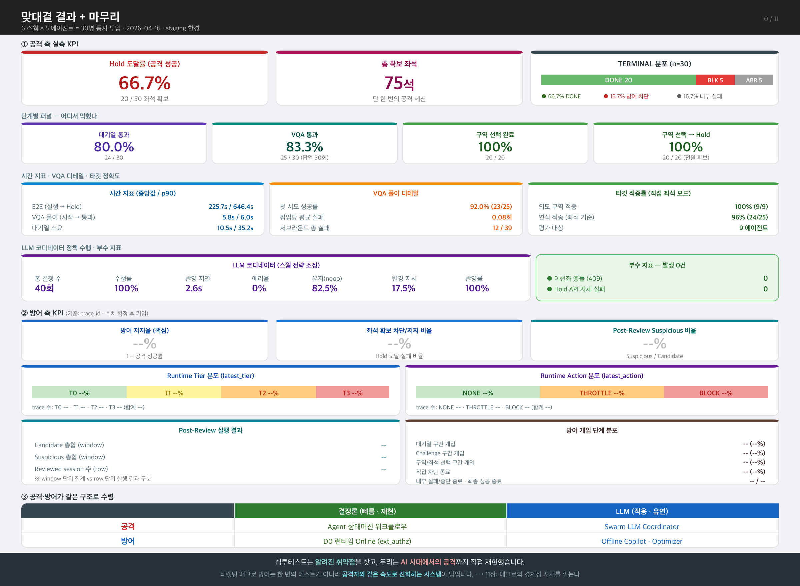

# 10장 — 맞대결 결과 + 마무리

> **전달 메시지**
> "침투테스트는 알려진 패턴을 검증하고,
> 우리는 **기존 방어의 전제 자체를 뒤집는 AI 에이전트 공격**을 직접 만들어 맞대결했습니다."

---

## 슬라이드 시각화 초안

> **단순 참고용입니다** — 디자인은 자유롭게 작업해주세요. 내용이 많다면 슬라이드를 더 쪼개주셔도 됩니다.
> 편집용 원본: [final_10.svg](../images/final_10.svg)

---

## 슬라이드에 담을 내용

### ① 실측 KPI

#### 공격 측 (확정)

> 테스트 환경: 6 스웜 × 5 에이전트 = **총 30명** 동시 투입 (2026-04-16)

| 지표 | 값 | 의미 |
|------|-----|------|
| **Hold 도달률** | **66.7%** (20/30) | 30명 중 20명이 좌석 확보 성공 |
| **총 확보 좌석** | **75석** | 단 한 번의 공격 세션에서 점유 |
| 대기열 통과율 | 80.0% (24/30) | 대기열 단계에서 6명 이탈 |
| VQA 통과율 | 83.3% (25/30) | 보안 퀴즈에서 5명 차단 |
| VQA 첫 시도 성공률 | 92.0% (23/25) | 통과한 에이전트 중 대부분 한 번에 성공 |

**단계별 이탈 분포 (TERMINAL 사유)**

| 결과 | 건수 | 비율 |
|------|------|------|
| **DONE** (좌석 확보 성공) | 20 | **66.7%** |
| **BLOCKED** (방어에 의한 차단) | 5 | 16.7% |
| **ABORT** (내부 실패·타임아웃) | 5 | 16.7% |

> 대기열과 VQA 구간에서 이탈 집중. 한 번 구역 선택 단계(S4·S5)에 진입한 에이전트는 전원 Hold 도달.

#### 방어 측

> **기준**: `trace_id` 기준으로 산정 (`session_id`는 재사용 가능성 존재)
> 수치는 팀 집계 완료 후 `--` 자리에 기입 예정.

**핵심 지표**

| 지표 | 값 | 의미 |
|------|-----|------|
| **방어 저지율** | **--%** | 공격 세션이 Hold 도달하지 못한 비율 (= 1 − 공격 성공률) |
| **좌석 확보 차단/저지 비율** | **--%** | 좌석 확보 성공을 막아낸 비율 |
| Post-Review Suspicious 비율 | --% | Candidate 중 LLM이 이상으로 분류한 비율 |

**Runtime Tier 분포** (latest_tier 기준)

| Tier | trace 수 | 비율 |
|------|---------|------|
| T0 | -- | --% |
| T1 | -- | --% |
| T2 | -- | --% |
| T3 | -- | --% |

**Runtime Action 분포** (latest_action 기준)

| Action | trace 수 | 비율 |
|--------|---------|------|
| NONE | -- | --% |
| THROTTLE | -- | --% |
| BLOCK | -- | --% |

**Post-Review 실행 결과**

| 지표 | 값 |
|------|-----|
| Candidate 총합 (window 집계) | -- |
| Suspicious 총합 (window 집계) | -- |
| Reviewed session 수 (row 기준) | -- |
| Suspicious session 수 (row 기준) | -- |

**방어 개입 단계 분포**

| 개입 단계 | 세션 수 | 비율 |
|---------|-------|------|
| 대기열 구간 개입 | -- | --% |
| Challenge 구간 개입 | -- | --% |
| 구역/좌석 선택 구간 개입 | -- | --% |
| 직접 차단 종료 | -- | --% |
| 내부 실패/중단 종료 | -- | --% |
| 최종 성공 종료 | -- | --% |

---

### ② 공격·방어 구조가 같은 원칙으로 수렴했다

8·9장을 거쳐 나온 가장 중요한 발견:
각자 독립적으로 시스템을 설계했는데 **같은 아키텍처 원칙**에 도달했습니다.

|  | 결정론 (빠름 · 재현) | LLM (적응 · 유연) |
|--|---|---|
| **공격** | Agent 상태머신 워크플로우 | Swarm LLM Coordinator |
| **방어** | D0 런타임 Online (ext_authz) | 오프라인 Copilot · OfflineOptimizer |

> LLM을 런타임에 두면 지연이, 아예 빼면 적응력이 없다.
> → 양쪽 모두: **실행은 결정론, 판단만 LLM**으로 분리했다.

---

### ③ 클로징

> 침투테스트는 **알려진 취약점**을 찾고,
> 우리는 **AI 시대에서의 공격**까지 직접 재현했습니다.
>
> 티켓팅 매크로 방어는 보안 테스트 한 번이 아니라,
> **공격자와 같은 속도로 진화하는 시스템**이 답이라고 생각합니다.

### ④ 11장 연결

> "그리고 궁극적으로는 — 매크로의 **경제성 자체를 깎는다**"
> → 11장(추천 분산 설계)으로 패스

---

## 참고 문서
- [06_KPI_트러블슈팅.md](../06_KPI_트러블슈팅.md) — 전체 KPI 상세, 스웜별 분석, 트러블슈팅
