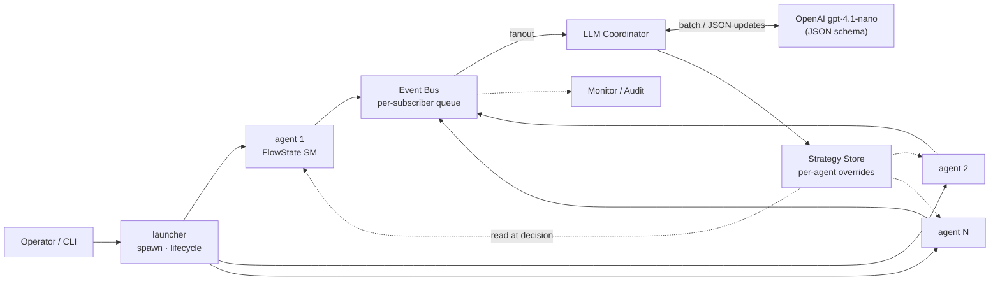

# AI Attack Agent 개발 문서

AI Attack Agent는 티켓팅 예매 시스템(goormgb)에 대한 Playwright 기반 봇 스웜으로, 방어 시스템(AI Defense)의 탐지·차단 강도를 **블랙박스 상태에서 정량 검증**합니다. 실제 Chromium 브라우저를 자동 조작해 로그인 복원부터 좌석 확보까지 전 과정을 반복 실행하고, LLM 코디네이터가 스웜 내 전략을 동적으로 조정합니다.

---

## 서비스 특성

| 항목 | 내용 |
|------|------|
| **유형** | 블랙박스 공격 시뮬레이션 도구 |
| **실행 환경** | 실제 브라우저(Chromium) 자동 조작 |
| **자동화 범위** | 로그인 복원 → 예매 진입 → 대기열 → 보안 검증 → 구역·좌석 선택 → 좌석 확보 |
| **배포 단위** | 1 PC = 1 스웜 = 에이전트 N개 (기본 5~10) |
| **성공 기준** | 좌석 확보(결제 페이지 도달) |
| **검증 목표** | "어느 수준의 공격에 방어가 얼마나 강한지" 측정 |

---

## 구성 범위

### 아키텍처 · 흐름

| 문서 | 내용 |
|------|------|
| [아키텍처](01-architecture.md) | 3계층 아키텍처 (에이전트 / 스웜 / 시뮬레이션) |
| [FlowState 상태머신](02-workflow-states.md) | S0~SX 상태 전이 워크플로우 |
| [오픈 시각 동기화](03-open-at-sync.md) | 오픈 시각 정밀 대기·큐 미개방 대응 |

### 핵심 기술

| 문서 | 내용 |
|------|------|
| [마우스 궤적 합성](04-mouse-trajectory.md) | 6단 파이프라인 |
| [VQA 자동 풀이](05-vqa-solver.md) | 보안 챌린지 자동 통과 |

### 스웜 인프라

| 문서 | 내용 |
|------|------|
| [스웜 인프라](06-swarm-infrastructure.md) | 이벤트 버스 · 공유 전략 저장소 |
| [LLM 코디네이터](07-llm-coordinator.md) | 스웜 레벨 전략 조정 |

### 감사 · 평가

| 문서 | 내용 |
|------|------|
| [감사 · 증거 수집](08-audit-evidence.md) | 감사 로그 · 증거 스냅샷 |
| [KPI 자동 집계](09-kpi-evaluation.md) | 성과 지표 자동 산출 |

### 운영

| 문서 | 내용 |
|------|------|
| [설정 및 실행](10-configuration.md) | 실행 매개변수 · 환경 구성 |
| [이벤트 카탈로그](11-events-reference.md) | 전체 이벤트 명세 |
| [트러블슈팅](12-troubleshooting.md) | 실패 시나리오 · 대응 |

---

## 공격 시스템 흐름

---

## 핵심 차별화 기능

1. **인간형 마우스 궤적 합성** — 수집된 인간 샘플 분포에서 형태를 매번 다르게 생성
2. **"티켓팅 장인" 속도 고정** — 형태는 인간처럼, 속도는 인간 분포 상위 극단으로 고정
3. **결정론 기반 보안 챌린지 풀이** — 화면 요소 좌표만으로 VQA 챌린지 자동 통과
4. **그래프 기반 상태머신** — 단계별 분리 + 인터럽트 자동 복귀 (S3 인터럽트 포함)
5. **LLM 스웜 코디네이션** — 선발 에이전트 결과 기반 후발 전략 동적 조정

---

## 사용 기술

| 영역 | 기술 |
|------|------|
| **브라우저 자동화** | Playwright (Chromium), 독립 BrowserContext per-agent |
| **상태머신** | LangGraph · FlowState 그래프 (S0~SX) |
| **스웜 오케스트레이션** | Python asyncio, EventBus, StrategySlot |
| **LLM** | OpenAI gpt-4.1-nano (JSON schema, `TM_ATTACK_AGENT_LLM_MODEL`로 교체 가능) |
| **보안 챌린지 풀이** | 결정론 DOM 좌표 기반 풀이 · 3종 VQA 유형 지원 |
| **마우스 궤적 생성** | 스플라인 곡선 + 인간 샘플 feature 분포 매칭 |
| **감사 · 관측** | JSONL audit (`logs/attack/<env>/`), Rich TUI 실시간 대시보드 |
| **배포 단위** | 1 PC = 1 스웜 = 에이전트 5~10개 (asyncio 병렬 실행) |

---

## 참고 자료

| 문서 | 용도 |
|------|------|
| `ATTACK_AGENT_TECH_REPORT.md` | 설계 근거·시행착오 기록을 포함한 원본 기술 보고서 |
| `PRESENTATION_02_03_ATTACKER.md` | 발표자료용 요약 |
| `PRESENTATION_06_KPI.md` | 테스트 실행 KPI 결과 |
| `spec/attack_scenarios.md` | 공격 시나리오 정의 |
| `spec/attack_kpi.md` | 공격 측 KPI 스펙 |

---

## 용어집

| 용어 | 의미 |
|------|------|
| **에이전트 (Agent)** | 단일 공격 주체. 예매 1회 수행 |
| **스웜 (Swarm)** | 한 PC에서 동시 실행되는 에이전트 그룹 (5~10개) |
| **시뮬레이션 (Simulation)** | 여러 PC에서 각자의 스웜을 동시 실행하는 전체 |
| **블랙박스 (Blackbox)** | 방어 내부 구조를 모르는 상태 |
| **FlowState** | 에이전트의 현재 단계 (S0~SX) |
| **직접 좌석 선택 모드 (MAP)** | 사용자가 구역·좌석을 직접 선택하는 경로 |
| **좌석 추천 모드 (RECOMMEND)** | 시스템이 자동 배정하는 경로 |
| **VQA 챌린지** | 공간·시간 판정 기반 인터랙티브 보안 챌린지 (캐치볼) |
| **좌석 확보 (Hold)** | 결제 페이지 도달 시점에 좌석 점유 완료 상태 |
