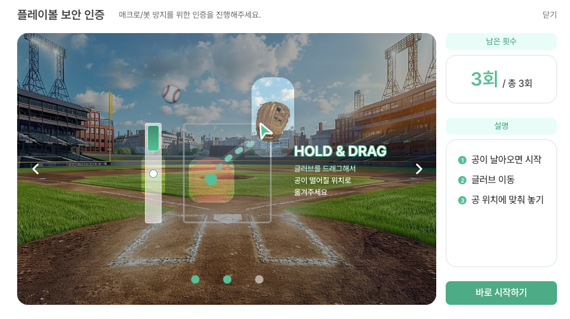

# 공격 설계 트러블슈팅

## 목차

1. [마우스 궤적 — 티켓팅 숙련자처럼 움직이는 에이전트](#1-마우스-궤적--티켓팅-숙련자처럼-움직이는-에이전트)
2. [VQA 풀이 — LLM 없이 결정론 + 착지 보정 + 동시성 게이트](#2-vqa-풀이--llm-없이-결정론--착지-보정--동시성-게이트)
3. [결정론 에이전트 × LLM 스웜 코디네이터의 비대칭 설계](#3-결정론-에이전트--llm-스웜-코디네이터의-비대칭-설계)
4. [스웜 간 완전 독립 — IPC 없는 시뮬레이션 계층](#4-스웜-간-완전-독립--ipc-없는-시뮬레이션-계층)

---

## 1. 마우스 궤적 — 티켓팅 숙련자처럼 움직이는 에이전트

### 문제

에이전트는 실제 브라우저를 직접 조작하므로 마우스 이동 자체가 행동 탐지의 핵심 지표가 된다. 평균 인간보다 느리면 정각 오픈 경쟁 구간에서 좌석을 확보할 수 없고, 봇으로 탐지되면 즉시 차단된다. "자연스러움"과 "수행 속도"가 서로 충돌하는 요구였다.

### 왜 단순 대안이 안 됐는가

| 기각 대안 | 구체적 문제 |
|------|------|
| Playwright 기본 클릭 (순간이동) | 마우스 이동 궤적 자체가 없어 행동 탐지에 즉시 걸림 |
| VQA 구간만 인간형 + 이후 구간은 봇 마우스 | 같은 세션 안에서 마우스 성격이 바뀌는 패턴 자체가 탐지 트리거로 관찰됨 |
| 고정 상수 기반 합성 궤적 | 반복 실행 시 파라미터가 고정되어 패턴 학습에 취약 |
| 평균 인간 속도 유지 | 정각 오픈 경쟁에서 상위권 진입이 지연돼 좌석 확보 확률이 급락 |

### 선택

FeatureBank 샘플링 + Jitter + Cubic Bezier + 수직 방향 Tremor로 이어지는 단일 합성 파이프라인을 만들고, **형태와 속도를 분리**했다.

| 축 | 파라미터 | 출처 |
|------|------|------|
| 형태 | `linearityRatio`, `tremorStdDev` | 수집된 인간 데이터 JSONL에서 샘플 + Gaussian jitter |
| 형태 | Bezier 제어점 `p1`·`p2`, 곡률 진폭 | 이동 벡터·거리에서 유도 + 양방향 비대칭 |
| 속도 | `avgVelocity` 2.0~2.8 px/ms | "티켓팅 숙련자" 고정 균일 분포 (수집 데이터 무시) |
| 속도 | `dwellTime` 8~20 ms | 동일하게 숙련자 고정 균일 분포 |
| 미세 | 수직 방향 Tremor | 생물학적 떨림 관찰 패턴 + 타깃 적중 정확성 유지 |

한 줄 요약: 형태 파라미터는 **실제 인간 분포에서 샘플링**, 속도·dwell은 **티켓팅 숙련자 고정값**으로 분리.

### 결과

- 행동 탐지 우회(형태)와 수행 속도(숙련자) 요구를 동시에 만족
- `TRAJ_SYNTH` 이벤트에 target/computed feature를 함께 남겨 사후 검증 가능 (`validate.py`로 p5~p95 분포 검증)
- FeatureBank는 환경변수(`TM_TRAJ_RAW_LOG_PATH`, `TM_TRAJ_DATASET_ID`)로 교체 가능 → 뱅크 다변화 실험 가능

### 남은 한계

포인트 간 타이밍(`uniform(0.3, 0.9) ms`)은 OS 스케줄러·브라우저 이벤트 큐·프레임 정렬의 불균일성을 모사한 **설계 타협점**이지 탐지 최적점이라는 보장은 없다. 브라우저의 이벤트 coalescing으로 실제 전달이 달라질 수 있으며, 궤적 품질 이슈가 의심될 땐 `TRAJ_SYNTH` target/computed 비교와 `validate.py` 리포트를 함께 확인해야 한다.

---

## 2. VQA 풀이 — LLM 없이 결정론 + 착지 보정 + 동시성 게이트

### 문제

VQA("캐치볼") 챌린지는 3개 서브라운드로 구성된 타이밍 + 드래그 인터랙션이다. 매 라운드 응답 지연이 생기면 타임아웃·차단으로 직결되기 때문에 LLM이나 외부 비전 모델 호출은 현실적 선택지가 아니었다.

### 왜 단순 대안이 안 됐는가

| 기각 대안 | 구체적 문제 |
|------|------|
| LLM/비전 모델 기반 풀이 | 서브라운드당 초 단위 추론 지연 → VQA 타임아웃·드롭 실패로 직결 |
| 드롭 타이밍을 "윈도우 진입 + 최소 대기"로만 판단 | 인디케이터가 상위 threshold를 실제로 넘지 못한 상태에서 드롭 → `fail` 편향 |
| 드래그 후 위치 확인 없음 | 마우스 떨림·곡선 합성 오차로 착지 위치가 목표에서 수십 px 벗어남 → `drag_verify_failed` |
| 멀티 에이전트 동시 VQA 풀이 | 서로 독립 세션이어도 "비정상적으로 동기화된 풀이 패턴"으로 서버에 보일 위험 |

### 선택

결정론 규칙 기반 풀이 파이프라인에 **타이밍 arm**, **drag-verify**, **동시성 게이트** 세 보정 장치를 더했다.

| 장치 | 동작 |
|------|------|
| **결정론 풀이 파이프라인** | JS evaluate로 글러브·마커·타이밍 윈도우·인디케이터 상태 조회 → 조건 만족 시 `drag_and_hold` |
| **`--vqa-require-arm`** | 인디케이터가 상위 60% threshold를 **한 번 이상** 넘은 기록(`sawAboveThreshold`)이 있을 때만 드롭 허용 |
| **`--vqa-drag-verify`** | `mouse.down` 이후 글러브 실제 위치 재확인, 목표점과 24 px 이상 벗어나면 최대 3회 재드래그 |
| **`--vqa-concurrency N`** | `strategy_slot.vqa_gate = asyncio.Semaphore(N)`, 기본 1로 스웜 차원 직렬화 |
| **`--vqa-start-jitter-ms`** | 에이전트별 결정론적 jitter로 완전 동시 시작 방지 |

### 결과

- `CHALLENGE_SUB_ROUND_RESULT` 이벤트의 결과 분류(`success` / `transitioning` / `fail` / `terminal_fail` / `drop_timeout` / `glove_timeout` / `positions_not_found` / `drag_verify_failed`)가 세분화돼 실패 원인 추적 가능
- 공동 테스트(2026-04-16 staging) 기준 VQA 팝업당 평균 실패 0.08회, 첫 시도 성공률 92%
- LLM 미사용으로 서브라운드 지연이 예측 가능

### 남은 한계

자연스러움을 위해 넣은 tremor가 역설적으로 착지 정확도를 해친다. 공동 테스트에서 `drag_verify_failed` 5건이 VQA 실패 최대 원인으로 남았고, "자연스러움과 정확성은 동시에 최적화되지 않는다"는 trade-off가 구조적으로 남아있다. 드래그 곡선 파라미터 추가 튜닝이 필요한 지점이다.

---

## 3. 결정론 에이전트 × LLM 스웜 코디네이터의 비대칭 설계

### 문제

에이전트 단위에는 "재현 가능성·디버깅 가능성·빠른 반응"이, 스웜 단위에는 "방어 반응에 실시간 적응하는 유연성"이 요구된다. 한 시스템에 둘을 같이 태우면 어느 쪽이든 어정쩡해진다.

### 왜 단순 대안이 안 됐는가

| 기각 대안 | 구체적 문제 |
|------|------|
| 에이전트 전체가 LLM 사용 | 결정 지점마다 LLM 호출 지연이 누적 → 경쟁 구간 타이밍 파괴 |
| 완전 결정론 (LLM 미사용) | "어느 zone이 계속 막히는가", "party_size를 줄여야 하는가" 같은 비결정적 판단을 규칙으로 모두 적기 어려움 |
| 단일 큐 pub-sub | 구독자 한 쪽이 느리면 다른 쪽도 같이 밀림 (head-of-line blocking) |
| LLM에게 자유로운 판단 권한 | 좌석 추천 모드(자동 배정) 에이전트에도 구역 변경 지시 등 **의미 없는 개입** 발생 |

### 선택

**에이전트 = 결정론 / 스웜 = LLM** 경계를 고정하고, 그 사이를 **관측 → 결정 → 반영** 3단 비동기 Pub-Sub으로 연결했다.

| 계층 | 컴포넌트 | 동작 |
|------|------|------|
| 관측 | **EventBus** | asyncio.Queue 기반 pub-sub, **구독자별 독립 큐** + 드롭 정책으로 HOL blocking 방지 |
| 결정 | **SwarmCoordinator** | 배치 플러시(5 이벤트 또는 10초) + 즉시 플러시(`PAYMENT_PAGE_REACHED` · `SECTION_BLOCKED` · 연속 `CHALLENGE_FAILED` 3회) 2트랙 트리거 |
| 결정 | **LLM 호출** | `gpt-4.1-nano` + JSON `response_format` 강제, **보수적 system prompt**로 `zone='RANDOM'`(RECOMMEND 자동 배정) 에이전트는 건드리지 않음 |
| 반영 | **StrategySlot** | per-agent `AgentStrategy`를 in-process dict로 보관, **read는 동기·락 없이 마이크로초**, write는 `asyncio.Lock`으로 직렬화된 **비대칭 I/O** |
| 반영 (결정론 경로) | **`PAYMENT_PAGE_REACHED` 사이드 이펙트** | LLM 없이 즉시 labels → 다른 에이전트 `excluded_seats` 추가 (이선좌 충돌 방지) |

### 결과

- 에이전트는 결정 지점에서 **동기 read만** 하면 되고, 관측·결정은 백그라운드로 분리
- 공동 테스트(40회 결정) 기준 정책 수행률 100%, 정책 반영 지연 중앙값 2.6초
- LLM이 82.5%를 "유지"로 판단 — 보수적 system prompt가 의도대로 작동
- `COORDINATOR_DECISION` / `COORDINATOR_ERROR` 이벤트가 다시 EventBus로 publish돼 Monitor/logger가 관찰 가능

### 남은 한계

LLM 응답 지연이 커지면 "결정 지점 read"의 즉시성 이점이 희석된다. 기본 `gpt-4.1-nano`는 비용·지연 최적화 선택이고, 대형 모델로 교체 시 응답 지연이 전체 스웜 반응 속도의 상한을 결정하게 된다. 또한 system prompt의 보수성은 무의미한 개입을 줄이는 동시에 **선제적 개입의 기회**도 줄인다 — 트리거 분포가 사후 이벤트(`PAYMENT_PAGE_REACHED`, `TERMINAL_*`) 중심이 되는 구조적 이유.

---

## 4. 스웜 간 완전 독립 — IPC 없는 시뮬레이션 계층

### 문제

실제 공격은 서로 다른 IP·네트워크·기기에서 독립적으로 들어온다. 방어가 이를 "하나의 공격원"으로 상관분석해 일괄 차단하지 못하는 것이 현실이다. 시뮬레이션이 이 현실을 재현하지 못하면 방어 검증 가치가 떨어진다.

### 왜 단순 대안이 안 됐는가

| 기각 대안 | 구체적 문제 |
|------|------|
| 중앙 컨트롤러 기반 분산 (봇넷 모델) | 단일 IP·컨트롤 채널에 집중 → 방어가 세션 상관관계로 일괄 차단 가능 |
| 스웜 간 공유 상태·통신 | 같은 전략·같은 큐 순위 같은 **과도하게 동기화된 신호**가 서버에 노출 |
| 단일 PC + 다수 에이전트 정각 완전 동시 투입 | Chromium 프로세스 간 CPU·메모리·네트워크 경합 + Playwright 메시지 직렬 처리 → 에이전트 응답 수 초 누적 지연 |

### 선택

**1 PC = 1 스웜 = 5~10 에이전트, 스웜 간 통신 없음** 의 시뮬레이션 계층을 선택했다.

| 축 | 선택 | 이유 |
|------|------|------|
| 스웜 간 | **어떤 네트워크 통신도 없음** | 방어 입장에서 "독립 공격원 다수" 상황 재현. IP·네트워크 경로가 자연스럽게 분산 |
| 스웜 내 | `asyncio.gather`로 N 에이전트 동시 실행 + 결정론 에이전트 + LLM 코디네이터 | §3의 비대칭 구조 |
| 호스트 보정 | 에이전트 순번별 예매 클릭 시각에 **선형 지연**(`open_at_click_spacing_ms * agent_id`) 주입 | 단일 PC 호스트 경합 완화 + 실전의 자연스러운 VQA 진입 시간차 재현 |
| 집계 | `scripts/summarize_logs.py`로 여러 PC 로그 합산 | 실행 중 통신은 없지만, **사후 합산**으로 전체 KPI 재계산 |

### 결과

- 방어 시스템 입장에서 현실적 "독립 공격원 다수" 상황 재현
- S1~S15 스웜 매트릭스로 RECOMMEND 대량 점유·MAP 스나이핑·2연석 대량 점유 시나리오 커버
- 스웜 간 네트워크 의존 없음 → 한 PC 장애가 다른 스웜에 전파되지 않음
- 각 스웜은 종료 시 `summary_<swarm_id>_<ts>.json/txt`를 독립적으로 생성 → 부분 제출·부분 재실행 가능

### 남은 한계

단일 PC에 다수 에이전트를 띄우는 구조는 호스트 리소스가 근본 병목이다. 정각 완전 동시 투입이 불가능해 **예매 클릭 시간차 인위 주입**이라는 시뮬-전용 보정이 들어가 있고, 이는 실전에서는 불필요한 장치다. 실전 근접도를 한 단계 높이려면 **"1 환경 = 1 에이전트, 다중 환경 = 1 스웜"** 분산 구조(클라우드 VM 풀 / K8s 노드 분산 / 물리 PC 확장)로 전환하는 것이 다음 단계다.
