# AI Defense 개발 문서

AI Defense는 티켓팅 예매 흐름에서 자동화 봇과 비정상 행동을 **실시간으로 탐지해 완충·차단**하는 방어 시스템입니다. Online Plane(실시간 판단)은 결정론 규칙만으로 동작하고, Offline Plane(정책 최적화)에서 LLM과 인간 개입으로 정책을 진화시킵니다. 이 두 평면 분리가 설계의 출발점입니다.

---

## 서비스 특성

| 항목 | 내용 |
|------|------|
| **유형** | 행동 기반 실시간 방어 시스템 |
| **판단 축** | 마우스 행동 + 세션 상태 + 외부 검증 점수 |
| **구조** | Online Plane (실시간 판단) + Offline Plane (정책 최적화) |
| **런타임 LLM** | **미사용** — 결정론 규칙만 |
| **오프라인 LLM** | 정책 제안·사후 검토에 활용 (안전장치 적용) |
| **감시 대상** | 큐 입장, 좌석 hold, 결제 등 중요 API |

---

## 설계 철학

| 요구 | 대응 |
|------|------|
| **실시간성** | 결정 로직 단순·결정론 → 응답 지연 예측 가능 |
| **진화 대응력** | 오프라인 평면에서 LLM·인간 개입으로 정책 업데이트 |
| **감사 추적** | 모든 판단이 로그로 재현 가능 |
| **가용성** | 방어 장애 시 fail-open으로 서비스 전체 중단 방지 |

---

## 구성 범위

### 아키텍처

| 문서 | 내용 |
|------|------|
| [아키텍처](01-architecture.md) | 두 Plane 분리 · 요청 흐름 · 주요 컴포넌트 |
| [Ext-Authz 연동](02-ext-authz.md) | Envoy/Istio ext-authz 연동 |

### Runtime 판단 파이프라인

| 문서 | 내용 |
|------|------|
| [Runtime 파이프라인](03-runtime-pipeline.md) | Guard → Analyzer → Planner → Orchestrator 4단 |
| [위험 점수 계산](04-risk-scoring.md) | 5 feature + EWMA |
| [Tier · Action · 히스테리시스](05-tier-action.md) | 단계적 대응 · 보호 대기 |
| [Analyzer 신호](06-analyzer-signals.md) | 규칙 기반 증거 축적 |
| [VQA 2중 게이트](07-vqa-gate.md) | 보안 챌린지 · 정답 + 행동 궤적 검증 |

### Policy 계층

| 문서 | 내용 |
|------|------|
| [정책 권위 · 런타임 캐시](08-policy-authority.md) | PostgreSQL 권위 · Redis 캐시 분리 |
| [오프라인 최적화기](09-offline-optimizer.md) | 자동 정책 제안 |
| [Post-Review Copilot](10-post-review.md) | 사후 검토 워크플로우 |

### 관측 · 운영

| 문서 | 내용 |
|------|------|
| [Observability · ETL](11-observability.md) | 감사 로그 · S3 · ClickHouse |
| [Storage · Deployment](12-storage-deployment.md) | 스토리지 · 마이그레이션 · 배포 |
| [실패 모델 · 복구](13-failure-recovery.md) | Fail-open 정책 · 복구 경로 |

---

## 방어 시스템 흐름

```mermaid
flowchart LR
    BR["Browser<br/>+ telemetry headers"] --> GW["Istio Ingress Gateway<br/>Envoy + Lua filter"]
    GW -->|ext-authz gRPC| AD["authz-adapter"]
    AD -->|POST /evaluate| GU["1. Guard<br/>risk · tier"]
    GU --> AN["2. Analyzer<br/>signals · counters"]
    AN --> PL["3. Planner<br/>priority rules"]
    PL --> OR["4. Orchestrator<br/>state commit · S3 gate"]
    OR <-->|state · policy| RE["Redis<br/>runtime cache"]
    GW -->|allow| BE["Backend API"]
    OR -.->|audit DEF_*| S3["S3 archive"]
    S3 --> ETL["ETL Worker"] --> CH["ClickHouse<br/>analytics"]
    CH --> OPT["Policy Optimizer"]
    CH --> PRV["Post-Review Copilot<br/>(LLM)"]
    OPT --> PG["PostgreSQL<br/>policy authority"]
    PRV --> PG
    PG --> RS["Projection resync"] --> RE
```

---

## 핵심 차별화 기능

1. **행동 기반 Risk Scoring** — 단순 WAF·rate-limit이 아닌 마우스 궤적 5 feature + EWMA 누적
2. **Online Deterministic × Offline LLM 경계** — 실시간은 예측 가능, 정책 업데이트는 LLM 활용
3. **PostgreSQL 권위 + Redis 캐시 분리** — 감사 추적과 런타임 지연 동시 달성
4. **VQA 2중 게이트** — 정답뿐 아니라 푸는 과정의 행동 궤적까지 검증
5. **허용 목록 기반 자동 최적화** — LLM 제안도 엄격한 범위 제한으로 안전 운영
6. **Human-in-the-Loop 사후 검토** — 완충 처리된 회색지대 세션을 사후 재판단

---

## 사용 기술

| 영역 | 기술 |
|------|------|
| **Gateway** | Istio Ingress Gateway, Envoy, Lua filter, ext-authz gRPC |
| **Runtime (Online)** | FastAPI, 4단 파이프라인, EWMA + 히스테리시스 |
| **런타임 저장소** | Redis (세션 · 정책 projection · 챌린지 토큰 · dedup TTL · block key · 세션 락) |
| **Offline 분석** | S3 archive, ETL Worker (CronJob hourly :15), ClickHouse (rollup views) |
| **정책 권위** | PostgreSQL (`policy_versions`, `policy_rollout_state`, `post_review_runs`) |
| **정책 제어 LLM** | Policy Optimizer (dry-run → apply, allowlist 제한), Post-Review Copilot |
| **감사 · 관측** | JSONL audit (`DEF_*` 이벤트), OpenTelemetry, Grafana |
| **배포** | Kubernetes (AI Defense FastAPI · ETL CronJob · Post-Review CronJob), KEDA 오토스케일링 |

---

## 참고 자료

| 문서 | 용도 |
|------|------|
| `AI_DEFENSE_DETAILED_TECHNICAL_DOCUMENT.md` | 원본 기술 보고서 (설계 근거 포함) |
| `PRESENTATION_04_05_DEFENSE.md` | 발표자료용 요약 |
| 201 레포 `spec/aligned_docs_2026-03-10/01_defense_runtime_online.md` | Runtime 설계 원본 |
| 201 레포 `spec/aligned_docs_2026-03-10/03_attack_defense_alignment_matrix.md` | 공격↔방어 매핑 |

---

## 용어집

| 용어 | 의미 |
|------|------|
| **Online Plane** | 실시간 요청 판단 계층 |
| **Offline Plane** | 정책 분석·개선 계층 |
| **Guard** | 위험 점수 계산 단계 |
| **Analyzer** | 규칙 기반 증거 축적 단계 |
| **Planner** | 정책 적용 단계 |
| **Orchestrator** | 실행·상태 전이 단계 |
| **EWMA** | 지수가중이동평균 (점수 누적 방식) |
| **Hysteresis** | 등급 다운그레이드 여유 임계치 |
| **Probation** | 챌린지 통과 후 다운그레이드 금지 기간 |
| **VQA 2중 게이트** | 정답 + 행동 궤적 동시 검증 |
| **Canary Rollout** | 단계적 배포 (5% → 20% → 50% → 100%) |
| **허용 목록 (Allowlist)** | 자동 최적화기가 수정 가능한 파라미터 제한 목록 |
