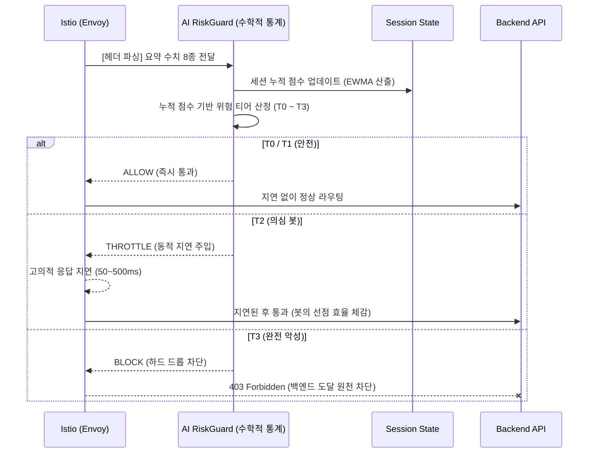

# 런타임 탐지

Envoy가 헤더로 전달한 텔레메트리 요약 수치를 실시간으로 분석해 사용자의 위험 티어를 산정합니다. 무작위 캡챠 대신, 티어에 따라 보이지 않게 제어하는 **비가시적(Invisible)** 방어 전략을 채택했습니다.

---

## 실시간 스코어링 흐름

---

## 위험 티어 분류

| 위험 티어 | 주요 판단 기준 | 런타임 방어 액션 | 효과 |
|---|---|---|---|
| **T0~T1 (사람)** | 정상 범위의 떨림, 마우스 체류 시간 | ALLOW (정상 통과) | UX 저하 0%. 밀리초 단위로 백엔드 API 정상 호출 |
| **T2 (의심 봇)** | 기계적으로 일정한 클릭 주기 및 궤적 | THROTTLE (동적 속도 지연) | UI에는 정상처럼 보이나, 응답을 고의로 늦춰 매크로의 선점 효율 무력화 |
| **T3 (위험 봇)** | 완전히 인위적인 좌표 직행, 식별된 IP | BLOCK (원천 차단) | 백엔드에 부하 없이 Envoy 단에서 Connection 강제 종료 (403) |

---

## 비가시적 방어 전략

일반적인 캡챠 방식은 정상 사용자에게도 불편함을 줍니다. 티켓팅 필수 관문인 'VQA 미션'은 모든 사용자가 동일하게 거치는 1회성 고정 관문으로 분리하고, 이후에는 **사용자가 인식하지 못하는 형태로 제어**합니다.

- T2 봇은 에러 메시지나 팝업 없이, 단지 응답이 수백 ms 느리게 옵니다. 절대 표를 선점할 수 없게 됩니다.
- T3 봇은 백엔드 서버와 커넥션조차 맺지 못하고 Envoy에서 즉시 차단됩니다. 인프라 부하가 0이 됩니다.
