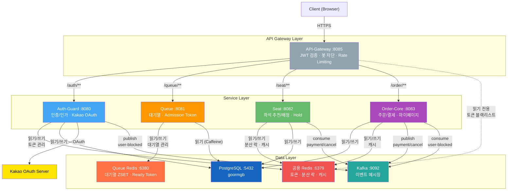

# PlayBall 백엔드 시스템 이너 아키텍처

> 최종 갱신: 2026-04-16 | 대상 버전: v1.13.0-staging

---

## 1. MSA 서비스 구성

PlayBall 백엔드는 **5개 마이크로서비스**와 **1개 공통 라이브러리**로 구성된다.

```
┌──────────────────────────────────────────────────────────────────────────┐
│                          Client (Browser / App)                         │
└──────────────────────────────┬───────────────────────────────────────────┘
                               │ HTTPS
                               ▼
┌──────────────────────────────────────────────────────────────────────────┐
│                    API-Gateway :8085  (Spring Cloud Gateway WebFlux)     │
│  ┌─────────────┐ ┌──────────────┐ ┌──────────────┐ ┌────────────────┐  │
│  │ JWT 인증 필터 │ │ 봇 UA 차단 필터│ │ Rate Limiting│ │ CORS Origin 검증│  │
│  └─────────────┘ └──────────────┘ └──────────────┘ └────────────────┘  │
└────┬──────────────┬──────────────┬──────────────┬────────────────────────┘
     │ /auth/**     │ /queue/**    │ /seat/**     │ /order/**
     ▼              ▼              ▼              ▼
┌──────────┐  ┌──────────┐  ┌──────────┐  ┌──────────────┐
│Auth-Guard│  │  Queue   │  │   Seat   │  │  Order-Core  │
│  :8080   │  │  :8081   │  │  :8082   │  │    :8083     │
│ 인증/인가  │  │ 대기열 관리│  │좌석추천/배정│  │ 주문/결제/마이페이지│
└──────────┘  └──────────┘  └──────────┘  └──────────────┘
     │              │              │              │
     └──────────────┴──────────────┴──────────────┘
                    공통 라이브러리: common-core
         (도메인 엔티티, Kafka 설정, 암호화, 예외 처리)
```

### 서비스별 역할

| 서비스 | 포트 | 프레임워크 | 역할 |
|-------|------|----------|------|
| **API-Gateway** | 8085 | Spring Cloud Gateway (WebFlux) | 단일 진입점, JWT 검증, 라우팅, Rate Limiting |
| **Auth-Guard** | 8080 | Spring Boot MVC | 인증/인가, Kakao OAuth 2.0, JWT 발급/검증 |
| **Queue** | 8081 | Spring Boot MVC | Redis 기반 대기열 관리, Admission Token 발급 |
| **Seat** | 8082 | Spring Boot MVC | 좌석 추천/자동배정, 분산 락, Hold 관리 |
| **Order-Core** | 8083 | Spring Boot MVC | 주문 생성/결제, 이메일 발송, 마이페이지 |
| **common-core** | - | 공유 라이브러리 | 도메인 엔티티, Kafka 토픽, 암호화, 전역 예외 |

### 핵심 설계 원칙

- **서비스 간 직접 REST 호출 없음** — Redis / Kafka를 통한 간접 데이터 공유만 존재
- **DB 공유**: 모든 서비스가 동일 PostgreSQL 인스턴스를 사용하되, 테이블 소유권을 서비스별로 분리
- **Redis 2대 분리**: 공용 Redis(캐시/토큰/분산 락) + Queue 전용 Redis(대기열 ZSET)

---

## 2. 전체 시스템 아키텍처 다이어그램



---

## 3. 데이터 인프라

### 3.1 PostgreSQL

| 항목 | 값 |
|------|-----|
| 버전 | PostgreSQL 16 |
| DB명 | `goormgb` |
| 사용 서비스 | Auth-Guard, Seat, Order-Core, Queue (Caffeine 원본) |
| 암호화 | AES-256-GCM 필드 암호화 (email, nickname, phone) |
| JPA DDL | `update` (자동 스키마 마이그레이션) |

**DB 테이블 소유권**

| 서비스 | 소유 테이블 |
|-------|-----------|
| Auth-Guard | `users`, `user_sns`, `dev_users`, `withdrawal_requests` |
| Seat | `seats`, `match_seats`, `seat_holds`, `blocks`, `sections`, `areas`, `price_policies` |
| Order-Core | `orders`, `order_seats`, `payments`, `cash_receipts`, `cancellation_fee_policies`, `inquiries`, `inquiry_answers`, `qr_tokens` |
| 공유 (common-core) | `matches`, `clubs`, `stadiums`, `team_season_stats`, `onboarding_preferences`, `onboarding_preferred_blocks`, `onboarding_viewpoint_priority` |

### 3.2 Redis (2인스턴스 분리)

```
┌───────────────────────────────────────────┐   ┌──────────────────────────────────┐
│        공용 Redis :6379                    │   │     Queue 전용 Redis :6380        │
│                                           │   │                                  │
│  Auth-Guard                               │   │  대기열 ZSET                      │
│  ├─ refresh_token:{jti}      (7일)        │   │  ├─ queue:wait:{matchId}          │
│  ├─ token_blacklist:{jti}    (잔여 TTL)   │   │  ├─ queue:ready:{matchId}:{userId}│
│  ├─ user-by-id:{userId}     (10분)       │   │  ├─ queue:ready:index:{matchId}   │
│  └─ auth-me:{userId}        (30초)       │   │  ├─ queue:expired:{matchId}:{uid} │
│                                           │   │  ├─ queue:match (SET)             │
│  Seat                                     │   │  └─ queue:precheck:booking-option │
│  ├─ seat:booking-options     (15분)       │   │       :{matchId}:{userId}         │
│  ├─ seat:recommendation:lock (Redisson)   │   │                                  │
│  ├─ seat:hold:lock           (Redisson)   │   │  목적: 대기열 폴링 트래픽이 캐시/토큰 │
│  └─ seat-groups-response     (5초)        │   │  Redis에 영향 주지 않도록 물리 분리   │
│                                           │   │                                  │
│  Order-Core                               │   │                                  │
│  ├─ user-by-id:{userId}     (10분)       │   │                                  │
│  └─ matches-list-response    (30초)       │   │                                  │
│                                           │   │                                  │
│  API-Gateway                              │   │                                  │
│  ├─ token_blacklist 읽기     (Reactive)   │   │                                  │
│  └─ Rate Limit 카운터                     │   │                                  │
└───────────────────────────────────────────┘   └──────────────────────────────────┘
```

### 3.3 Kafka 이벤트 메시징

| 토픽 | 파티션 | Producer | Consumer | 용도 |
|------|--------|----------|----------|------|
| `payment-completed` | 3 | Order-Core | Seat | 결제 완료 시 좌석 BLOCKED → SOLD 전환 |
| `order-cancelled` | 3 | Order-Core | Seat | 주문 취소 시 좌석 SOLD → AVAILABLE 복원 |
| `bank-transfer-expired` | 3 | Order-Core | Seat | 무통장 입금 기한 만료 시 좌석 복원 |
| `user-blocked` | 3 | Auth-Guard | Order-Core | 유저 차단 시 활성 주문 UNDER_REVIEW 처리 |

**Kafka 설정**

- 버전: Apache Kafka 3.7.1
- Acks: `all` (모든 replica 확인 후 응답)
- 에러 처리: 3회 재시도 (1초 간격) → 실패 시 DLT(Dead Letter Topic)로 전송
- DLT 이름 패턴: `{토픽명}.DLT` (예: `payment-completed.DLT`)

```
┌──────────────┐     payment-completed      ┌──────────────┐
│  Order-Core  │ ─────────────────────────→  │     Seat     │
│  (Producer)  │     order-cancelled         │  (Consumer)  │
│              │ ─────────────────────────→  │              │
│              │     bank-transfer-expired   │              │
│              │ ─────────────────────────→  │              │
└──────────────┘                             └──────────────┘

┌──────────────┐     user-blocked           ┌──────────────┐
│  Auth-Guard  │ ─────────────────────────→  │  Order-Core  │
│  (Producer)  │                             │  (Consumer)  │
└──────────────┘                             └──────────────┘
```

---

## 4. 캐싱 전략

### 4.1 Caffeine 로컬 캐시 (JVM 인-메모리)

Caffeine은 Java용 고성능 로컬 캐시 라이브러리로, W-TinyLFU 교체 알고리즘을 사용하여 LRU보다 높은 hit rate를 달성한다. 네트워크 홉 없이 나노~마이크로초 단위 접근이 가능하다.

| 서비스 | 캐시 이름 | 최대 크기 | TTL | 대상 데이터 | 도입 이유 |
|-------|---------|---------|-----|----------|----------|
| **Seat** | `match-exists` | 1,000 | 10분 | Match 존재 검증 | 요청당 2회 DB 조회 제거 |
| **Seat** | `match-detail` | 1,000 | 10분 | Match 메타데이터 (JOIN FETCH) | 거의 불변 데이터, DB 커넥션 절약 |
| **Seat** | `section-all` | 16 | 1시간 | 스타디움 섹션 구조 | 영구 불변, 배포 시에만 변경 |
| **Seat** | `blocks-by-section-ids` | 512 | 1시간 | 스타디움 블럭 매핑 | 영구 불변, 배포 시에만 변경 |
| **Queue** | `match-for-queue` | 1,000 | 1분 | Match saleStatus 검증 | 대기열 진입 시 폭주 쿼리 흡수 |
| **Order-Core** | `match-detail` | 1,000 | 10분 | 주문서용 Match 메타데이터 | Seat과 동일 패턴 적용 |

### 4.2 Redis 분산 캐시

인스턴스 간 공유가 필요한 데이터는 Redis 분산 캐시를 사용한다.

| 서비스 | 캐시 이름 | TTL | 대상 데이터 | 이유 |
|-------|---------|-----|----------|------|
| **Auth-Guard** | `user-by-id` | 10분 | User DTO 스냅샷 | 닉네임/상태 변경 시 Pod 간 즉시 전파 필요 |
| **Auth-Guard** | `auth-me` | 30초 | /me 응답 | 프론트 폴링 빈도 높음 |
| **Order-Core** | `user-by-id` | 10분 | User DTO | Auth-Guard와 동일 패턴 |
| **Order-Core** | `matches-list-response` | 30초 | 경기 목록 API 응답 | 동일 날짜 경기 목록 반복 조회 |
| **Seat** | `seat-groups-response` | 5초 | 좌석맵 API 응답 | 유저 독립적 페이로드, 실시간 갱신 필요 |

### 4.3 캐시 종류 선택 기준

```
┌─────────────────────────────────────────────────────────────┐
│              캐시 종류 판정 플로우                             │
│                                                             │
│  데이터가 거의 바뀌지 않는가? ──── Yes ──→ Caffeine (로컬)    │
│         │                                                   │
│         No                                                  │
│         │                                                   │
│  변경 시 모든 Pod에 즉시 반영 필요? ── Yes ──→ Redis (분산)   │
│         │                                                   │
│         No                                                  │
│         │                                                   │
│  TTL 1분 이내로 stale 허용? ──── Yes ──→ Caffeine (짧은 TTL) │
│         │                                                   │
│         No ──→ Redis (분산)                                  │
└─────────────────────────────────────────────────────────────┘
```

| 항목 | Caffeine (로컬) | Redis (원격) |
|------|----------------|-------------|
| 저장 위치 | JVM 힙 메모리 | 별도 서버 |
| 접근 시간 | < 1us | 0.5~2ms (+네트워크) |
| 용량 | JVM 힙 한도 내 | GB~TB 가능 |
| 인스턴스 간 공유 | 불가 (각자 따로) | 공유됨 |
| 일관성 | 노드별 달라질 수 있음 | 단일 소스 |
| 장애 격리 | JVM과 운명공유 | Redis 다운 시 영향 |

---

## 5. 서비스별 외부 의존성 매트릭스

| 서비스 | PostgreSQL | 공용 Redis | Queue Redis | Kafka | 외부 API |
|-------|------------|-----------|-------------|-------|---------|
| API-Gateway | - | 읽기 전용 (블랙리스트) | - | - | - |
| Auth-Guard | 읽기/쓰기 | 읽기/쓰기 (토큰) | - | Publisher | Kakao OAuth |
| Queue | 읽기 (Caffeine) | - | 읽기/쓰기 | - | - |
| Seat | 읽기/쓰기 | 읽기/쓰기 (락/캐시) | 읽기/쓰기 (PreQueue 마커) | Consumer | - |
| Order-Core | 읽기/쓰기 | 읽기/쓰기 (캐시) | - | Publisher + Consumer | - |

---

## 6. 스케줄러 (백그라운드 작업)

| 서비스 | 스케줄러 | 주기 | 역할 |
|-------|---------|------|------|
| Queue | `QueuePromotionScheduler` | 1초 간격 | 대기열 → Ready 승격 (배치 100명) |
| Seat | `MatchSeatScheduler` | 매일 00:00 KST | 경기 7일 전 좌석 데이터 자동 생성 |
| Seat | `SeatHoldCleanupScheduler` | 60초 간격 | 만료된 Hold 정리 + 좌석 AVAILABLE 복원 |
| Order-Core | `MatchStatusScheduler` | 매일 10:59 / 00:00 KST | 경기 판매 개시(ON_SALE) / 종료(CLOSED) 처리 |
| Order-Core | `BankTransferExpirationScheduler` | 5분 간격 | 입금 기한 초과 무통장 주문 자동 취소 |

---

## 7. 인프라 구성 (Docker Compose)

| 서비스 | 이미지 | 포트 | 비고 |
|-------|-------|------|------|
| PostgreSQL | postgres:16 | 5432 | `goormgb` DB |
| Redis (공용) | redis:7 | 6379 | 캐시, 토큰, 분산 락 |
| Redis (Queue) | redis:7 | 6380 | 대기열 전용 |
| Kafka | apache/kafka:3.7.1 | 9092 | 이벤트 스트리밍 |
| Kafka UI | provectuslabs/kafka-ui | 8090 | 모니터링 (선택) |
| API-Gateway | Custom | 8085 | - |
| Auth-Guard | Custom | 8080 | - |
| Queue | Custom | 8081 | - |
| Seat | Custom | 8082 | - |
| Order-Core | Custom | 8083 | - |

**기술 스택**: Java 21 LTS / Spring Boot 4.0.2 / Spring Cloud 2025.1.1 / Gradle

---

## 8. Health Check & 모니터링

모든 서비스에 Spring Boot Actuator가 활성화되어 있다.

| 엔드포인트 | 용도 |
|-----------|------|
| `/actuator/health` | 헬스체크 (liveness/readiness) |
| `/actuator/prometheus` | Prometheus 메트릭 수집 |

- Readiness probe: `/actuator/health/readiness` (DB 연결 포함)
- Liveness probe: `/actuator/health/liveness`
- API-Gateway는 DB 미사용이므로 readiness에서 `db` health contributor 제외
- 비즈니스 메트릭: 대기열 진입 수, 좌석 Hold 성공/실패, 결제 시도/완료, 분산 락 대기시간 등
- Prometheus → Grafana 대시보드로 실시간 모니터링

---

## 9. 부하 예상 서비스 (스케일링 우선순위)

| 순위 | 서비스 | 이유 |
|-----|-------|------|
| 1 | API-Gateway | 모든 트래픽이 통과하는 단일 진입점 |
| 2 | Queue | 티켓팅 오픈 시 대기열 폴링 트래픽 집중 |
| 3 | Seat | 좌석 추천/배정 연산 + Redisson 분산 락 |
| 4 | Order-Core | 주문/결제 (상대적으로 낮은 트래픽) |
| 5 | Auth-Guard | 로그인 시에만 부하 (토큰 로테이션은 경량) |
