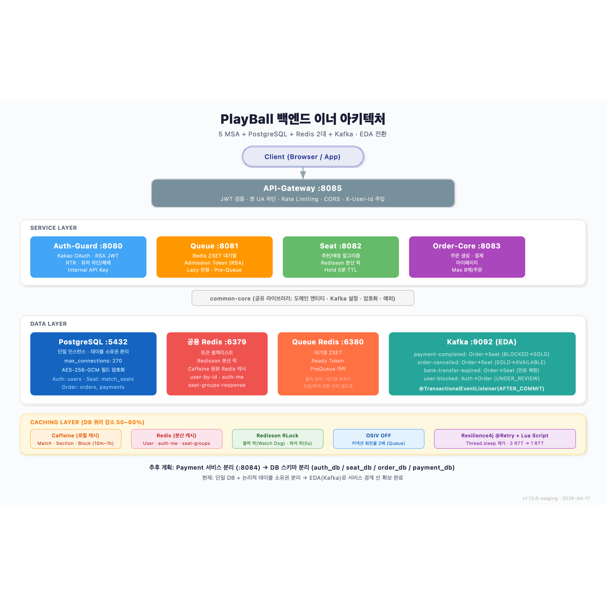

# 8장 — 백엔드 이너 아키텍처

> **전달 메시지**
> "5개 MSA + 단일 DB에서 시작해, Kafka EDA로 서비스 경계를 확보하고,
> Caffeine/Redis 2단 캐싱으로 DB 커넥션 풀 병목을 해결했습니다."

---

## 슬라이드 시각화 초안



> **단순 참고용입니다** — 디자인은 자유롭게 작업해주세요. 내용이 많다면 슬라이드를 더 쪼개주셔도 됩니다.
> 편집용 원본: [slide_08_inner_architecture.svg](../images/slide_08_inner_architecture.svg)

---

## 슬라이드에 담을 내용

### ① MSA 5개 서비스 구성

| 서비스 | 포트 | 핵심 역할 |
|-------|------|---------|
| **API-Gateway** | 8085 | JWT 중앙 검증, 라우팅, Rate Limiting, 봇 UA 차단 |
| **Auth-Guard** | 8080 | Kakao OAuth, RSA JWT 발급/갱신(RTR), 유저 차단 |
| **Queue** | 8081 | Redis ZSET 대기열, Admission Token, Lazy 시간 판정 |
| **Seat** | 8082 | 추천/배정 알고리즘, Redisson 분산 락, Hold 5분 |
| **Order-Core** | 8083 | 주문 생성, 결제, 마이페이지, 주문당 최대 8매 |

- 서비스 간 **직접 REST 호출 없음**
- Redis / Kafka를 통한 간접 데이터 공유만 존재

### ② 데이터 인프라 — "MSA인데 DB는 하나"

**현재 상태**: 단일 PostgreSQL 인스턴스 (`max_connections=270`)
- 테이블 소유권만 논리적으로 분리 (물리 스키마 분리 X)
- 모든 서비스가 같은 커넥션 한도를 공유 → 한 서비스 쿼리 폭주가 전체에 전이

**Redis 2대 분리**:
- **공용 Redis :6379** — 토큰·분산 락·캐시
- **Queue Redis :6380** — 대기열 ZSET 전용 (대기열 폭주가 인증/락에 영향 주지 않도록)

### ③ EDA 전환 — Kafka

서비스 간 상태 변경을 **비동기 이벤트**로 전파:

| 토픽 | Producer → Consumer | 처리 |
|------|-------------------|------|
| `payment-completed` | Order → Seat | 좌석 BLOCKED → SOLD |
| `order-cancelled` | Order → Seat | 좌석 SOLD → AVAILABLE |
| `bank-transfer-expired` | Order → Seat | 만료 시 좌석 복원 |
| `user-blocked` | Auth → Order | 주문 UNDER_REVIEW |

**핵심 설계**: `@TransactionalEventListener(AFTER_COMMIT)` — DB 커밋 후에만 이벤트 발행

**Kafka 채택 이유**: 추후 **Payment 서비스 분리** 시 Producer 위치만 옮기면 Consumer(Seat) 무변경

### ④ 캐싱 전략 — DB 쿼리 50~60% 감소

| 종류 | 용도 | 적용 데이터 |
|------|------|-----------|
| **Caffeine (로컬)** | sub-μs 접근, 네트워크 홉 제로 | Match·Section·Block (불변, TTL 10m~1h) |
| **Redis (분산)** | Pod 간 공유, 변동 데이터 | User·auth-me·seat-groups (TTL 5s~10m) |
| **Redisson RLock** | Watch Dog 자동 TTL 갱신 | 블럭 락(추천) + 좌석 락(포도알) |

### ⑤ 추후 확장 계획

```
현재 → Payment 서비스 분리 (:8084) → DB 스키마 분리 (서비스당 별도 DB)
                                      → Outbox Pattern + Saga Pattern
```

---

## 참고 문서
- [01-백엔드-시스템-이너-아키텍처.md](../../01-백엔드-시스템-이너-아키텍처.md) — 전체 아키텍처 상세
- 사이트: `/development/system-architecture` (시스템 아키텍처)
- 사이트: `/development/eda-architecture` (MSA · EDA 전환)
- 사이트: `/development/kafka-caching` (Kafka · Caffeine 캐싱)
