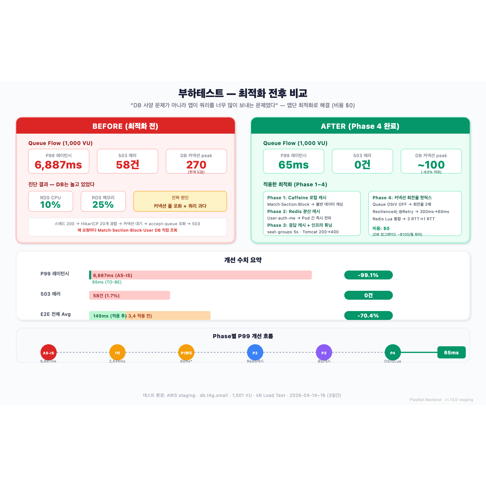

# 9장 — 부하테스트 결과 (최적화 전후 비교)

> **전달 메시지**
> "DB 인스턴스를 올려 돈으로 해결할 수 있었지만, 원인을 파고드니 사양 문제가 아니라
> 앱이 쿼리를 너무 많이 보내는 문제였다. **3일간 Phase 1~4 코드 최적화로 P99 6,887ms → 65ms (-99%) 달성, 비용 $0.**"

---

## 슬라이드 시각화 초안



> **단순 참고용입니다** — 디자인은 자유롭게 작업해주세요. 내용이 많다면 슬라이드를 더 쪼개주셔도 됩니다.
> 편집용 원본: [slide_09_load_test_before_after.svg](../images/slide_09_load_test_before_after.svg)

---

## 슬라이드에 담을 내용

### ① Before — 최적화 전 상태 (2026-04-14)

**환경**: AWS staging, `db.t4g.medium`, `max_connections=250`, 1,001 VU

| 지표 | 값 | 비고 |
|------|-----|------|
| **Queue Flow P99** | **6,887ms** | 응답까지 약 7초 |
| **503 에러** | **58건** | Queue 40건 + Seat 18건 |
| **DB 커넥션 peak** | **250** (한계) | max_connections 도달 |
| RDS CPU | **10%** | 사양 문제 아님 |
| RDS 메모리 | **25%** | 사양 문제 아님 |
| Tomcat 스레드 peak | **735** | 자원 고갈의 외형적 증거 |
| HikariCP pending | **48** | 커넥션 대기열 누적 |

**핵심 진단**:
```
DB는 CPU 10% / 메모리 25%로 놀고 있는데, 왜 503?
→ 쿼리 자체가 느린 게 아니라, 쿼리 횟수가 너무 많음
→ 매 요청마다 Match·Section·Block·User를 DB에서 직접 조회
→ 200개 스레드가 20개 커넥션을 두고 경합 → 대기 → 타임아웃 → 503
```

### ② After — Phase 4 완료 후 (2026-04-16)

| 지표 | Before | After | 개선률 |
|------|--------|-------|-------|
| **Queue Flow P99** | 6,887ms | **65ms** | **-99.1%** |
| **503 에러** | 58건 | **0건** | 완전 제거 |
| **E2E 9-step Avg** | 503ms | **149ms** | **-70.4%** |
| **DB 커넥션 peak** | 270 (한계) | **~100** | **-63%** |

### ③ 어떻게 해결했나 — Phase 1~4

**Phase 1**: Caffeine 로컬 캐시 도입 (Match 조회 1개 → **P99 65% 감소** PoC 성공)
→ Multi-Service 확대 (Seat/Queue/Order-Core × 6종 캐시)
→ **DB 쿼리 50~60% 감소**

**Phase 2**: Redis 분산 캐시 (User, auth-me)
→ `/auth/me` P99: **400ms → 50ms**

**Phase 3**: 응답 레벨 Redis 캐시 + 인프라 파라미터 튜닝
→ Tomcat 200→400, HikariCP 20→30
→ `seat-groups` P99: **2000ms → 200ms**

**Phase 4**: 커넥션 회전율 핫픽스
→ Queue OSIV OFF (회전율 2배)
→ Resilience4j @Retry (Thread.sleep 300ms → 60ms)
→ Redis Lua 스크립트 통합 (3 RTT → 1 RTT)

### ④ 선택하지 않은 카드

| 선택지 | 비용 | 결과 |
|--------|------|------|
| DB 인스턴스 업그레이드 (`db.t4g.medium` 이상) | **~$100/월 지속** | 일시적 — 쿼리가 많다는 근본 원인 그대로 |
| **앱단 캐싱 + 인프라 재배분** | **$0** | **근본 원인 해결** |

> "CPU/메모리가 한가한데 돈 쓰는 건 낭비" — 엔지니어링 판단

### ⑤ 최종 결과 (1,000 VU 기준)

**추천 ON Flow (1,000 VU E2E)**:
- Queue: P99 194ms
- Seat: P99 1.23s
- Error: 0%
- 100% 성공

**추천 OFF Flow (포도알 직접 선택, 1,000 VU)**:
- 총 요청: 60,316건
- 좌석 Hold 성공률: **83.6%** (92/110 VU)
- 이선좌(409) 114건 → **정상 동시성 제어 결과** (경합이 잘 처리되고 있다는 증거)
- 503: **0건**

### ⑥ Phase별 P99 감소 추이

```
6,887ms → 2,434ms → 60ms → (Redis캐시) → (응답캐시) → 65ms
AS-IS      1차PoC    P1확대     Phase2       Phase3     Phase4

P99: 6,887ms → 65ms = -99.1% 감소
503: 58건 → 0건 = 완전 제거
비용: $0 (DB 업그레이드 ~$100/월 회피)
```

---

## 발표 포인트 (1분 내 전달)

> 1. **"DB가 놀고 있는데 왜 503?"** — 반전 포인트
> 2. **"쿼리 수를 줄였다"** — 캐싱 전략 한 줄 요약
> 3. **"P99 6.9초 → 65ms, 503 0건"** — 숫자로 증명
> 4. **"돈 안 쓰고 해결"** — 엔지니어링 판단

---

## 참고 문서
- [06-503-트러블슈팅-핵심스토리.md](../../부하테스트/06-503-트러블슈팅-핵심스토리.md) — 발표용 기-승-전-결
- [07-시각화-Before-Middle-After-비교.md](../../부하테스트/07-시각화-Before-Middle-After-비교.md) — 캡쳐 69장 갤러리
- 사이트: `/development/load-test/503-story` (503 트러블슈팅 스토리)
- 사이트: `/development/load-test/comparison` (Before/After 시각화)
- 사이트: `/development/load-test/phases` (Phase별 타임라인)
