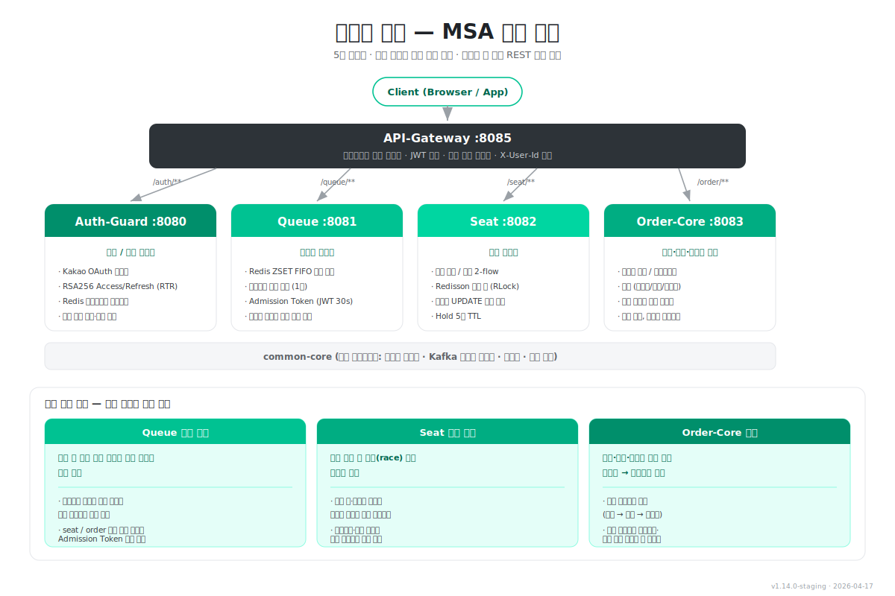

# 10장 — 백엔드 이너: MSA 모듈 구조

> **전달 메시지**
> "5개 서비스는 기능이 아니라 **부하 특성에 따라 경계를 그었습니다.**
> 대기열 트래픽은 격리(Queue), 경합은 격리(Seat), 저부하는 통합(Order-Core)."

---

## 슬라이드 시각화 초안

> **단순 참고용입니다** — 디자인은 자유롭게 작업해주세요. 장표가 복잡하다면 "서비스 카드 + 분리 원칙"을 2장으로 쪼개셔도 됩니다.
> 편집용 원본: [slide_10_msa_modules.svg](../images/slide_10_msa_modules.svg)

---

## 슬라이드에 담을 내용

### ① 5개 서비스 역할 (한 줄 요약)

| 서비스 | 포트 | 핵심 책임 |
|-------|------|---------|
| **API-Gateway** | 8085 | 클라이언트 단일 진입점, JWT 중앙 검증, 경로 기반 라우팅, X-User-Id 주입 |
| **Auth-Guard** | 8080 | Kakao OAuth 로그인, RSA256 Access/Refresh(RTR) 발급, Redis 블랙리스트, 악성 유저 차단/탈퇴 |
| **Queue** | 8081 | Redis ZSET FIFO 대기열, 스케줄러 일괄 승격, Admission Token (JWT, TTL 30s) |
| **Seat** | 8082 | 직접 선택 / 추천 2-flow, Redisson 분산 락(RLock) + 조건부 UPDATE 로 좌석 경합 제어 |
| **Order-Core** | 8083 | 주문서 생성, 결제(무통장/토스/카카오 목업), 마이페이지, 티켓 이메일 발송 일원화 |

> **서비스 간 직접 REST 호출 없음** — 모든 상태 공유는 Redis / Kafka 를 통한 간접 경로

---

### ② 모듈 분리 원칙 — 부하 특성에 따른 경계

발표 때 강조할 한 줄: **"기능별로 나눈 게 아니라, 부하가 다르기 때문에 나눴다"**

#### 🟠 Queue 독립 분리 — 트래픽 버퍼
- 피크 시 **수만 명이 몰리는 대기 트래픽**이 집중되는 지점
- 대기열의 폭발적 증가 특성을 먼저 격리해야 뒤단(Seat / Order-Core)으로의 유입이 제어됨
- Admission Token 발급 속도를 조절하면 전체 시스템의 처리량 스로틀링이 가능

#### 🟢 Seat 독립 분리 — 경합 핫스팟
- 좌석 선점 시 발생하는 **race condition 이 집중**되는 지점
- 분산 락·재시도·멱등 UPDATE 같은 동시성 로직이 몰리므로, 별도 서비스로 빼내야 스케일링·튜닝 전략을 독립 수행할 수 있음
- CPU 민감한 추천 알고리즘도 이 서비스에 함께 격리

#### 🟣 Order-Core 통합 — 저부하 트랜잭션 번들
- 주문·결제·이메일은 **목업 기반이라 연산 부하가 낮음**
- 동일 트랜잭션 경계(주문 생성 → 결제 확정 → 이메일 발송)로 묶이는 도메인
- 분리 이익보다 **네트워크·운영 통신 비용이 크기 때문에 하나로 합침**

---

### ③ 발표 포인트 (30초 내 전달)

> 1. "**기능이 아니라 부하 특성으로 나눴다**"
> 2. "**몰리는 곳은 격리 (Queue/Seat), 조용한 곳은 통합 (Order-Core)**"
> 3. "**서비스 간 직접 호출 없이 Redis·Kafka 로만 상태를 공유한다**" → 다음 장으로 연결

---

## 참고 문서
- [01-백엔드-시스템-이너-아키텍처.md](../../01-백엔드-시스템-이너-아키텍처.md) — 전체 아키텍처 상세
- 사이트: `/development/system-architecture` (시스템 아키텍처)
