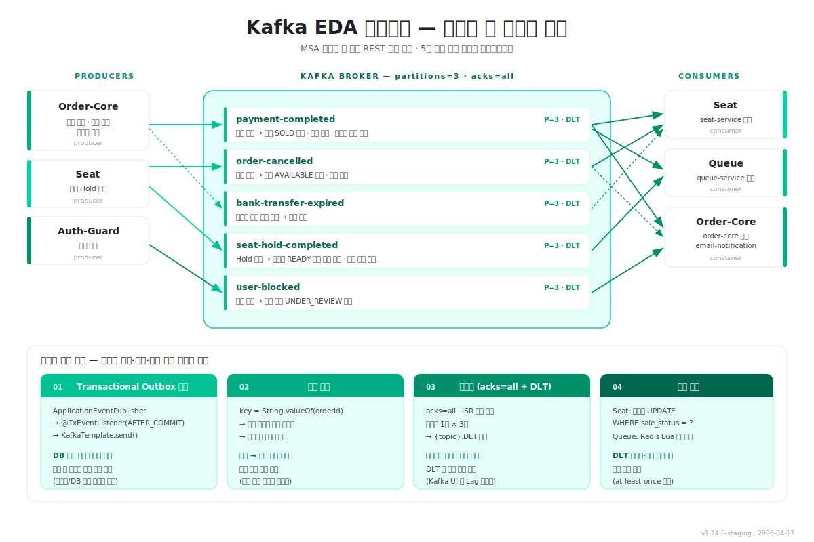

# 11장 — Kafka EDA 토폴로지: 서비스 간 비동기 통신

> **전달 메시지**
> "MSA 로 경계를 그었으니, 이제는 어떻게 통신하느냐가 문제입니다.
> 직접 REST 호출을 걷어내고 **5개 토픽 기반 이벤트 브로드캐스트**로 서비스를 느슨하게 묶었습니다."

---

## 슬라이드 시각화 초안



> **단순 참고용입니다** — 디자인은 자유롭게 작업해주세요. 정합성 패턴 4종은 장표 하단 박스에 모았지만, 필요 시 별도 장으로 쪼개셔도 됩니다.
> 편집용 원본: [slide_11_kafka_eda_topology.svg](../images/slide_11_kafka_eda_topology.svg)

---

## 슬라이드에 담을 내용

### ① 토픽 맵 — 5개 토픽 · Producer ↔ Consumer

| 토픽 | Producer | Consumer | 역할 |
|------|---------|---------|------|
| **`payment-completed`** | Order-Core | Seat · Queue · Order-Core | 결제 확정 브로드캐스트 (좌석 SOLD 전환 · READY 슬롯 회수 · 티켓 메일) |
| **`order-cancelled`** | Order-Core | Seat · Order-Core | 주문 취소 → 좌석 AVAILABLE 복원 + 취소 메일 |
| **`bank-transfer-expired`** | Order-Core | Seat | 무통장 입금 기한 만료 → 좌석 복원 |
| **`seat-hold-completed`** | Seat | Queue | Hold 확정 → 대기열 READY 슬롯 즉시 회수 (TTL 대기 제거) |
| **`user-blocked`** | Auth-Guard | Order-Core | 유저 차단 → 활성 주문 UNDER_REVIEW 전환 |

**공통 설정**: 파티션 3 · replicas 1 · acks=all · 재시도 1s × 3회 후 `{topic}.DLT` 격리

---

### ② 동기 지점을 비동기로 분리한 효과

발표용 핵심 멘트 3가지:

1. **결제 API 응답이 빨라진다**
   - 결제 확정 시 Seat(BLOCKED→SOLD) · Queue(슬롯 회수) · Order-Core(이메일) 세 도메인이 **병렬 소비**
   - 결제 API 는 이벤트 발행 직후 즉시 응답 → 좌석 전환·메일 발송 지연이 사용자 응답 시간에 포함되지 않음

2. **대기열 회전율이 오른다**
   - Seat Hold 성공 시 `seat-hold-completed` 이벤트 즉시 발행
   - Queue 가 소비 즉시 다음 대기자를 READY 승격 → **기존 스케줄러 TTL 대기 제거**

3. **서비스 계약이 단일화된다**
   - 이벤트 스키마는 `common-core` 의 `*Event` POJO + JSON Serializer 에 집중
   - 모듈 간 API 버전 협상 부담 없음, Payment 서비스 분리 시 Producer 위치만 옮기면 Consumer 무변경

---

### ③ 정합성 보장 패턴 — 4종

Kafka 를 쓸 때 항상 따라오는 **메시지 손실 · 중복 · 순서 역전** 엣지 케이스를 어떻게 막았는지.

#### ① Transactional Outbox 유사 패턴
```
ApplicationEventPublisher
  → @TransactionalEventListener(AFTER_COMMIT)
  → KafkaTemplate.send()
```
- **DB 커밋 성공 후에만 Kafka 발행**
- 롤백 시 메시지 유실 원천 차단 → 이벤트와 DB 상태의 불일치 방지

#### ② 순서 보장 — 파티션 키 전략
- `key = String.valueOf(orderId)` → 같은 주문의 이벤트는 **동일 파티션에 적재**
- 파티션 내 FIFO 소비가 보장되므로 "결제 완료 → 주문 취소" 순서가 역전되어 좌석 상태가 꼬이는 상황 방지

#### ③ 내구성 — acks=all + DLT
- **`acks=all`** → Leader + ISR 복제 완료까지 대기
- 소비 실패 시 **1초 간격 3회 재시도** → 실패 지속되면 **`{topic}.DLT`** 로 격리
- DLT 는 Kafka UI 에서 모니터링, 운영팀이 수동 대응

#### ④ 멱등 소비
- Seat: **조건부 UPDATE** (`WHERE sale_status = 'BLOCKED'`) → 중복 소비해도 상태 불변
- Queue: **Redis Lua 스크립트** 로 CAS 방식 처리
- at-least-once 전제에서도 안전하게 동작

---

### ④ 인프라 구성

- Apache Kafka 3.7.1, **KRaft 단일 노드 (Zookeeper 제거)**
- 내부 `kafka:9092` / 외부 `localhost:19092`
- 모니터링: **`provectuslabs/kafka-ui` :8090** — 토픽 · Consumer Lag · DLT 실시간 조회

---

### ⑤ 발표 포인트 (30초 내 전달)

> 1. "**직접 호출 대신 이벤트 브로드캐스트**" — 하나의 이벤트로 여러 도메인이 동시에 반응
> 2. "**AFTER_COMMIT 으로 DB 와 Kafka 상태 일관성 확보**"
> 3. "**DLT + 멱등 UPDATE 로 at-least-once 를 안전하게 처리**"
> 4. (다음 장 예고) "**시퀀스로 보면 이렇습니다**" → 12장 시퀀스 다이어그램으로 연결

---

## 참고 문서
- [01-백엔드-시스템-이너-아키텍처.md](../../01-백엔드-시스템-이너-아키텍처.md) — Kafka 설정 상세 (§3.3)
- 사이트: `/development/eda-architecture` (MSA · EDA 전환)
- 사이트: `/development/kafka-caching` (Kafka · Caffeine 캐싱)
