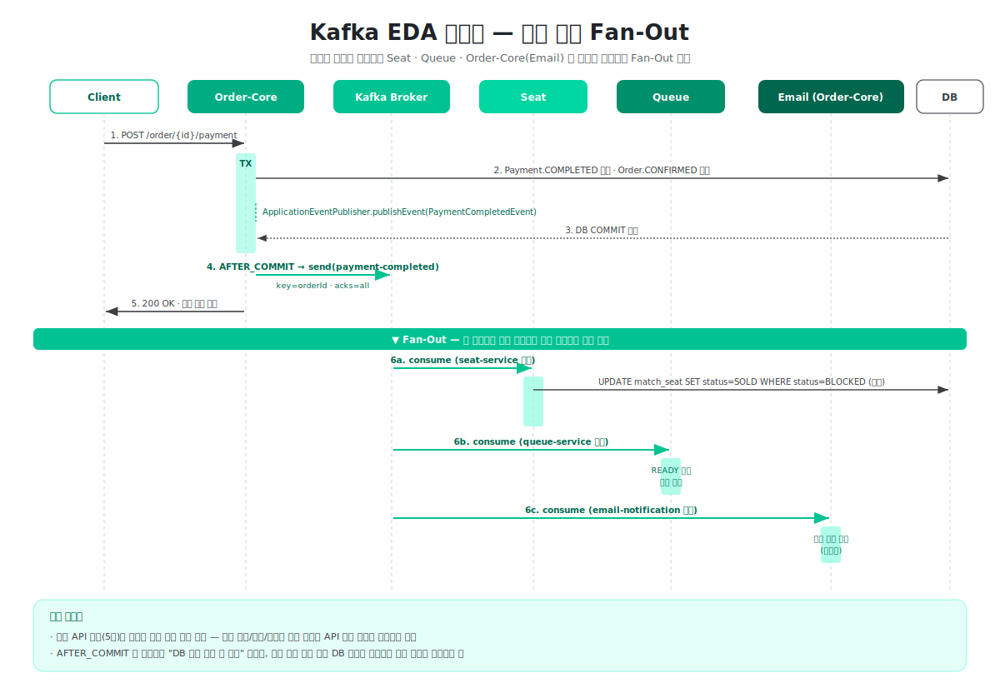

# 12장 — Kafka EDA 시퀀스: 결제 확정 Fan-Out

> **전달 메시지**
> "결제 한 번으로 **좌석 / 대기열 / 이메일** 세 도메인이 동시에 반응합니다.
> AFTER_COMMIT → Kafka → 세 컨슈머 병렬 소비. 결제 API 응답은 그 지연을 기다리지 않습니다."

---

## 슬라이드 시각화 초안



> **단순 참고용입니다** — 디자인은 자유롭게 작업해주세요. 시퀀스 라인 6개가 화면에 빽빽하면 "API 응답까지 / Fan-Out 이후" 를 2장으로 쪼개시면 깔끔합니다.
> 편집용 원본: [slide_12_kafka_eda_sequence.svg](../images/slide_12_kafka_eda_sequence.svg)

---

## 슬라이드에 담을 내용

### ① 시퀀스 — 결제 확정 플로우

```
Client  →  Order-Core  →  Kafka  →  Seat / Queue / Order-Core(Email)  →  DB
```

**단계별 메시지**

1. **Client → Order-Core**: `POST /order/{id}/payment`
2. **Order-Core → DB (TX 시작)**: `Payment.COMPLETED` · `Order.CONFIRMED` 저장
3. **Order-Core 내부**: `ApplicationEventPublisher.publishEvent(PaymentCompletedEvent)` 호출 — 아직 발행 아님
4. **DB COMMIT**
5. **@TransactionalEventListener(AFTER_COMMIT) → `KafkaTemplate.send("payment-completed")`**
   - `key = orderId` · `acks = all`
6. **Order-Core → Client**: `200 OK` 즉시 응답

**▼ Fan-Out (여기서부터 병렬 소비)**

- **6a.** `seat-service` 그룹 → `UPDATE match_seat SET sale_status = SOLD WHERE sale_status = BLOCKED` (멱등)
- **6b.** `queue-service` 그룹 → READY 슬롯 즉시 회수 → 다음 대기자 승격
- **6c.** `email-notification` 그룹 → 티켓 이메일 비동기 발송

---

### ② 핵심 포인트 (장표 하단 박스)

> **① 결제 API 응답(5번)은 이벤트 발행 직후 즉시 반환된다**
> → 좌석 전환 · 메일 발송 · 대기열 회수 지연이 사용자 응답 시간에 포함되지 않음

> **② AFTER_COMMIT 이 보장하는 "DB 커밋 성공 후 발행" 덕분에,**
> → 소비 측은 항상 최신 DB 상태를 기준으로 멱등 처리만 수행하면 됨 (이벤트 ↔ DB 불일치 없음)

> **③ 세 컨슈머는 서로 다른 Consumer Group 이므로 동일 메시지를 독립적으로 소비한다**
> → 한 컨슈머가 느려져도 다른 컨슈머의 처리는 영향받지 않음 (장애 격리)

---

### ③ 다른 플로우는? — 3종 추가 시퀀스 요약

발표에서는 결제 확정 1종만 그림으로 보여주고, 나머지는 말로만 언급하는 것을 추천합니다.

#### 주문 취소 플로우 (`order-cancelled`)
```
Client → Order-Core → (TX) → Kafka order-cancelled
  → Seat: UPDATE match_seat SET sale_status=AVAILABLE WHERE sale_status=SOLD
  → Order-Core(Email): 취소 메일 발송
```

#### 무통장 입금 만료 (`bank-transfer-expired`)
```
BankTransferExpirationScheduler (5분 주기)
  → Order-Core: 만료 주문 찾아 결제 취소 → Kafka bank-transfer-expired
  → Seat: 좌석 복원 (AVAILABLE)
```

#### 유저 차단 (`user-blocked`)
```
Auth-Guard 관리자 API → (TX) → Kafka user-blocked
  → Order-Core: 해당 유저의 활성 주문을 UNDER_REVIEW 상태로 전환
```

#### 대기열 즉시 승격 (`seat-hold-completed`)
```
Seat: Hold 성공 → (TX) → Kafka seat-hold-completed
  → Queue: 해당 유저의 READY 슬롯 회수 → 다음 대기자 즉시 승격 (TTL 대기 없음)
```

---

### ④ 발표 포인트 (30초 내 전달)

> 1. "**결제 한 번이 세 개의 도메인을 깨운다**"
> 2. "**API 응답은 그걸 기다리지 않는다 — 그래서 빠르다**"
> 3. "**멱등 UPDATE 덕분에 재시도·DLT 재발행에도 안전하다**"

---

## 참고 문서
- [01-백엔드-시스템-이너-아키텍처.md](../../01-백엔드-시스템-이너-아키텍처.md) — Kafka 토픽 테이블 (§3.3)
- 사이트: `/development/eda-architecture` (MSA · EDA 전환)
- 코드: `Order-Core/.../kafka/publisher/PaymentEventPublisher.java` — Producer
- 코드: `Seat/.../kafka/consumer/PaymentCompletedEventConsumer.java` — Consumer
- 코드: `Queue/.../kafka/consumer/QueueSlotReleaseConsumer.java` — Consumer
