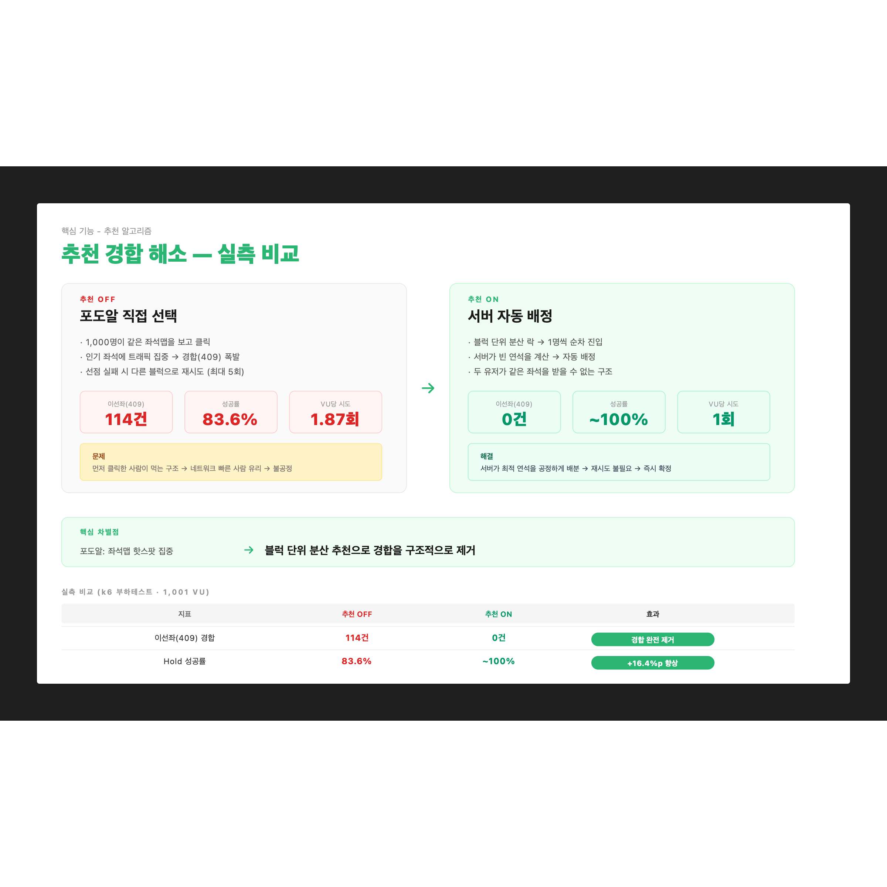

# 추천 서비스 — 좌석 경합을 구조적으로 해소한다

> **전달 메시지**
> "추천 서비스는 편의 기능이 아닙니다.
> 포도알 직접 선택에서 발생하는 좌석 경합(409)을 **구조적으로 제거**하여
> 시스템 안정성과 유저 공정성을 함께 확보한 핵심 설계입니다."

---

## 슬라이드 시각화 초안

> **단순 참고용입니다** — 디자인은 자유롭게 작업해주세요. 내용이 많다면 슬라이드를 더 쪼개주셔도 됩니다.
> 편집용 원본: [slide_recommendation_contention.svg](../images/slide_recommendation_contention.svg)

---

## 슬라이드에 담을 내용

### ① 추천 OFF (포도알) — 경합이 발생하는 구조

1,000명이 **같은 좌석맵**을 보고 **같은 인기 좌석**을 클릭합니다.
좌석 단위 락으로 동시성을 제어하지만, 본질적으로 "먼저 클릭한 사람이 먹는" 경합 구조입니다.

| 지표 | 값 |
|------|-----|
| **이선좌(409) 경합** | **114건** |
| Hold 성공률 | **83.6%** (92/110 VU) |
| VU당 평균 시도 | **1.87회** (재시도 필요) |
| VU당 시도 P95 | 4회 |

**문제**:
- 인기 좌석에 트래픽 집중 → 409 → 재시도 → 서버 부하 증가
- 18명(16.4%)은 모든 블럭 시도 후에도 실패
- 재시도 반복 → 유저 이탈 + 불공정 (네트워크 빠른 사람 유리)

### ② 추천 ON (자동 배정) — 경합이 없는 구조

서버가 **블럭 단위 Redisson 분산 락**(Watch Dog)을 잡고 **1명씩 순차 진입**시킵니다.
빈 연석을 서버가 계산해서 배정하므로, 두 유저가 같은 좌석을 받을 수 없습니다.

| 지표 | 값 |
|------|-----|
| **이선좌(409) 경합** | **0건** |
| Hold 성공률 | **~100%** |
| VU당 시도 | **1회** (즉시 확정) |
| 연석 없음(404) | 4건 (좌석 자체 소진) |

**왜 0건인가?**:
- 블럭 락 → 한 번에 1명만 진입 → 빈 좌석 조회 → 배정 → 락 해제 → 다음 사람
- 전 사용자가 서로 다른 연석을 받으므로 겹칠 수 없음

### ③ 비교 테이블 (부하테스트 1,000 VU 실측)

| 지표 | 추천 OFF (포도알) | 추천 ON (자동배정) | 효과 |
|------|----------------|----------------|------|
| 이선좌(409) 경합 | **114건** | **0건** | **경합 완전 제거** |
| Hold 성공률 | 83.6% | ~100% | **+16.4%p** |
| VU당 평균 시도 | 1.87회 (재시도) | 1회 (즉시 확정) | 재시도 불필요 |

### ④ 핵심 메시지

> 포도알: **"인기 좌석을 먼저 클릭한 사람이 먹는다"**
> 추천: **"서버가 최적 연석을 공정하게 배분한다"**

추천 서비스는 단순히 "좌석 고르기 귀찮은 유저를 위한 편의 기능"이 아니라:
1. **경합 구조 자체를 제거** → 서버 안정성 (재시도 트래픽 소멸)
2. **100% 성공률** → 유저 이탈 방지
3. **공정한 배분** → 네트워크 속도가 아닌 취향 기반 배정

### ⑤ 정렬 기준 문구 제안

현재 장표: "좌석 차이가 +-10 이내면, 유저의 온보딩 선호도 반영"

**추천 문구**: **"비슷하게 앉을 수 있다면, 취향이 맞는 블럭 우선"**

또는 간결하게: **"연석 차이 ±10 이내 → 취향 점수로 결정"**

("온보딩 선호도"는 구현 용어, "취향"이 관객에게 더 직관적)

---

## 데이터 출처

| 데이터 | 원본 파일 |
|-------|---------|
| 추천 OFF 결과 | `부하테스트/20-추천 off 1000개/k6-test-result-2026.-4.-16.-오전-10-40-40_load.md` |
| 추천 ON 결과 | `부하테스트/15-httplient pool을 늘리고.../추처on 1000명 페이즈12-httpclient pool늘림 k6-test-result-..._load.md` |
| 추천 알고리즘 코드 | `Seat/src/.../recommendation/service/PreferenceScoreCalculator.java` (취향 점수 0~70) |
| 분산 락 코드 | `Seat/src/.../recommendation/service/SeatBlockLock.java` (블럭 단위 Redisson Watch Dog) |

---

## 참고 문서
- [03-추천-서비스-알고리즘.md](../../03-추천-서비스-알고리즘.md) — 알고리즘 상세
- [04-좌석-분산락-Hold-동시성-경합.md](../../04-좌석-분산락-Hold-동시성-경합.md) — 경합 해결 방식
- 사이트: `/development/recommendation` (추천 알고리즘)
- 사이트: `/development/seat-concurrency` (좌석 분산락/Hold 동시성)
