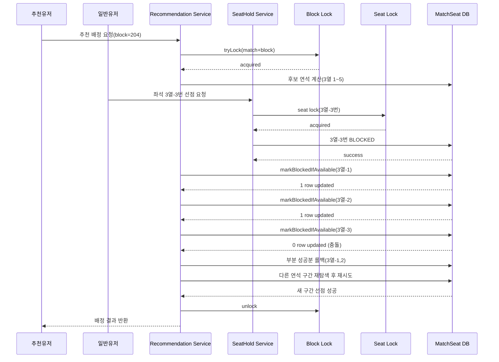
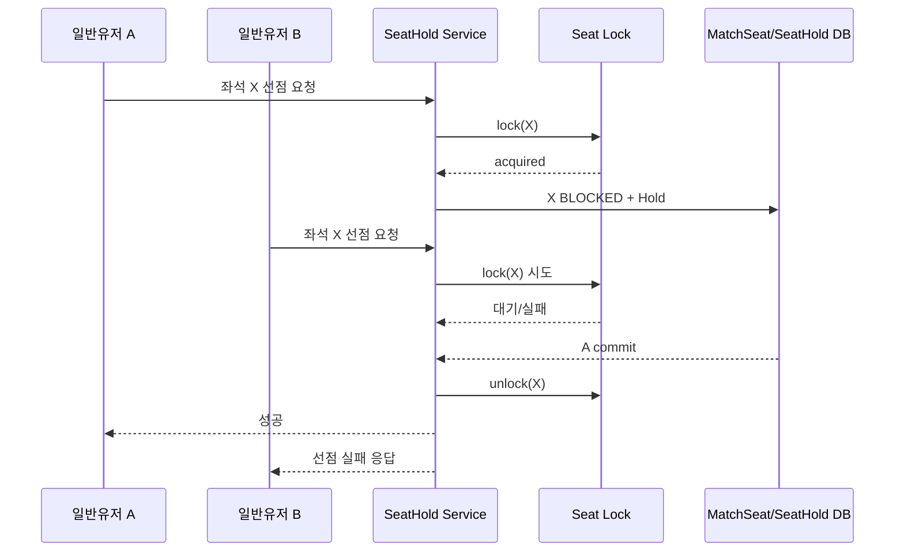

# 추천 좌석 vs 일반 좌석 동시성 경합

## 1. 경합이 생기는 이유

좌석 선점 경로는 2개다.

| 경로      | 락 단위      | 처리 특성                         |
| --------- | ------------ | --------------------------------- |
| 추천 배정 | 블럭 단위 락 | 블럭 전체 조회 후 N연석 계산/선점 |
| 일반 선택 | 좌석 단위 락 | 사용자가 고른 좌석 즉시 선점      |

중요 포인트

- 락 키 체계가 다르다.
- 즉, 추천이 블럭 락을 잡고 있어도 일반은 좌석 락을 잡을 수 있다.

결론

- 교차 경합(추천 vs 일반)은 "락만으로 직렬화"되지 않는다.
- 별도의 최종 정합성 방어가 반드시 필요하다.

---

## 2. 교차 경합 기본 시나리오

상황

- 추천 요청이 블럭 204에서 [3열 1~5]를 유력 후보로 계산
- 같은 시점에 일반 사용자가 3열 3번을 클릭

시간순 흐름

1. 추천 경로: 블럭 락 획득, 후보 연석 계산
2. 일반 경로: 좌석 락 획득, 3열 3번 선점
3. 추천 경로: 조건부 UPDATE 수행 중 3열 3번에서 0건 발생
4. 추천 경로: 이번 시도에서 선점한 나머지 좌석 롤백
5. 추천 경로: 다른 연석 구간으로 재탐색/재시도

핵심

- 교차 경합은 "오류"가 아니라 "예상 가능한 정상 경쟁 상황"으로 처리해야 한다.

---

## 3. 최종 방어: DB 조건부 UPDATE

추천 배정은 좌석을 확정할 때 아래 의미를 사용한다.

- 1건 업데이트: 내가 먼저 선점 성공
- 0건 업데이트: 이미 누군가 선점(충돌)

장점

- 분산락 체계가 달라도, 실제 좌석 상태는 DB에서 원자적으로 판정 가능
- 충돌 감지가 명확함(모호한 상태 최소화)

---

## 4. 부분 롤백이 필요한 이유

추천은 좌석을 "묶음"으로 선점한다.
예: 5연석 선점 시도 중

- 1,2,4,5번 성공
- 3번 충돌

이때 1,2,4,5를 유지하면 오염 상태가 된다.

- 사용자 입장: 최종 배정 실패인데 일부 좌석이 막힘
- 시스템 입장: 잔여 좌석 계산 왜곡

현재 전략

- 이번 시도에서 성공한 좌석을 즉시 AVAILABLE로 롤백
- 재탐색으로 새 연석 구간 시도

효과

- 정합성 유지
- 사용자 경험 보호(다음 시도로 성공 가능성 확보)

---

## 5. 재탐색/재시도 정책

권장 흐름

1. 진짜 연석 우선 탐색
2. 충돌 시 재탐색(최대 횟수 제한)
3. 진짜 연석 실패 누적 시 옵션에 따라 준연석 fallback
4. 최종 실패 시 명확한 실패 응답

정책 의도

- 무한 재시도 방지
- 응답시간 상한 보장
- 피크 구간에서 시스템 과부하 제어

---

## 6. 시퀀스 다이어그램

### A) 추천 vs 일반 교차 경합

### B) 일반 vs 일반 (같은 좌석)

---

## 7. 실패 모드와 대응

| 실패 모드      | 설명                            | 대응                               |
| -------------- | ------------------------------- | ---------------------------------- |
| 교차 경합 충돌 | 추천 후보 중 일부를 일반이 선점 | 조건부 UPDATE 0건 감지 + 부분 롤백 |
| 재시도 소진    | 피크 경쟁으로 연속 충돌         | 재탐색 제한 후 실패 반환           |
| 대기 초과      | lock waitTime 내 획득 실패      | 즉시 실패 응답으로 상한 시간 보장  |
