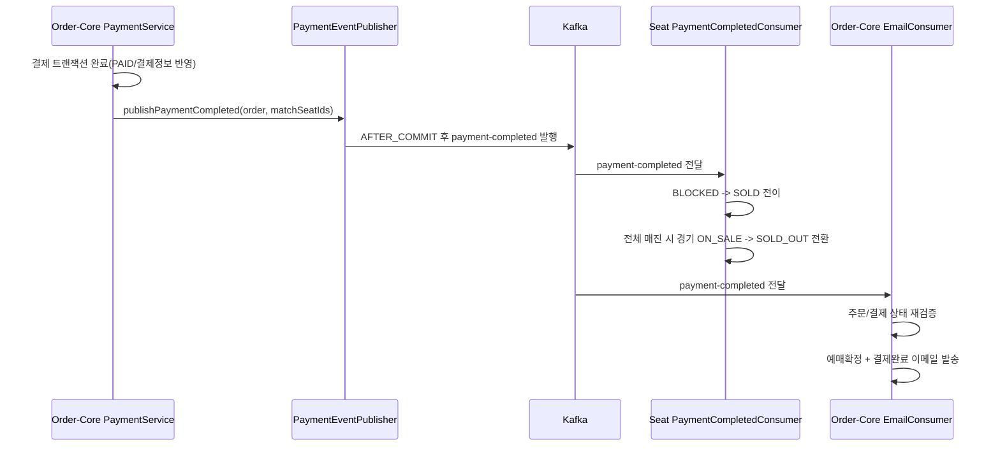
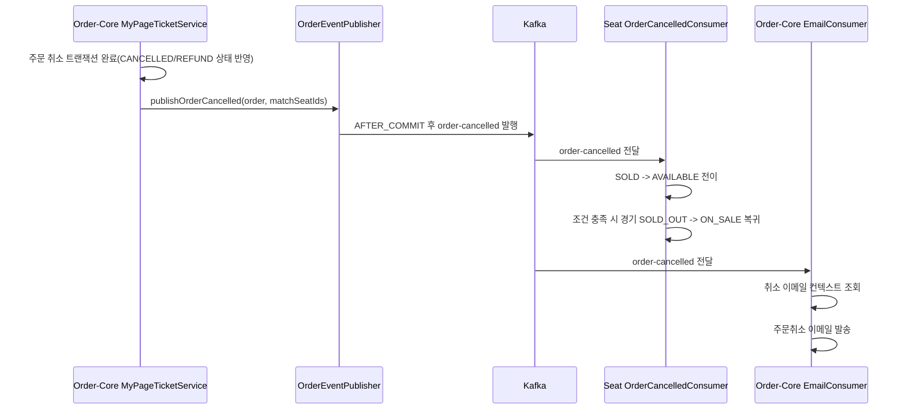
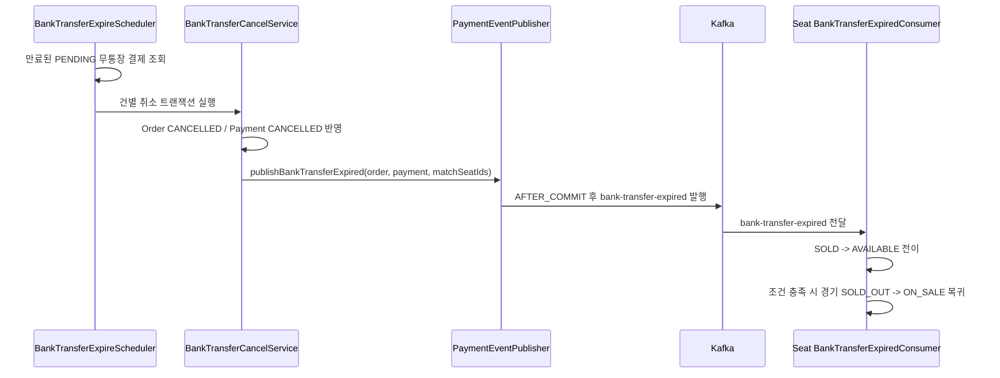
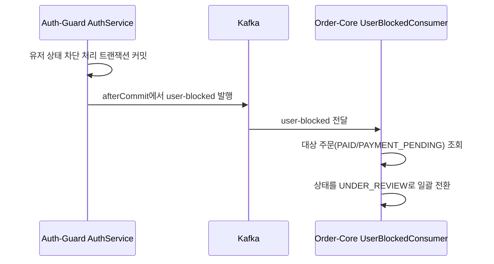
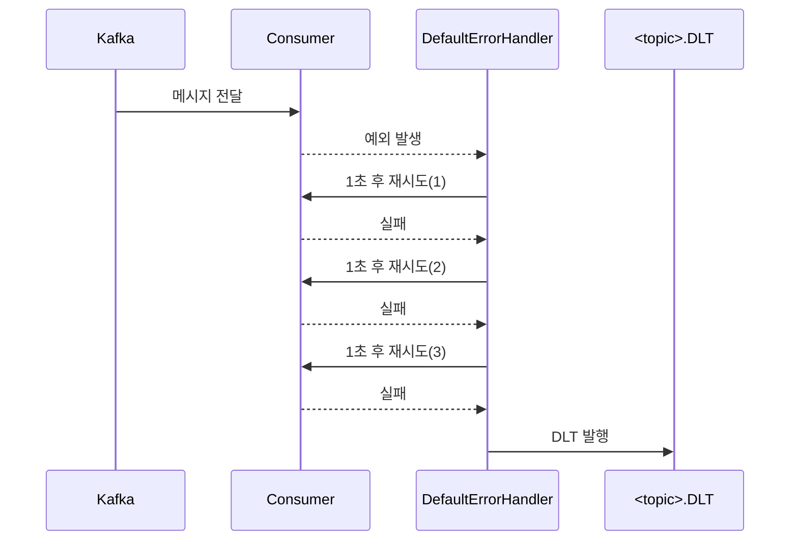

# Kafka 이벤트 아키텍처

## 1. Kafka 도입 이유

### 1-1. 서비스 경계 분리(결합도 완화)

티켓팅 도메인에서는 하나의 비즈니스 동작이 여러 서비스의 상태를 동시에 바꾼다.

예시

- 결제 완료: Order-Core 결제/주문 상태 변경 + Seat 좌석 SOLD 반영 + 이메일 발송
- 주문 취소: Order-Core 주문 취소 + Seat 좌석 AVAILABLE 복원 + 이메일 발송
- 유저 차단: Auth-Guard 유저 상태 변경 + Order-Core 주문 상태 UNDER_REVIEW 전환

이 흐름을 동기 호출/직접 DB 업데이트로 묶으면

- 서비스 간 강결합
- 장애 전파
- 배포/변경 영향 범위 확대
  문제가 발생한다.

Kafka 도입 후에는

- 상태 변경은 각 서비스가 자신의 데이터에서 처리
- 다른 서비스에는 이벤트로 통지
  구조로 분리되어 책임 경계가 명확해진다.

### 1-2. 트랜잭션 후속 처리의 안전한 분리

핵심 이벤트는 "DB 커밋 이후"에 발행되도록 구현되어 있다.
즉, 로컬 트랜잭션이 실패한 변경이 외부 이벤트로 먼저 퍼지는 일을 줄인다.

### 1-3. 피크 트래픽에서의 완충

소비자 장애/일시적 오류가 나더라도 즉시 전체 플로우가 멈추지 않도록
재시도 + DLT로 실패 메시지를 격리한다.

---

## 2. 현재 Kafka 구현 구성요소

## 2-1. 인프라

- 브로커: `apache/kafka:3.7.1`
- Docker 설정:
  - internal listener: `kafka:9092`
  - external listener: `localhost:9092`
- 기본 파티션: `3` (`KAFKA_NUM_PARTITIONS=3`)
- Kafka UI: `provectuslabs/kafka-ui` 포함

## 2-2. 공통 토픽 정의

공통 상수(`EventTopic`)로 운영 토픽명을 관리한다.

운영 토픽

- `payment-completed`
- `order-cancelled`
- `bank-transfer-expired`
- `user-blocked`

DLT 토픽(현재 Bean 생성)

- `payment-completed.DLT`
- `order-cancelled.DLT`
- `bank-transfer-expired.DLT`

토픽 스펙

- partitions: 3
- replicas: 1

## 2-3. 이벤트 스키마(공유 DTO)

common-core에 이벤트 payload 클래스를 공용으로 둔다.

- `PaymentCompletedEvent`
  - `orderId, userId, matchId, matchSeatIds, paymentMethod, totalAmount, occurredAt`
- `OrderCancelledEvent`
  - `orderId, userId, matchId, matchSeatIds, cancellationFee, refundedAmount, occurredAt`
- `BankTransferExpiredEvent`
  - `orderId, userId, matchId, paymentId, matchSeatIds, occurredAt`
- `UserBlockedEvent`
  - `userId, occurredAt`

---

## 3. 서비스별 Producer / Consumer 구성

| 서비스     | Producer                                                         | Consumer                                                         | 역할                                                             |
| ---------- | ---------------------------------------------------------------- | ---------------------------------------------------------------- | ---------------------------------------------------------------- |
| Auth-Guard | USER_BLOCKED 발행                                                | 없음                                                             | 유저 차단 이벤트 발행                                            |
| Order-Core | PAYMENT_COMPLETED / ORDER_CANCELLED / BANK_TRANSFER_EXPIRED 발행 | PAYMENT_COMPLETED / ORDER_CANCELLED / USER_BLOCKED 소비          | 결제/주문 도메인 이벤트 발행, 이메일 발송, 차단 후 주문상태 변경 |
| Seat       | 없음(현재)                                                       | PAYMENT_COMPLETED / ORDER_CANCELLED / BANK_TRANSFER_EXPIRED 소비 | 좌석 상태 전이 반영 및 경기 상태 업데이트                        |
| Queue      | 없음                                                             | 없음                                                             | Kafka 비사용(현재 범위)                                          |

---

## 4. 핵심 구현 포인트

## 4-1. 발행 시점 보장: "커밋 후 발행"

Order-Core는 내부 이벤트를 먼저 발행하고,
`@TransactionalEventListener(AFTER_COMMIT)`에서 Kafka로 publish한다.

의미

- 로컬 DB 변경이 커밋된 뒤에만 외부 이벤트 전파
- "롤백된 상태가 이벤트로 퍼지는 문제" 감소

Auth-Guard의 USER_BLOCKED도 같은 목적을 위해
`TransactionSynchronization.afterCommit()`에서 Kafka 발행한다.

## 4-2. 메시지 Key 전략

- 주문 기반 이벤트는 `orderId`를 key로 전송
- 유저 차단 이벤트는 `userId`를 key로 전송

효과

- 같은 key 메시지가 동일 파티션에 라우팅될 가능성이 높아
  관련 이벤트 순서 안정성에 유리

## 4-3. Producer 내구성 설정

환경 변수 기준으로

- `acks=all`
  설정을 사용한다.

의미

- 리더/복제 확인 기준으로 전송 ack를 받으므로
  `acks=1`보다 안전성을 우선한다.

---

## 5. 컨슈머 보장 전략

현재 전략은 "완전한 exactly-once"가 아니라
**at-least-once + 멱등(또는 준멱등) 처리 + DLT 격리** 모델이다.

## 5-1. 에러 처리 표준

Seat / Order-Core 모두 동일한 `CommonErrorHandler`를 사용한다.

정책

- 재시도: `FixedBackOff(1000ms, 3회)`
- 3회 실패 시: `DeadLetterPublishingRecoverer`로 `<원본토픽>.DLT` 발행
- DLT 라우팅: 원본 partition 유지

즉, 한 레코드 처리 실패 시

1. 즉시 실패하지 않고 최대 3회 재시도
2. 그래도 실패하면 DLT로 격리
3. 메인 소비 흐름은 계속 진행

## 5-2. Seat 컨슈머의 멱등/중복 내성

Seat 소비자는 "현재 상태를 보고 목표 상태로 전이"하는 방식이다.

예시

- 결제 완료 컨슈머:
  - BLOCKED -> SOLD: update
  - 이미 SOLD: skip
  - 그 외 상태: warn + skip

- 주문취소/입금만료 컨슈머:
  - SOLD -> AVAILABLE: update
  - 이미 AVAILABLE: skip
  - 그 외 상태: warn + skip

이 패턴은 중복 소비가 발생해도
동일 상태 재적용에서 부작용을 줄이도록 설계되어 있다.

## 5-3. Order-Core 소비자의 보장 특성

- EmailEventConsumer
  - 주문 존재/결제 상태 조건을 다시 조회한 뒤 메일 발송
  - 메시지 중복 자체를 DB에 별도 dedupe 키로 막지는 않으므로,
    이론적으로 중복 전달 시 중복 발송 가능성은 남는다.

- UserBlockedEventConsumer
  - 대상 상태(PAID, PAYMENT_PENDING)만 UNDER_REVIEW로 일괄 변경
  - 이미 UNDER_REVIEW 등으로 바뀐 건은 추가 변경이 없어 재실행 내성이 있음

---

## 6. 전체 Kafka 구현 다이어그램

### A) `payment-completed` 이벤트 플로우

### B) `order-cancelled` 이벤트 플로우

### C) `bank-transfer-expired` 이벤트 플로우

### D) `user-blocked` 이벤트 플로우

### E) 컨슈머 실패 -> 재시도 -> DLT

