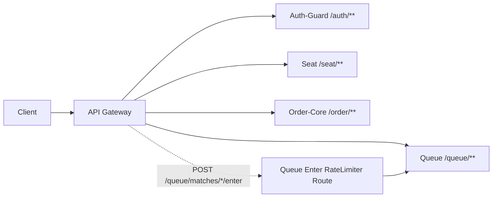

# API Gateway

## 1. 한 줄 요약

API Gateway는 WebFlux 기반 단일 진입점으로 인증, 라우팅, 레이트리밋, 보안 필터링, 관측 로깅을 중앙 처리한다.

## 2. 구현 목적

- 인증/권한 검증을 게이트웨이에서 선처리해 다운스트림 부하 축소
- 봇/폭주 요청을 진입 초기에 차단
- 서비스별 라우팅 정책을 한 곳에서 운영
- 429/보안 이벤트를 중앙 관측

## 3. 라우팅 구성

주요 라우트

- `/auth/**` -> Auth-Guard
- `POST /queue/matches/*/enter` -> Queue (전용 rate limiter)
- `/queue/**` -> Queue
- `/seat/**` -> Seat
- `/order/**` -> Order-Core

설정 파일

- `API-Gateway/src/main/resources/application.yaml`

### 라우팅 아키텍처 다이어그램



## 4. 필터 체인 순서

1. `CorsGlobalFilter` (`HIGHEST_PRECEDENCE`)
2. `RateLimitingFilter` (`-3`, prod 프로필)
3. `BotUserAgentBlockFilter` (`-2`)
4. `JwtAuthenticationFilter` (`-1`)
5. `RateLimitMonitoringFilter` (`LOWEST_PRECEDENCE`)

### 필터 체인 다이어그램

```mermaid
flowchart LR
    REQ[Incoming Request]
    CORS[CorsGlobalFilter]
    RATE[RateLimitingFilter (-3, prod)]
    BOT[BotUserAgentBlockFilter (-2)]
    JWT[JwtAuthenticationFilter (-1)]
    ROUTE[Route to Downstream]
    MON[RateLimitMonitoringFilter (response after-chain)]
    RESP[Response]

    REQ --> CORS --> RATE --> BOT --> JWT --> ROUTE --> MON --> RESP
```

## 5. JWT 인증 처리

`JwtAuthenticationFilter` 동작

1. 화이트리스트 경로/메서드 확인
2. Bearer 토큰 파싱
3. RS256 서명, issuer, audience 검증
4. ACCESS 타입 검증
5. Redis 블랙리스트(`token_blacklist:{jti}`) 확인
6. 다운스트림 헤더 주입

주입 헤더

- `X-User-Id`
- `X-User-Role`
- `X-Session-Id`
- `X-Token-Jti`

## 6. 레이트리밋 구조

### 6.1 Queue Enter 전용 제한 (RequestRateLimiter)

대상

- `POST /queue/matches/*/enter`

기본 파라미터

- `replenishRate=3`
- `burstCapacity=10`
- `requestedTokens=1`

키 전략

- `userOrIpKeyResolver`
- 우선순위: `uid:{userId}` -> `ip:{x-forwarded-for}` -> `ip:{remote}` -> `ip:unknown`

### 6.2 글로벌 커스텀 제한 (prod)

`RateLimitingFilter` 기준

- 로그인 API: 분당 10회
- 일반 API: 분당 100회
- Redis 에러 시 fail-open(가용성 우선)

## 7. 봇/자동화 차단

`BotUserAgentBlockFilter`

- 대상: `POST /queue/matches/{id}/enter`
- 차단: 빈/짧은 UA, 자동화 도구 키워드(`curl`, `python`, `selenium`, `headless` 등)
- 차단 시 `403 Forbidden`

## 8. 관측/모니터링

`RateLimitMonitoringFilter`

- 429 응답 발생 시 `key`, `path`, `clientIp`를 warn 로그로 남김

`GatewayObservationConfig`

- path 정규화(`/{id}`, `/{uuid}`)로 메트릭 cardinality 폭증 방지
- route 태그 최대 100 제한

## 9. 발표용 핵심 메시지

- 인증과 트래픽 제어를 Gateway에서 먼저 처리해 하위 서비스 보호
- queue enter를 별도 라우트/정책으로 분리해 티켓팅 트래픽에 특화 대응
- 사용자 기반 키 + IP fallback으로 공정성과 방어를 균형 있게 확보

## 10. 예상 Q&A

- 왜 user 우선 키인가?
  - 로그인 사용자는 사용자 단위로 공정하게 제어 가능
- 왜 fail-open인가?
  - Redis 장애 시 전체 차단보다 서비스 가용성 유지 우선
- JWT를 Gateway에서 검증하는 이유?
  - 중복 인증 제거와 정책 중앙화
