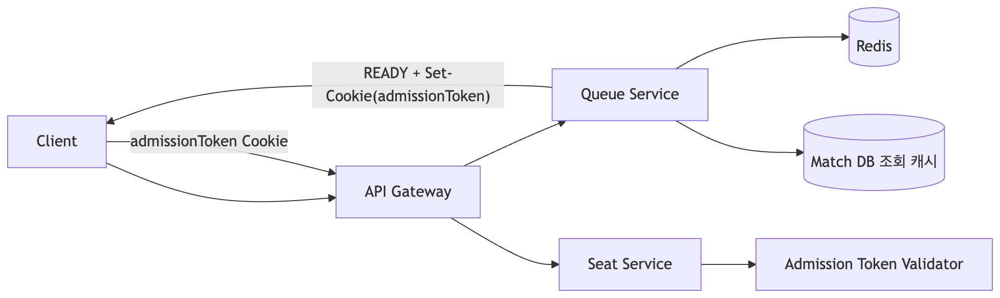
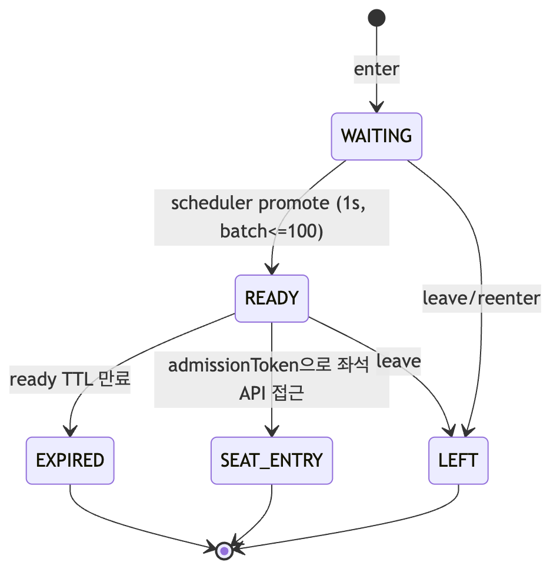

# 대기열 진입 아키텍처

## 1. 한 줄 요약

Queue 서비스는 Redis 기반 대기열(ZSET)과 1초 승격 스케줄러를 사용해 `WAITING -> READY`를 처리하고, READY 사용자에게 Admission Token(JWT)을 발급해 Seat 서비스 입장 권한을 부여한다.

## 2. 구현 목적

- 티켓 오픈 순간 트래픽을 DB가 직접 받지 않도록 Redis 중심으로 처리
- 선착순 공정성 보장(진입 시각 기반 정렬)
- READY 체류시간을 제한해 점유 방지
- Seat 서비스에서 독립 검증 가능한 입장 토큰 사용

## 3. 아키텍처 개요

`Client -> API Gateway -> Queue Service -> Redis`

`Client(admissionToken 쿠키) -> API Gateway -> Seat Service(토큰 검증)`

### 아키텍처 다이어그램

핵심 구성요소

- Queue API: `QueueController`
- 큐 도메인 로직: `QueueService`
- 승격 로직: `QueuePromotionService`
- 승격 스케줄러: `QueuePromotionScheduler`
- Redis 저장소: `QueueRedisRepository`

## 4. Redis 키 설계

- `queue:wait:{matchId}`: ZSET (member=userId, score=enteredAtMillis)
- `queue:ready:{matchId}:{userId}`: String(JSON, TTL)
- `queue:ready:index:{matchId}`: SET (READY 사용자 인덱스)
- `queue:expired:{matchId}:{userId}`: String(TTL)
- `queue:match`: SET (활성 경기 목록)

## 5. API 흐름

### 5.1 대기열 진입 `POST /queue/matches/{matchId}/enter`

1. 인증 및 PreQueue 옵션 검증
2. 경기 오픈 가능 여부 검증
3. `reenterQueueAtomic`(Lua) 실행
4. WAITING 상태와 rank/total 반환

### 5.2 상태 조회 `GET /queue/matches/{matchId}/status`

1. READY 토큰 조회
2. 토큰 TTL > 0이면 READY 반환 + `Set-Cookie(admissionToken)`
3. 토큰 만료 시 expired marker 기록
4. expired marker 존재 시 `ADMISSION_TOKEN_EXPIRED`
5. 아니면 WAITING rank/total/pollingMs 반환

### 5.3 이탈 `DELETE /queue/matches/{matchId}/enter` (Deprecated)

- `leaveQueueAtomic`(Lua)로 WAITING/READY/EXPIRED/인덱스 정리
- 조건 충족 시 active match에서도 제거

### 큐 상태 전이 다이어그램

## 6. 승격 스케줄러 상세

- 주기: `promotion-interval-ms=1000` (1초)
- 배치 크기: `promotion-batch-size=100`
- 동작:

1. active match 목록 순회
2. 만료된 READY 인덱스 동기화
3. `permit = 100 - activeReadyCount`
4. ZSET에서 `popMin`으로 permit만큼 승격
5. Admission JWT 발급 후 READY 저장

## 7. 토큰/쿠키/TTL

기본 파라미터

- READY TTL: `60s`
- Admission Token TTL: `900s`
- Expired Marker TTL: `300s`

쿠키 정책

- `HttpOnly=true`
- `Secure=true`
- `SameSite=None`
- `Path=/`

JWT

- Queue: RS256 개인키로 발급
- Seat: 공개키로 검증 (`issuer`, `type`, `userId`, `matchId`)

## 8. 공정성/안정성 포인트

- ZSET score(enteredAtMillis) 기반 선착순
- Lua 원자 연산으로 경쟁조건 완화
- READY stale index를 스케줄러에서 정리
- rank 기반 polling 간격 조절로 과도한 폴링 완화

## 9. 발표에서 강조할 수치

- 1초 간격 승격
- 경기당 최대 100명 배치 승격
- READY 유효시간 60초
- Admission Token 유효시간 900초

## 10. 예상 Q&A

- 왜 ZSET인가?
  - 진입 시각 기준 정렬과 `popMin` 처리에 최적
- 만료/인덱스 불일치 문제는?
  - `syncExpiredReadyUsers`로 주기 동기화
- 토큰 위변조 방지는?
  - RS256 서명 + claim 검증
