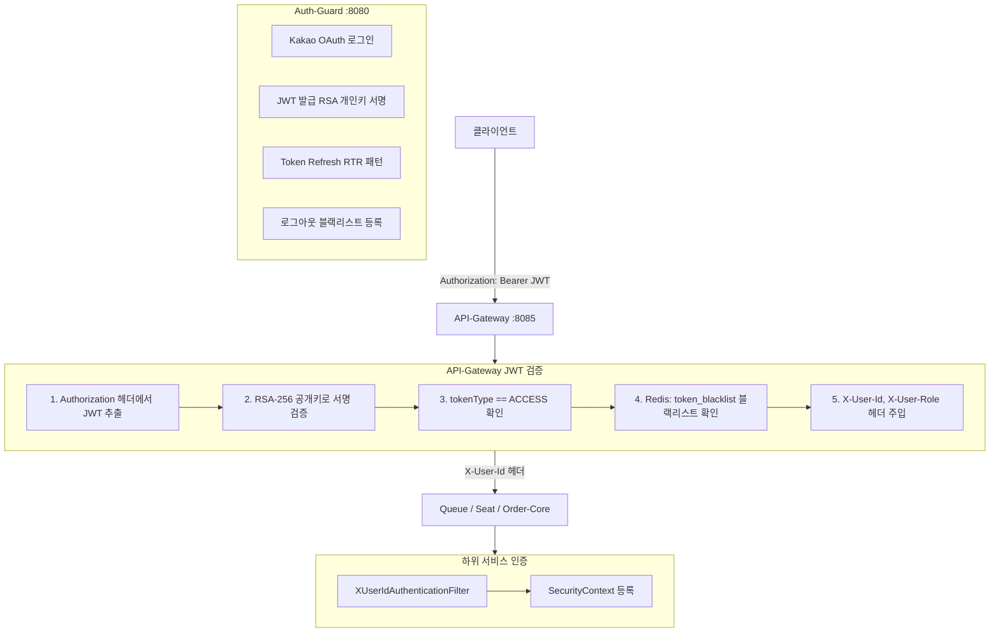

# 인증 아키텍처

RSA 비대칭키 방식을 사용합니다. **Auth-Guard가 개인키로 서명**하고, **API Gateway가 공개키로 검증**합니다. Gateway만 JWT를 파싱하고, 하위 서비스는 `X-User-Id` 헤더만 읽습니다.

---

## JWT 중앙 검증 구조

---

## 토큰 설계

| 토큰 | TTL | 저장 위치 | 용도 |
|---|---|---|---|
| **Access Token** | 15분 | 클라이언트 메모리 | API 인증 |
| **Refresh Token** | 7일 | HttpOnly Secure Cookie + Redis | 토큰 재발급 (RTR) |
| **Admission Token** | 30초 | Redis (`queue:ready`) | 대기열 통과 → Seat 진입권 |
| **Seat Hold** | 5분 | PostgreSQL (`seat_holds`) | 좌석 점유 → 주문 생성 권한 |

---

## 핵심 설계 포인트

**RTR (Refresh Token Rotation)** 패턴으로 토큰을 재발급할 때 기존 Refresh Token을 즉시 폐기합니다. 토큰 탈취 시에도 재사용이 불가능합니다.

로그아웃 시에는 Access Token의 JTI를 Redis 블랙리스트에 등록하고, 남은 TTL 동안 API Gateway에서 해당 토큰을 차단합니다.

서비스 간 신뢰는 **Admission Token**(대기열 → 좌석)과 **Seat Hold**(좌석 → 주문) 2단계로 분리하여, 대기열 우회와 중복 주문을 원천 차단합니다.
