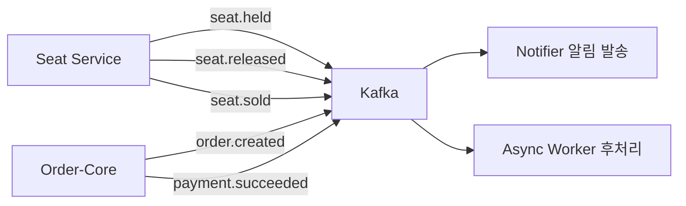

# 백엔드 개요

백엔드팀은 두 가지 목표를 중심으로 시스템을 구축했습니다. **MSA 기반의 티켓팅 시스템**으로 대기열부터 결제까지 전체 플로우를 안정적으로 처리하는 것, 그리고 **추천 좌석 배정 알고리즘**으로 사용자 취향을 반영한 연석 배정을 보장하는 것입니다.

---

## 구현 현황

| 구분 | 내용 | 상태 |
|---|---|---|
| **MSA 아키텍처** | 5개 서비스 + API Gateway + 공통 모듈 | ✅ 완료 |
| **인증/인가** | JWT RSA-256 + API Gateway 중앙화 | ✅ 완료 |
| **좌석 추천/배정** | 연석 탐색 + 선호도 점수 + 분산 락 | ✅ 완료 |
| **주문/결제** | Hold 검증 + Mock 결제 + 마이페이지 | ✅ 완료 |
| **대기열** | Redis ZSET 기반 대기열 + Admission Token | 🔧 진행 중 |

---

## 서비스 구성

| 서비스 | 포트 | 핵심 책임 |
|---|---|---|
| **API-Gateway** | 8085 | JWT 중앙 검증 (RSA 공개키), 라우팅, CORS, Swagger 통합 |
| **Auth-Guard** | 8080 | Kakao OAuth, JWT 발급/갱신(RTR), 로그아웃/블랙리스트, 회원 탈퇴 |
| **Queue** | 8081 | 대기열 진입/폴링, Admission Token 발급, 선호도 저장 |
| **Seat** | 8082 | 좌석맵, 추천 블록 계산, 연석/준연석 배정, 분산 락 Hold |
| **Order-Core** | 8083 | 주문 생성, Mock 결제, 마이페이지, 온보딩, 경기/구단 조회 |
| **common-core** | — | 공통 엔티티, 인증 필터, 설정, 예외 처리 (공유 라이브러리) |

---

## 향후 계획

| 상태 | 작업 |
|---|---|
| 🔧 진행 중 | Queue Controller / Service |
| 🔧 진행 중 | 일반 좌석 선택 플로우 |
| 🔧 진행 중 | 주문 취소 / 환불 처리 |
| 📋 확장 예정 | Kafka 이벤트 비동기 처리 |
| 📋 확장 예정 | Redis 이중 인스턴스 배포 |
| 📋 확장 예정 | 실시간 좌석 상태 브로드캐스트 |
| 📋 확장 예정 | QR 입장권 발급 |
| 📋 확장 예정 | 부하 테스트 / 성능 튜닝 |

### Kafka 도입 계획

Kafka를 도입해 좌석 Hold, 주문 생성, 결제 완료 등 주요 이벤트를 비동기로 처리할 예정입니다.

| 이벤트 | Producer | Consumer | 용도 |
|---|---|---|---|
| `seat.held` | Seat | Notifier | 좌석 Hold 알림 |
| `seat.released` | Seat | Async Worker | 좌석 해제 후처리 |
| `seat.sold` | Seat | Notifier | 좌석 판매 확정 알림 |
| `order.created` | Order-Core | Async Worker | 주문 후처리 |
| `payment.succeeded` | Order-Core | Notifier | 결제 완료 알림 + QR 발급 |
