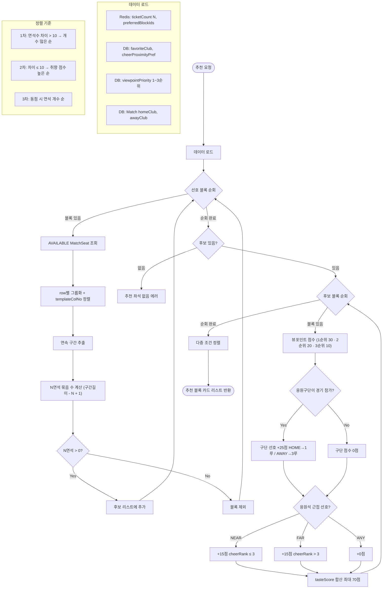
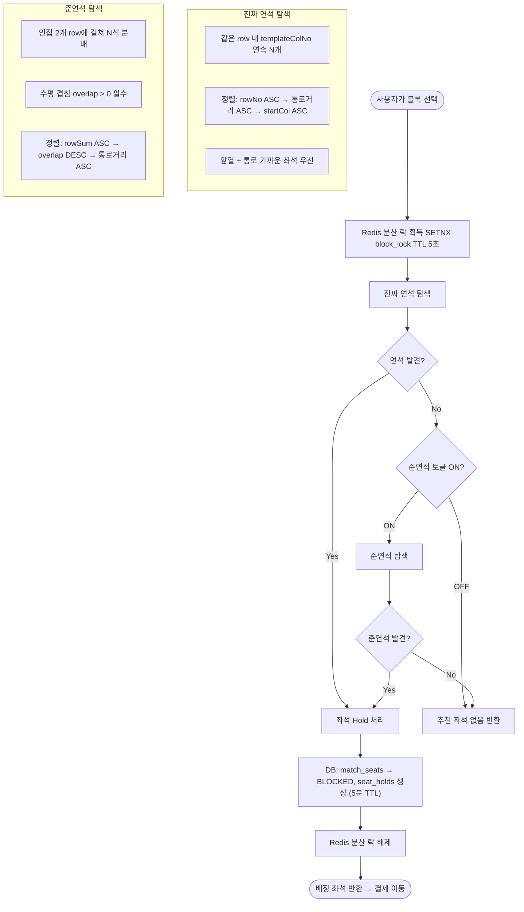

# 추천 알고리즘

추천 시스템은 **블록 추천(Phase 1)**과 **좌석 배정(Phase 2)** 두 단계로 나뉩니다. 사용자 온보딩 선호도를 기반으로 최적 블록을 추천하고, 선택 후 분산 락을 이용해 연석을 안전하게 배정합니다.

---

## Phase 1 — 블록 추천

### 취향 점수 계산 (최대 70점)

| 항목 | 조건 | 점수 |
|---|---|---|
| **뷰포인트 우선순위** | 1순위 블록 | 30점 |
| **뷰포인트 우선순위** | 2순위 블록 | 20점 |
| **뷰포인트 우선순위** | 3순위 블록 | 10점 |
| **응원구단 매칭** | 경기 참가 구단 선호 | +25점 |
| **응원석 근접** | NEAR 선호 + cheerRank ≤ 3 | +15점 |
| **응원석 원거리** | FAR 선호 + cheerRank > 3 | +15점 |

연석 수 차이가 10개 이내일 때는 취향 점수가 높은 블록을 우선 추천합니다. 차이가 10개를 초과하면 연석이 더 많은 블록을 우선합니다.

---

## Phase 2 — 좌석 배정

### 배정 우선순위

1. **같은 행(row)의 연속 좌석** — 가장 앞 열, 통로에 가까운 좌석 우선
2. **연석이 없는 경우** — 인접 2행에 걸친 준연석으로 fallback
3. **준연석도 없는 경우** — 추천 좌석 없음 반환

배정된 좌석은 **5분간 Hold** 상태가 되며, 그 안에 결제를 완료해야 합니다. 만료 시 Hold가 자동 해제되고 다른 사용자가 선택할 수 있습니다.
