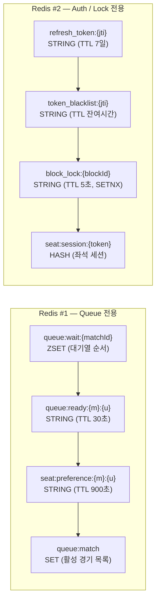

# Redis 구성

Redis는 두 개의 독립적인 인스턴스로 분리하여 운영합니다. 티켓 오픈 시 대기열 트래픽이 폭발해도 인증과 좌석 분산 락 성능에 영향을 주지 않도록 설계했습니다.

---

## 이중 인스턴스 구성

---

## Key 목록

| 인스턴스 | Key | Type | 설명 | TTL |
|---|---|---|---|---|
| **Queue #1** | `queue:wait:{matchId}` | ZSET | 대기열 사용자 순서 관리 | 없음 |
| **Queue #1** | `queue:ready:{matchId}:{userId}` | STRING | 대기열 입장 허용 토큰 | 30초 |
| **Queue #1** | `seat:preference:{matchId}:{userId}` | STRING | 사용자 좌석 선호 캐시 | 900초 |
| **Queue #1** | `queue:match` | SET | 활성 티켓팅 경기 목록 | 없음 |
| **Auth #2** | `refresh_token:{jti}` | STRING | Refresh Token 저장 | 7일 |
| **Auth #2** | `token_blacklist:{jti}` | STRING | 로그아웃 토큰 차단 | 남은 AccessToken TTL |
| **Auth #2** | `block_lock:{blockId}` | STRING (SETNX) | 블록 단위 좌석 락 | 5초 |
| **Auth #2** | `seat:session:{token}` | HASH | 좌석 선택 세션 관리 | 세션 TTL |

---

## 분리 이유

| 문제 | 해결 |
|---|---|
| 대기열 폭발 시 Redis 부하 → 인증/락 지연 | Queue 전용 인스턴스 분리로 영향 차단 |
| 블랙리스트 확인 지연 → JWT 검증 병목 | Auth/Lock 인스턴스가 항상 안정적 응답 보장 |
| 좌석 분산 락 실패 → 동시성 이슈 | 대기열 트래픽과 분리되어 락 성공률 보장 |

---

## PostgreSQL 테이블 소유권

각 서비스는 자신의 테이블만 쓰기하고, 다른 서비스 테이블은 읽기만 합니다.

| 서비스 | 소유 테이블 | 비고 |
|---|---|---|
| **Auth-Guard** | users, user_sns, dev_users, withdrawal_requests | 회원 관리 |
| **Seat** | seats, blocks, sections, areas, match_seats, seat_holds, price_policies | 좌석/가격 구조 |
| **Order-Core** | orders, order_seats, payments, cash_receipts, qr_tokens, inquiries | 주문/결제 |
| **common-core** | matches, clubs, stadiums, team_season_stats | 공유 도메인 |
| **Order-Core** | onboarding_preferences, viewpoint_priorities, preferred_blocks | 사용자 선호도 |
