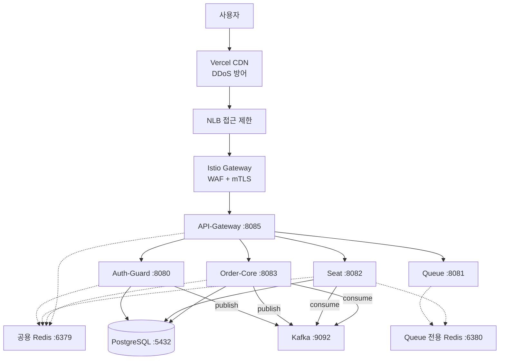

# 시스템 아키텍처

사용자 요청은 Playball이 구성한 CDN → NLB → Istio를 통과한 뒤 API Gateway에 도달합니다. Gateway에서 JWT를 중앙 검증하고, `X-User-Id` 헤더를 주입하여 하위 서비스로 라우팅합니다. 하위 서비스는 JWT를 직접 파싱하지 않고 헤더만 신뢰합니다.

PlayBall 백엔드는 **5개 마이크로서비스와 1개 공통 라이브러리**로 구성되며, 서비스 간 직접 REST 호출 없이 **Redis / Kafka를 통한 간접 데이터 공유**만 존재합니다. 현재 DB는 단일 PostgreSQL 인스턴스에 테이블 소유권만 분리된 상태이며, 향후 Payment 서비스 분리와 DB 스키마 분리를 대비해 **EDA(Event-Driven Architecture)로 전환**했습니다. 상세 내용은 [MSA · EDA 전환](./eda-architecture.md) 문서 참고.

---

## 전체 구조

---

## 서비스별 역할

| 서비스 | 포트 | 핵심 책임 |
|---|---|---|
| **API-Gateway** | 8085 | JWT 중앙 검증 (RSA 공개키), 라우팅, CORS, Swagger 통합 |
| **Auth-Guard** | 8080 | Kakao OAuth, JWT 발급/갱신(RTR), 로그아웃/블랙리스트, 회원 탈퇴 |
| **Queue** | 8081 | 대기열 진입/폴링, Admission Token 발급, 선호도 저장 |
| **Seat** | 8082 | 좌석맵, 추천 블록 계산, 연석/준연석 배정, 분산 락 Hold |
| **Order-Core** | 8083 | 주문 생성, Mock 결제, 마이페이지, 온보딩, 경기/구단 조회 |
| **common-core** | — | 공통 엔티티, 인증 필터, 설정, 예외 처리 (공유 라이브러리) |

---

## 데이터 저장소

Redis는 **Queue 전용**과 **Auth/Lock 전용**으로 두 인스턴스를 분리합니다. 티켓 오픈 시 대기열 트래픽이 폭발하더라도 인증이나 좌석 분산 락에 영향을 주지 않도록 설계했습니다.

PostgreSQL은 단일 인스턴스에서 테이블 소유권을 서비스별로 명확히 분리합니다. 각 서비스는 자신의 테이블만 쓰기하고, 다른 서비스 테이블은 읽기만 합니다.
