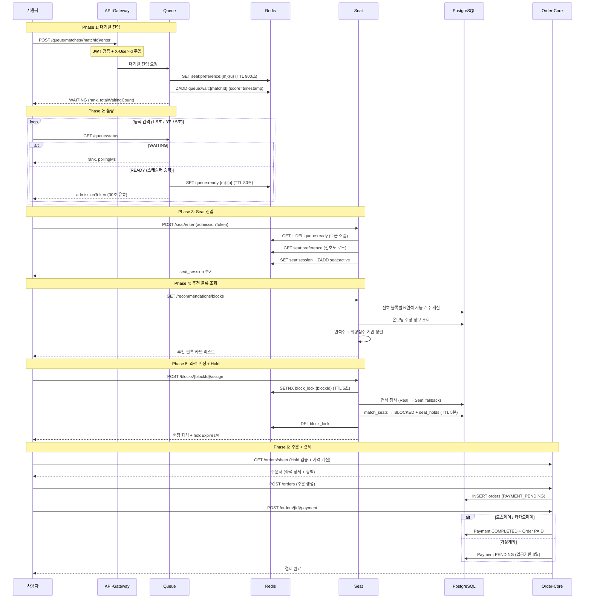

# 티켓팅 플로우

티켓팅은 대기열 진입부터 결제 완료까지 6개 Phase로 구성됩니다. 각 단계는 보안 토큰과 분산 락으로 보호되어 대기열 우회, 좌석 중복 선점, 미결제 점유를 원천 차단합니다.

---

## 전체 시퀀스

---

## 단계별 핵심 메커니즘

| Phase | 핵심 기술 | 목적 |
|---|---|---|
| **1. 대기열** | Redis Sorted Set | 순서 보장 + 대량 트래픽 흡수 |
| **2. 폴링** | 동적 간격 (rank 기반) | 서버 부하 최소화 |
| **3. Seat 진입** | Admission Token (TTL 30초) | 대기열 우회 차단 |
| **4. 추천** | 선호도 점수 (max 70점) | 사용자 취향 반영 |
| **5. 배정** | 분산 락 + 연석/준연석 알고리즘 | 동시성 제어 + 연석 보장 |
| **6. 주문/결제** | Hold 검증 (TTL 5분) | 좌석 점유 증명 |

---

## 폴링 간격 전략

클라이언트는 자신의 순위(rank)에 따라 폴링 간격을 동적으로 조절합니다. 대기 순위가 높을수록 짧은 간격으로 자주 확인하고, 순위가 낮을수록 긴 간격을 두어 서버 부하를 분산합니다.

| 순위 | 폴링 간격 |
|---|---|
| rank ≤ 100 | 1.5초 |
| rank ≤ 1000 | 3초 |
| rank > 1000 | 5초 |
