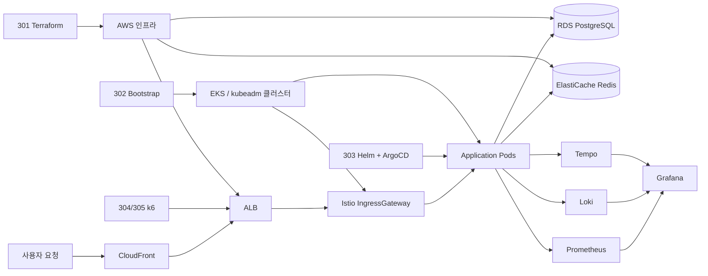

# 인프라 아키텍처

Playball 인프라는 `프로비저닝`, `클러스터 부트스트랩`, `GitOps 배포`, `부하 검증`을 저장소 단위로 분리했습니다. 인프라팀은 한 저장소에 모든 작업을 섞지 않고, 변경 책임과 복구 기준이 분명하도록 역할을 나눴습니다.

---

## 전체 구성

---

## 저장소 역할 분리

| 저장소 | 역할 | 인프라팀 관점의 의미 |
|---|---|---|
| **301 Terraform** | VPC, EKS, RDS, ElastiCache, Route53, ECR, SSO 등 AWS 리소스 프로비저닝 | 기반 인프라를 코드로 관리하고 재생성 가능하도록 유지 |
| **302 Bootstrap** | ESO, Karpenter, ArgoCD, Root App, DB 초기화 등 클러스터 초기 구성 | 새 클러스터를 운영 가능한 상태로 빠르게 부트스트랩 |
| **303 Helm / ArgoCD** | 환경별 values, 인프라 차트, 애플리케이션 배포 정의 | 선언형 배포와 환경별 운영 설정의 기준점 |
| **304 k6 / 305 k6-operator** | 단일/분산 부하 테스트와 운영 검증 | 티켓 오픈 시나리오 기준의 병목 검증과 확장 전략 검증 |

역할을 분리해 두면 장애 시에도 "어느 레이어를 어떤 기준으로 복구해야 하는지"가 분명해집니다. 예를 들어 AWS 리소스 이상은 Terraform 기준으로, 클러스터 초기화 문제는 Bootstrap 기준으로, 배포 상태 이상은 GitOps 기준으로 추적합니다.

---

## 환경별 핵심 차이

| 항목 | Dev | Staging | Prod |
|---|---|---|---|
| **클러스터** | kubeadm (MiniPC 2대) | AWS EKS | AWS EKS Multi-AZ |
| **용도** | 개발, 기능 테스트 | QA, 부하, 운영 검증 | 실제 운영 |
| **DB** | PostgreSQL Pod | RDS PostgreSQL | RDS PostgreSQL Multi-AZ |
| **캐시** | Redis Pod | ElastiCache Redis | ElastiCache Redis |
| **TLS** | cert-manager + Let's Encrypt | ACM | ACM |
| **외부 진입** | NodePort + DDNS | ALB + External DNS | ALB + External DNS |
| **노드 확장** | 수동 | Karpenter | Karpenter |
| **시크릿 연동** | 개발용 분리 관리 | ESO + IRSA | ESO + IRSA |

Staging은 단순 테스트 환경이 아니라, 운영과 같은 AWS 구성에서 배포와 복구 기준을 검증하는 환경입니다. Prod는 같은 구조를 고가용성 기준으로 운영합니다.

---

## 운영 계층 구성

### 1. 네트워크 진입 계층

- `CloudFront`로 외부 트래픽을 받고 정적 캐싱과 기본 진입점을 통합합니다.
- `ALB`가 Kubernetes Ingress 진입점 역할을 수행합니다.
- `Istio IngressGateway`가 내부 서비스 라우팅의 기준점입니다.

### 2. 애플리케이션 실행 계층

- 백엔드 서비스는 Kubernetes Pod로 운영합니다.
- 서비스 설정, replica, 인프라 의존성은 Helm values로 선언형 관리합니다.
- 장애 시 Pod는 백업 복원이 아니라 재스케줄링과 재배포로 복구합니다.

### 3. 데이터 계층

- 운영 데이터는 `RDS PostgreSQL`을 기준으로 관리합니다.
- 세션성/고빈도 접근 데이터는 `ElastiCache Redis`로 분리합니다.
- 복구 기준은 `RDS Automated Backup + PITR`과 `pg_dump -> S3` 보조 백업입니다.

### 4. 관측 계층

- `Prometheus`가 메트릭을 수집합니다.
- `Loki`가 운영 로그를 수집합니다.
- `Tempo`가 분산 추적 데이터를 수집합니다.
- `Grafana`가 운영 대시보드의 단일 진입점 역할을 합니다.

---

## 운영 접근과 감사

| 항목 | 운영 방식 |
|---|---|
| **운영 접근** | AWS SSO와 IAM Role 분리를 기준으로 접근 권한을 관리합니다. |
| **시크릿 주입** | External Secrets Operator와 IRSA를 사용해 클러스터 내부에 시크릿을 안전하게 주입합니다. |
| **감사 이벤트** | CloudTrail 이벤트를 EventBridge와 Lambda로 전달해 운영 변경 이력을 추적합니다. |
| **접속 기록** | 관리자/운영자 접근 기록은 별도 감사 로그 경로로 장기 보관합니다. |
| **운영 알림** | AWS 리소스 경로와 EKS 내부 경로를 분리하되, 최종 전파 채널은 Discord로 통합합니다. |

---

## 운영 책임 범위

| 영역 | 실제 운영 항목 |
|---|---|
| **배포 기반** | ArgoCD Root App, Helm values, 환경별 배포 브랜치 |
| **확장 기반** | HPA, KEDA, Karpenter |
| **외부 연동** | ALB, Route53, External DNS, ACM |
| **시크릿/권한 연동** | External Secrets Operator, IRSA 기반 Secret 접근 |
| **관측성** | Prometheus, Loki, Tempo, Grafana, Alertmanager |
| **감사/추적** | CloudTrail, EventBridge, Lambda 기반 감사 이벤트 전파 |
| **복구 기준** | RDS PITR, 수동 스냅샷, `pg_dump -> S3`, GitOps 선언형 복구 |
