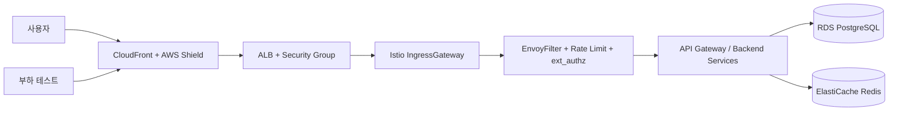
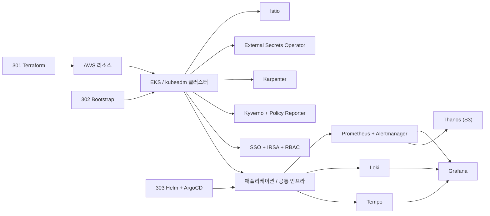
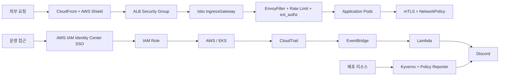

# 인프라 아키텍처

Playball 인프라는 `프로비저닝`, `클러스터 부트스트랩`, `GitOps 배포`, `운영 검증`을 저장소 단위로 분리했습니다.

---

## 외부 진입 구조

---

## 내부 구성

---

## 보안 / 감사 구조

---

## 아키텍처 설계 기준

| 구분                      | 반영 내용                                                                                                   |
| ------------------------- | ----------------------------------------------------------------------------------------------------------- |
| **진입 경로 일원화**      | CloudFront, ALB, Istio Gateway를 기준으로 외부 진입 경로를 단일화하고 요청 흐름을 분리해 관리               |
| **검증 환경 분리**        | Dev, Staging, Prod를 분리해 기능 개발, 배포 전 검증, 실서비스 운영 단계를 구분                              |
| **선언형 운영**           | Terraform, Bootstrap, Helm, ArgoCD로 인프라와 배포 구성을 저장소 단위로 관리                                |
| **확장 대응**             | KEDA, HPA, Karpenter를 조합해 티켓 오픈 시점의 급격한 요청 증가에 대응                                      |
| **복구 기준 분리**        | 애플리케이션은 GitOps 재적용과 재배포, 데이터는 RDS PITR과 `pg_dump -> S3` 기준으로 복구                    |
| **상태 확인 일원화**      | Grafana, Policy Reporter, CloudWatch, CloudTrail을 기준으로 상태 확인과 장애 분석을 수행                    |
| **진입 보호**             | EnvoyFilter, Rate Limit, ext_authz를 통해 Gateway 단계에서 요청을 검사                                      |
| **서비스 간 통신 보호**   | mTLS와 NetworkPolicy를 적용해 클러스터 내부 통신 범위를 제한                                                |
| **운영 접근 통제**        | AWS IAM Identity Center SSO, IAM Role, IRSA, Kubernetes RBAC 기준으로 접근 권한을 분리                      |
| **정책 검증과 감사 추적** | Kyverno, Policy Reporter, CloudTrail, EventBridge, Lambda, Discord 경로로 정책 위반과 운영 변경 이력을 추적 |

---

## 저장소 역할 분리

| 저장소              | 역할                                                                                 | 운영 의미                                                          |
| ------------------- | ------------------------------------------------------------------------------------ | ------------------------------------------------------------------ |
| **301 Terraform**   | `stacks`와 `environments/dev`, `staging`, `prod` 기준으로 AWS 리소스를 프로비저닝    | 기반 인프라와 공용 리소스를 코드로 관리하고 재생성 가능하도록 유지 |
| **302 Bootstrap**   | 환경별 초기 설치, ESO, Karpenter, ArgoCD, Root App, DB 초기화 구성                   | 새 클러스터를 운영 가능한 상태로 빠르게 부트스트랩                 |
| **303 Helm**        | 환경별 values, 인프라 차트, 애플리케이션 배포 정의, `argocd-sync/*` 배포 브랜치 관리 | 선언형 배포와 환경별 운영 설정의 기준점                            |
| **304 k6-operator** | 단일/분산 부하 테스트와 운영 검증                                                    | 티켓 오픈 시나리오 기준의 병목 검증과 확장 전략 검증               |

---

## 환경별 차이

환경 운영 개요(용도·클러스터·외부 진입 등)는 [환경 구성](./environment.md) 페이지 참조. 여기서는 **인프라 구조 축에서 다른 부분만** 정리합니다.

| 항목             | Dev                            | Staging                                      | Prod                                                     |
| ---------------- | ------------------------------ | -------------------------------------------- | -------------------------------------------------------- |
| **엣지 보호**    | Cloudflare                     | CloudFront                                   | CloudFront + AWS WAF + Shield                            |
| **TLS / 인증서** | cert-manager + Let's Encrypt   | ACM (CloudFront ↔ ALB)                       | ACM (CloudFront ↔ ALB)                                   |
| **오토스케일링** | 수동                           | HPA + KEDA + Karpenter                       | HPA + KEDA + Karpenter                                   |
| **시크릿 주입**  | `bot-kubeadm` IAM User + ESO   | ESO + IRSA                                   | ESO + IRSA                                               |
| **RDS 보호**     | PostgreSQL Pod                 | 저장 암호화 · Single-AZ · 삭제 보호 OFF      | 저장 암호화 · **Multi-AZ · 삭제 보호 ON · 최종 스냅샷**  |
| **Redis 보호**   | Redis Pod                      | TLS(required) · 저장 암호화 · 단일 노드      | TLS(required) · 저장 암호화 · **복제본 + 자동 장애조치** |
| **Kyverno 정책** | Audit 모드 (`requireProbes` ✗) | Audit 모드 (`requireProbes` ✗)               | Audit 모드 (`requireProbes` ✓), **Deny 전환 예정**       |
| **백업 / 복구**  | 수동 / 실험                    | RDS PITR + `pg_dump → S3`                    | RDS PITR + `pg_dump → S3` + 복구 훈련                    |

> Dev/Staging은 팀 내부 접근 범위(whitelist IP + OAuth는 Istio 레벨에서 처리)로 제한되어 엣지 WAF/Shield가 불필요. Prod는 공개 트래픽을 받으므로 AWS WAF/Shield를 적용합니다. RDS/Redis 내부 통신은 **모든 환경에서 TLS 강제**하며, Prod는 Multi-AZ·복제본·삭제 보호·최종 스냅샷 등 **가용성과 데이터 손실 방지 옵션**을 추가로 적용합니다. Kyverno 정책 세부 기준은 [클러스터 정책](../security/kyverno.md) 메뉴 참조.

---

## 환경 공통

구조적 차이는 위 표와 같고, 다음 구성은 **전 환경 공통**으로 적용됩니다.

- **GitOps 배포 경로**: Argo CD Root App + `argocd-sync/*` 브랜치 기반 선언형 배포
- **관측성 스택**: Prometheus · Loki · Tempo → Grafana 통합 (메트릭 · 로그 · 트레이스)
- **서비스 메쉬 보안**: Istio IngressGateway + EnvoyFilter(Lua WAF) + Rate Limit + ext_authz + mTLS
- **정책 검증 프레임**: Kyverno 배포는 전 환경 공통 (정책별 강제 수준은 위 표 참조, Policy Reporter 대시보드는 Staging/Prod)
- **감사 추적**: CloudTrail → EventBridge → Lambda → Discord 경로 (AWS 환경 한정)

---

## 운영 계층 구성

### 1. 네트워크 진입 계층

- `CloudFront`가 외부 요청의 기본 진입점 역할을 수행합니다.
- `ALB`가 EKS 내부 Ingress 진입점 역할을 수행합니다.
- `Istio IngressGateway`가 내부 서비스 라우팅의 기준점입니다.

### 2. 애플리케이션 실행 계층

- 백엔드 서비스는 Kubernetes Pod로 운영합니다.
- 서비스 설정, replica, 인프라 의존성은 Helm values로 선언형 관리합니다.
- 장애 시 Pod는 백업 복원이 아니라 재스케줄링과 재배포로 복구합니다.

### 3. 데이터 계층

- 운영 데이터는 `RDS PostgreSQL`을 기준으로 관리합니다.
- 세션성/고빈도 접근 데이터는 `ElastiCache Redis`로 분리합니다.
- 복구 기준은 `RDS Automated Backup + PITR`과 `pg_dump -> S3` 보조 백업입니다.

### 4. 관측 계층

- `Prometheus`가 메트릭을 수집합니다.
- `Loki`가 운영 로그를 수집합니다.
- `Tempo`가 분산 추적 데이터를 수집합니다.
- `Thanos`가 메트릭 장기 보관을 담당합니다.
- `Grafana`, `Policy Reporter`, `CloudWatch`, `CloudTrail`을 기준으로 상태 확인과 장애 분석을 수행합니다.

---

## 운영 접근과 감사

| 항목            | 운영 방식                                                                               |
| --------------- | --------------------------------------------------------------------------------------- |
| **운영 접근**   | AWS IAM Identity Center SSO와 IAM Role 전환 기준으로 접근 권한을 관리합니다.            |
| **시크릿 주입** | External Secrets Operator와 IRSA를 사용해 클러스터 내부에 시크릿을 안전하게 주입합니다. |
| **감사 이벤트** | CloudTrail 이벤트를 EventBridge와 Lambda로 전달해 운영 변경 이력을 추적합니다.          |
| **접속 기록**   | 관리자/운영자 접근 기록은 별도 감사 로그 경로로 장기 보관합니다.                        |
| **운영 알림**   | AWS 리소스 경로와 EKS 내부 경로를 분리하되, 최종 전파 채널은 Discord로 통합합니다.      |

---

## 운영 범위

| 영역                 | 실제 운영 항목                                                                    |
| -------------------- | --------------------------------------------------------------------------------- |
| **배포 기반**        | ArgoCD Root App, Helm values, 환경별 배포 브랜치 (`303`)                          |
| **확장 기반**        | HPA, KEDA, Karpenter                                                              |
| **외부 연동**        | CloudFront, ALB, Route53, External DNS, ACM                                       |
| **시크릿/권한 연동** | External Secrets Operator, IRSA 기반 Secret 접근                                  |
| **보안 정책**        | EnvoyFilter, Rate Limit, ext_authz, mTLS, NetworkPolicy, Kyverno, Policy Reporter |
| **관측성**           | Prometheus, Alertmanager, Loki, Tempo, Thanos, Grafana                            |
| **감사/추적**        | CloudTrail, EventBridge, Lambda 기반 보안·감사 이벤트 전파                        |
| **복구 기준**        | RDS PITR, `pg_dump -> S3`, GitOps 선언형 복구                                     |
