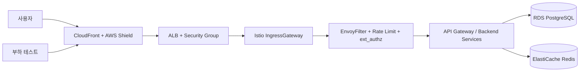
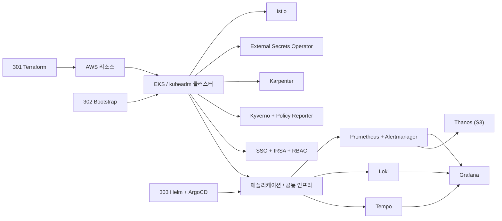
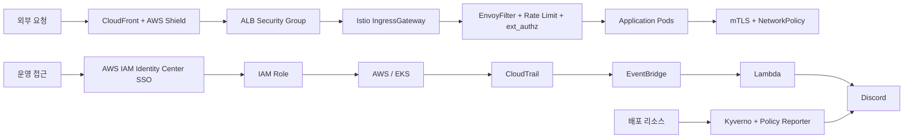

# 인프라 아키텍처

Playball 인프라는 `프로비저닝`, `클러스터 부트스트랩`, `GitOps 기반 Helm/Values 관리`를 저장소 단위로 분리하고, 외부 진입부터 관측과 복구 기준까지 하나의 운영 흐름으로 연결합니다.

---

## 외부 진입 구조

---

## 내부 구성

---

## 보안 / 감사 구조

---

## 아키텍처 설계 기준

| 구분 | 반영 내용 |
|---|---|
| **진입 경로 일원화** | CloudFront, ALB, Istio Gateway를 기준으로 외부 진입 경로를 단일화하고 요청 흐름을 분리해 관리 |
| **검증 환경 분리** | Dev, Staging, Prod를 분리해 기능 개발, 배포 전 검증, 실서비스 운영 단계를 구분 |
| **선언형 운영** | Terraform, Bootstrap, Helm, ArgoCD로 인프라와 배포 구성을 저장소 단위로 관리 |
| **확장 대응** | KEDA, HPA, Karpenter를 조합해 티켓 오픈 시점의 급격한 요청 증가에 대응 |
| **복구 기준 분리** | 애플리케이션은 GitOps 재적용과 재배포, 데이터는 RDS PITR과 PostgreSQL 데이터베이스 보조 백업 기준으로 복구 |
| **상태 확인 일원화** | Grafana, Policy Reporter, CloudWatch, CloudTrail을 기준으로 상태 확인과 장애 분석을 수행 |
| **5계층 심층 방어** | 엣지(CloudFront + Shield) · LB(ALB + SG) · 메쉬(Istio WAF + Rate Limit + ext_authz) · 내부통신(mTLS + NetworkPolicy) · 앱(JWT + 보안 헤더) 기준으로 방어 계층을 구성 |
| **운영 접근 통제** | AWS IAM Identity Center SSO, IAM Role, IRSA, Kubernetes RBAC 기준으로 접근 권한을 분리 |
| **정책 검증과 감사 추적** | Kyverno, Policy Reporter, CloudTrail, EventBridge, Lambda, Discord 경로로 정책 위반과 운영 변경 이력을 추적 |

---

## 저장소 역할 분리

| 저장소 | 역할 | 운영 의미 |
|---|---|---|
| **301 Terraform** | `stacks`와 `environments/dev`, `staging`, `prod` 기준으로 AWS 리소스를 프로비저닝 | 기반 인프라와 공용 리소스를 코드로 관리하고 재생성 가능하도록 유지 |
| **302 Bootstrap** | 환경별 초기 설치, ESO, Karpenter, ArgoCD, Root App, DB 초기화 구성 | 새 클러스터를 운영 가능한 상태로 빠르게 부트스트랩 |
| **303 Helm** | 환경별 values, 인프라 차트, 애플리케이션 배포 정의, `argocd-sync/*` 배포 브랜치 관리 | 선언형 배포와 환경별 운영 설정의 기준점 |
| **304 k6-operator** | 단일/분산 부하 테스트와 운영 검증 | 티켓 오픈 시나리오 기준의 병목 검증과 확장 전략 검증 |

---

## 환경별 차이

환경 운영 개요는 [환경 구성](/infrastructure/environment)에서 정리하고, 여기서는 구조 축에서 달라지는 부분만 정리합니다.

| 항목 | Dev | Staging | Prod |
|---|---|---|---|
| **엣지 보호** | Cloudflare | CloudFront | CloudFront + AWS WAF + Shield |
| **TLS / 인증서** | cert-manager + Let's Encrypt | ACM (CloudFront ↔ ALB) | ACM (CloudFront ↔ ALB) |
| **오토스케일링** | 수동 | HPA + KEDA + Karpenter | HPA + KEDA + Karpenter |
| **시크릿 주입** | `bot-kubeadm` IAM User + ESO | ESO + IRSA | ESO + IRSA |
| **RDS 보호** | PostgreSQL Pod | 저장 암호화 · Single-AZ · 삭제 보호 OFF | 저장 암호화 · Multi-AZ · 삭제 보호 ON · 최종 스냅샷 |
| **Redis 보호** | Redis Pod | TLS(required) · 저장 암호화 · 단일 노드 | TLS(required) · 저장 암호화 · 복제본 + 자동 장애조치 |
| **Kyverno 정책** | Audit 모드 (`requireProbes` ✗) | Audit 모드 (`requireProbes` ✗) | Audit 모드 (`requireProbes` ✓), Deny 전환 예정 |
| **백업 / 복구** | 수동 / 실험 | RDS PITR + PostgreSQL 데이터베이스 보조 백업 | RDS PITR + PostgreSQL 데이터베이스 보조 백업 + 복구 훈련 |

---

## 환경 공통

- **GitOps 배포 경로**: Argo CD Root App + `argocd-sync/*` 브랜치 기반 선언형 배포
- **관측성 스택**: Prometheus · Loki · Tempo → Grafana 통합, Thanos 장기 보관
- **서비스 메쉬 보안**: Istio IngressGateway + EnvoyFilter(Lua WAF) + Rate Limit + ext_authz + mTLS
- **정책 검증 프레임**: Kyverno 배포는 전 환경 공통, Policy Reporter 대시보드는 Staging/Prod 기준
- **감사 추적**: CloudTrail → EventBridge → Lambda → Discord 경로
