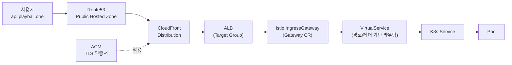

# 도메인 · 라우팅

> **역할**: DNS → 인증서 → CDN → 로드밸런서 → 서비스까지의 도메인 라우팅 체인

Playball은 **Route53 공인 도메인 → ACM 인증서 → CloudFront 배포 → ALB → Istio Gateway → VirtualService → Pod** 순서로 요청을 라우팅합니다. 각 단계에서 TLS·도메인 검증·경로 매칭이 차례로 이뤄져 최종 서비스에 도달합니다.

---

## 단계별 역할

| 단계 | 구성 요소 | 무엇을 하나 |
|------|--------|-----------|
| **DNS** | Route53 Public Hosted Zone | `api.{env}.playball.one` 등 도메인 → CloudFront alias 매핑 |
| **인증서** | ACM (CloudFront용은 us-east-1, ALB용은 region) | TLS 인증서 발급 · 자동 갱신 · DNS validation |
| **CDN** | CloudFront Distribution | 엣지 캐싱 · TLS termination · 원본(ALB) 전달 · (Prod) WAF/Shield |
| **LB** | ALB + Target Group | 퍼블릭 진입 · 호스트/경로 기반 타겟 라우팅 · 보안 그룹 통제 |
| **메쉬 진입** | Istio Gateway CR | 클러스터 내부 진입점 · TLS 설정 |
| **라우팅 규칙** | VirtualService CR | HTTP 경로·헤더·가중치 기반 라우팅 |
| **서비스** | K8s Service → Pod | 서비스 레이어 추상화 · Pod 로드 밸런싱 |

---

## 환경별 도메인 예시

| 환경 | 도메인 | 인증서 위치 |
|------|------|----------|
| **Dev** | `*.dev.playball.one` (Cloudflare 프록시 경유) | cert-manager + Let's Encrypt |
| **Staging** | `api.staging.playball.one` 등 | ACM (us-east-1 for CloudFront, ap-northeast-2 for ALB) |
| **Prod** | `api.playball.one` | ACM 동일 |

Dev는 Cloudflare Proxy 경유 — [환경 구성 · Dev Cloudflare 도입 배경](./environment#dev-환경) 참조.

---

## 설계 포인트

- **외부 진입은 CloudFront로 단일화** — ALB 직접 노출 없음 (Prod SG에 CloudFront prefix list만 허용)
- **Istio Gateway → VirtualService 2단 분리** — Gateway는 진입점 관리, VirtualService는 경로 라우팅만 전담
- **인증서는 ACM 자동 갱신** — TLS 만료 수동 관리 부담 없음
- **환경별 도메인 prefix 분리** — `api.` · `staging.` · `dev.` 등으로 운영/개발 URL 시각 구분
