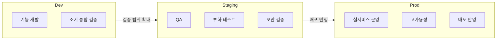

# 환경 구성

Playball은 Dev, Staging, Prod 세 가지 환경을 분리해 변경 범위와 검증 단계를 나눕니다. Dev는 기능 개발과 실험, Staging은 실제 배포 전 검증, Prod는 실서비스 제공을 담당합니다. 비용 격리와 보안 경계를 위해 **AWS Organizations 기반으로 환경별 계정을 분리**해 운영합니다.

---

## 공통 운영 기반

전 환경 공통으로 다음 운영 기반을 갖춥니다. 환경별 차이는 규모·범위·민감도에 있으며, 운영 축 자체는 동일합니다.

- **GitOps 기반 배포**: Argo CD 기반 선언형 배포와 드리프트 감시
- **모니터링/알람**: Grafana 스택(Prometheus·Loki·Tempo) 기반 메트릭·로그·트레이스 통합과 이상 신호 알람
- **관측 경험 일관성**: Grafana 대시보드를 환경 간 공유해 장애 분석 경험 통일

---

## 환경 개요

| 환경        | 실행 기반                                       | 외부 진입                  | 데이터 계층               | 역할                       |
| ----------- | ----------------------------------------------- | -------------------------- | ------------------------- | -------------------------- |
| **Dev**     | kubeadm (MiniPC 2대)                            | Cloudflare + Istio Gateway | PostgreSQL Pod, Redis Pod | 기능 개발, 초기 통합 검증  |
| **Staging** | AWS EKS (Multi-AZ · Spot 기반 비용 최적화)      | CloudFront + ALB           | RDS, ElastiCache          | QA, 부하 테스트, 보안 검증 |
| **Prod**    | AWS EKS (Multi-AZ · On-Demand 기반 안정성 우선) | CloudFront + ALB           | RDS, ElastiCache          | 실서비스 운영              |

> Staging은 **Spot 중심**으로 비용을 최적화하면서 중단 내성을 상시 검증하고, Prod는 **On-Demand**로 안정성을 우선합니다. (Staging Spot 다양화 정책은 별도 문서 참조)

---

## Dev 환경

> **목적**: 기능 개발 · 초기 통합 검증 · 인프라 실험

On-Premise MiniPC 2대에 kubeadm으로 Kubernetes 클러스터를 구성해 **2026년 2월 23일(월)부터 운영** 중입니다. 애플리케이션, PostgreSQL, Redis를 클러스터 내부에서 함께 운영하며 기능 개발, 초기 통합 검증, 인프라 실험을 수행합니다.

로컬 `docker-compose` => 공유 Dev 클러스터를 지원함으로써, **백엔드·프론트엔드가 초기부터 실제 API·데이터와 연동하며 협업할 수 있도록 했습니다.**

- **접근 제어**: Cloudflare whitelist IP + Google OAuth(Istio) — 팀원만 진입 (모니터링 도구 포함)
- **지원 도구**: CloudBeaver(DB), RedisInsight(Redis), Grafana(메트릭, 로그 등) 대시보드 제공

---

## Staging 환경

> **목적**: QA · 부하 테스트 · 보안 검증 (Prod 배포 전 최종 검증)

AWS EKS 기반 검증 환경으로, **2026년 3월 23일(월)부터 상시 운영** 중입니다. CloudFront, ALB, EKS, RDS, ElastiCache를 포함한 AWS 구조를 기준으로 실제 배포 전 최종 검증을 수행합니다.

- **QA**: 기능 시나리오 전체 검증
- **부하 테스트**: 티켓팅 오픈 시나리오 기준 동시 접속 부하 테스트(최대 5000vu) 진행, 서비스 병목 확인
- **모의 해킹 진행**: 인프라, 앱 보안 등 통합 테스트 진행
- **접근 제어**: whitelist IP + Google OAuth(Istio) 필수
- **지원 도구**: CloudBeaver, RedisInsight, Kafka-UI, Grafana
- **접근 제어**: Bastion SSM을 통해 SSO 권한을 가진 책임자만 접근 허용되는 RDS/Elasticache Prod CLI 사전 연습 환경 제공 - DEV/AI 팀

---

## Prod 환경

> **목적**: 사용자 요청을 처리하는 실서비스 운영

Prod는 사용자 요청을 직접 처리하는 AWS EKS 운영 환경입니다. Multi-AZ 기반으로 CloudFront, EKS, RDS, ElastiCache를 운영하며, **복구 시나리오에 따라 백업 정책과 복구 기준을 실무환경 가정으로 점검·적용**하는 데 운영의 주력을 둡니다.

- **고가용성**: Multi-AZ 기반 EKS, RDS, Redis 운영
- **백업 정책**: RDS PITR, `pg_dump → S3` 보조 백업 — 복구 시나리오에 따라 보관·복제 범위 점검
- **복구 기준**: 실무환경을 가정한 복구 기준 수립 및 시나리오별 검증 훈련
- **접근 제어**: GUI 도구 직접 접근 제한, Bastion을 통해 SSO 권한을 가진 책임자만 접근 허용
