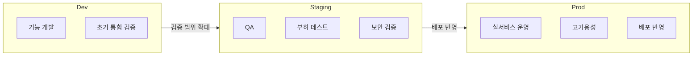

# 환경 구성

Playball은 Dev, Staging, Prod 세 가지 환경을 분리해 변경 범위와 검증 단계를 나눕니다. Dev는 기능 개발과 실험, Staging은 실제 배포 전 검증, Prod는 실서비스 제공을 담당합니다. 비용 격리와 보안 경계를 위해 **AWS Organizations 기반으로 환경별 계정을 분리**해 운영합니다.

---

## 환경 개요

| 환경 | 실행 기반 | 외부 진입 | 데이터 계층 | 역할 |
|---|---|---|---|---|
| **Dev** | kubeadm (MiniPC 2대) | Cloudflare + Istio Gateway | PostgreSQL Pod, Redis Pod | 기능 개발, 초기 통합 검증 |
| **Staging** | AWS EKS | CloudFront + ALB | RDS PostgreSQL, ElastiCache Redis | QA, 부하 테스트, 보안 검증 |
| **Prod** | AWS EKS (Multi-AZ) | CloudFront + ALB | RDS PostgreSQL, ElastiCache Redis | 실서비스 운영 |

---

## Dev 환경

> **목적**: 기능 개발 · 초기 통합 검증 · 인프라 실험

On-Premise MiniPC 2대에 kubeadm으로 Kubernetes 클러스터를 구성했습니다. 애플리케이션, PostgreSQL, Redis를 클러스터 내부에서 함께 운영하며 기능 개발, 초기 통합 검증, 인프라 실험을 수행합니다.

- **접근 제어**: Cloudflare whitelist IP + Google OAuth(Istio) — 팀원만 진입 (모니터링 도구 포함)
- **지원 도구**: CloudBeaver, RedisInsight, Kafka-UI

---

## Staging 환경

> **목적**: QA · 부하 테스트 · 보안 검증 (Prod 배포 전 최종 검증)

AWS EKS 기반 검증 환경입니다. CloudFront, ALB, EKS, RDS, ElastiCache를 포함한 AWS 구조를 기준으로 실제 배포 전 최종 검증을 수행합니다.

- **QA**: 기능 시나리오 전체 검증
- **부하 테스트**: 티켓팅 오픈 시나리오 기준 동시 접속 부하 테스트
- **보안 테스트**: Istio EnvoyFilter + Lua WAF, mTLS, AI 방어 시스템 검증
- **접근 제어**: whitelist IP + Google OAuth(Istio) 필수
- **지원 도구**: CloudBeaver, RedisInsight, Kafka-UI
- **Bastion SSM**: Prod CLI 접근에 익숙해지도록 사전 연습 허용

Staging에서 검증이 완료된 코드만 Prod에 반영합니다.

---

## Prod 환경

> **목적**: 사용자 요청을 처리하는 실서비스 운영

Prod는 사용자 요청을 직접 처리하는 AWS EKS 환경입니다. Multi-AZ를 기준으로 CloudFront, EKS, RDS, ElastiCache를 운영하고, GitOps 배포, 모니터링/알람, 로그 및 데이터베이스 보관/백업, 복구 기준을 함께 관리합니다.

- **고가용성**: Multi-AZ 기반 EKS, RDS, Redis 운영
- **배포**: GitOps 기반 자동 배포와 배포 복구 기준 관리
- **복구**: RDS PITR, `pg_dump -> S3` 보조 백업 운영
- **관측성**: Grafana, CloudWatch, CloudTrail 기준 상태 확인과 장애 분석
- **접근 제어**: GUI 도구 직접 접근 제한, Bastion을 통해 SSO 권한을 가진 책임자만 접근 허용
