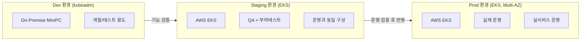

# 환경 구성

인프라팀은 Dev, Staging, Prod 세 가지 환경을 목적에 따라 분리하여 운영합니다. Dev에서 기능을 개발하고, Staging에서 운영 환경과 동일한 구성으로 검증한 뒤, Prod에 반영합니다.

---

## 환경 개요

| 환경 | 인프라 | 목적 | 상태 |
|---|---|---|---|
| **Dev** | kubeadm (MiniPC 2대) | 서비스 개발, 기능 테스트 | ✅ 구축 완료 |
| **Staging** | AWS EKS | QA, 부하테스트, 보안테스트 | ✅ 구축 완료 |
| **Prod** | AWS EKS (고가용성) | 실제 운영, 배포 및 복구 기준 검증 | ✅ 운영 환경 구축 완료 |

---

## Dev 환경

On-Premise MiniPC 2대에 kubeadm으로 Kubernetes 클러스터를 구성했습니다. 로컬 개발 환경으로 사용하며, 기능 단위 테스트와 초기 통합 검증을 진행합니다.

---

## Staging 환경

AWS EKS로 구성한 검증 환경입니다. Prod와 최대한 동일한 구성을 유지하여 실제 배포 전 최종 검증을 수행합니다.

- **QA**: 기능 시나리오 전체 검증
- **부하 테스트**: 티켓팅 오픈 시나리오 기준 동시 접속 부하 테스트
- **보안 테스트**: Istio EnvoyFilter + Lua WAF, mTLS, AI 방어 시스템 검증

Staging에서 검증이 완료된 코드만 Prod로 배포합니다.

---

## Prod 환경

Prod는 실제 운영을 위한 AWS EKS 환경입니다. Multi-AZ를 기본으로 하고, RDS/Redis 고가용성 구성, GitOps 배포, 모니터링/알람, 백업/복구 기준을 운영 문서와 함께 관리합니다.

- **고가용성**: Multi-AZ 기반 EKS, RDS, Redis 운영
- **배포**: GitOps 기반 자동 배포 및 롤백 기준 관리
- **복구**: RDS PITR, 수동 스냅샷, `pg_dump -> S3` 보조 백업 운영
- **관측성**: Prometheus, Loki, Tempo, Thanos 기반 메트릭/로그/트레이스 운영
