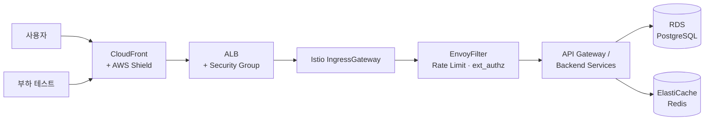

# 외부 진입 구조

> **역할**: 사용자 요청이 엣지부터 백엔드까지 어떻게 흐르는지 보여주는 다이어그램

외부 사용자와 부하 테스트 트래픽이 **CloudFront → ALB → Istio IngressGateway → EnvoyFilter(Rate Limit · ext_authz) → API Gateway / Backend Services → RDS · ElastiCache** 경로로 흐릅니다. 각 단계에서 검증·제한이 차례로 적용되어 앱 계층에 도달합니다.

---

## 흐름 요약

1. **사용자 / 부하 테스트** → CloudFront(+ AWS Shield): 엣지 캐싱 · DDoS 기본 방어
2. **ALB + Security Group**: TLS termination · 포트/출처 통제
3. **Istio IngressGateway**: 서비스 메쉬 진입점
4. **EnvoyFilter + Rate Limit + ext_authz**: 요청 단위 검증(토큰·행동 분석)
5. **API Gateway / Backend**: 라우팅 + 앱 로직
6. **데이터 저장소**: RDS PostgreSQL · ElastiCache Redis

상세 방어 논리는 [보안 / 보안 흐름](../security/flow) 참조.
