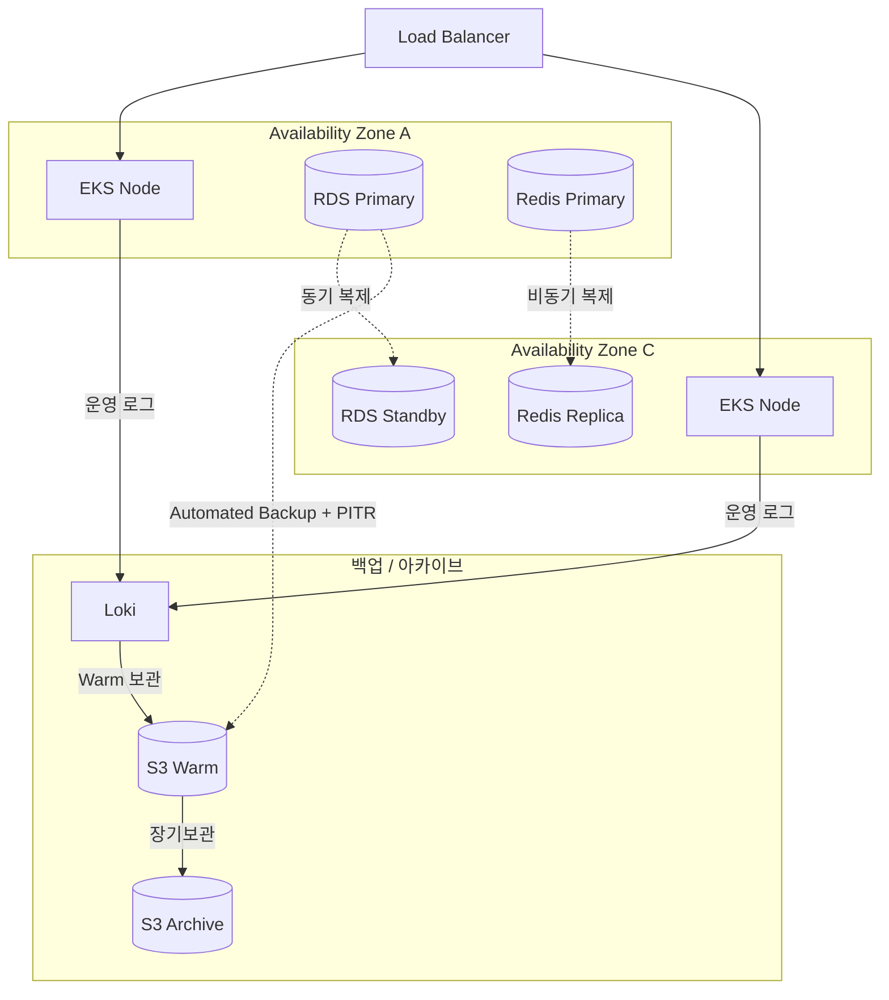

# 장애 대응

Prod 환경은 Multi-AZ 구성으로 EKS 노드, RDS, Redis를 모두 2개 이상의 Availability Zone에 분산합니다. 한쪽 AZ에 장애가 발생해도 다른 쪽이 서비스를 이어받을 수 있도록 설계했습니다.

---

## Multi-AZ 구성

---

## 장애 대응 (Failover)

| 계층 | 장애 시 동작 | 복구 시간 | 데이터 손실 |
|---|---|---|---|
| **EKS** | 다른 AZ에서 Pod 재스케줄링 + Kubernetes self-healing | 즉시~수분 | 없음 |
| **RDS** | Multi-AZ Failover 또는 PITR/스냅샷 기반 신규 복원 후 전환 | 수분 단위 | 없음 또는 최소화 |
| **Redis** | Replica 기반 복구 또는 재구성 | 수초~수분 | 최소 |

Pod는 백업으로 복구하는 대상이 아니라, Kubernetes self-healing, 이미지 재배포, Helm values, GitOps 이력으로 다시 살리는 구조입니다. 상태 저장 데이터는 RDS Automated Backup + PITR + 수동 스냅샷을 기준으로 복구하고, 필요 시 기존 인스턴스를 덮어쓰지 않고 신규 복원 후 전환합니다.

---

## 현재 복구 기준

- **기본 복구 수단**: RDS Automated Backup + PITR
- **보조 복구 수단**: staging/prod `pg_dump -> S3`
- **선언형 복구 기준**: GitOps, Helm values, 컨테이너 이미지
- **관측 데이터 보관**: Loki/Tempo S3 backend, Prometheus 로컬 TSDB + Thanos S3 block

---

## 백업 및 로그 보관 전략

| 대상 | 전략 | 보관 기간 | 비고 |
|---|---|---|---|
| **RDS 운영 데이터** | Automated Backup + PITR + 변경 전 수동 스냅샷 | PITR 7일 기준 | 기본 복구 수단 |
| **PostgreSQL 보조 백업** | `pg_dump -> S3` | 14일 | `goormgb-backup/staging/postgres/`, `goormgb-backup/prod/postgres/` |
| **운영 로그** | Loki(S3 backend) | 인프라 3일 / 서비스 14일 | RCA 및 단기 재조사 |
| **Trace 데이터** | Tempo(S3 backend) | 7일 | 분산 추적 확인용 |
| **메트릭 장기 블록** | Prometheus + Thanos(S3) | staging 14일 / prod 180일 | Prometheus는 로컬 TSDB 유지 |
| **결제/예매 운영 로그** | Loki + S3 Archive | Hot 30일 + Warm 90일 | 운영 검색용 |
| **일반 감사로그** | S3 → Glacier Flexible Retrieval | 총 400일 | CloudTrail, 감사 보고서 |
| **개인정보처리시스템 접속기록** | S3 → Glacier Flexible Retrieval | 총 2년 | 관리자/운영자 접근 이력 |
| **회원/CS 증적** | S3 → Deep Archive | 총 3년 | member-retention |
| **주문/결제/정산 증적** | S3 → Deep Archive | 총 5년 | commerce-retention |
| **Helm Values** | GitOps | 무제한 | 선언형 복구 기준 |

운영 로그와 법정 보존 원장을 분리합니다. 운영 로그는 Hot/Warm 구간으로 빠른 장애 분석(RCA)을 지원하고, 감사로그와 회원/거래 증적은 S3 아카이브로 법적 요건에 맞게 장기 보관합니다.
