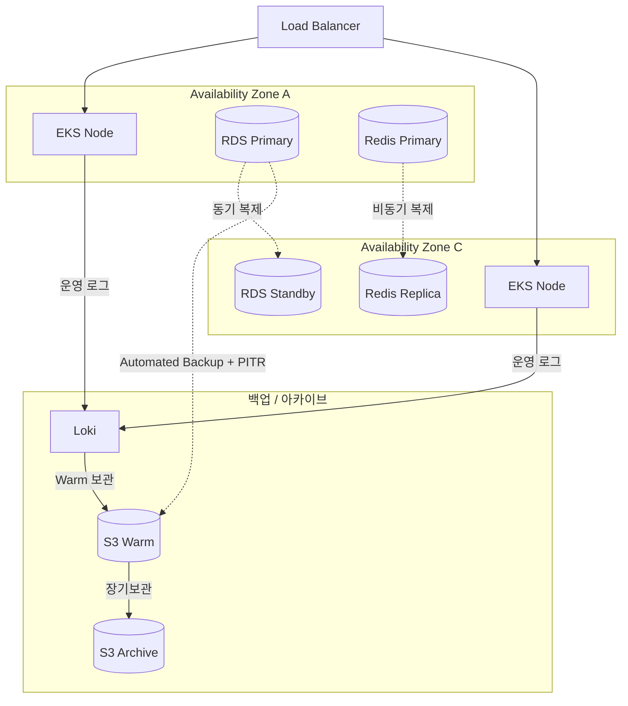
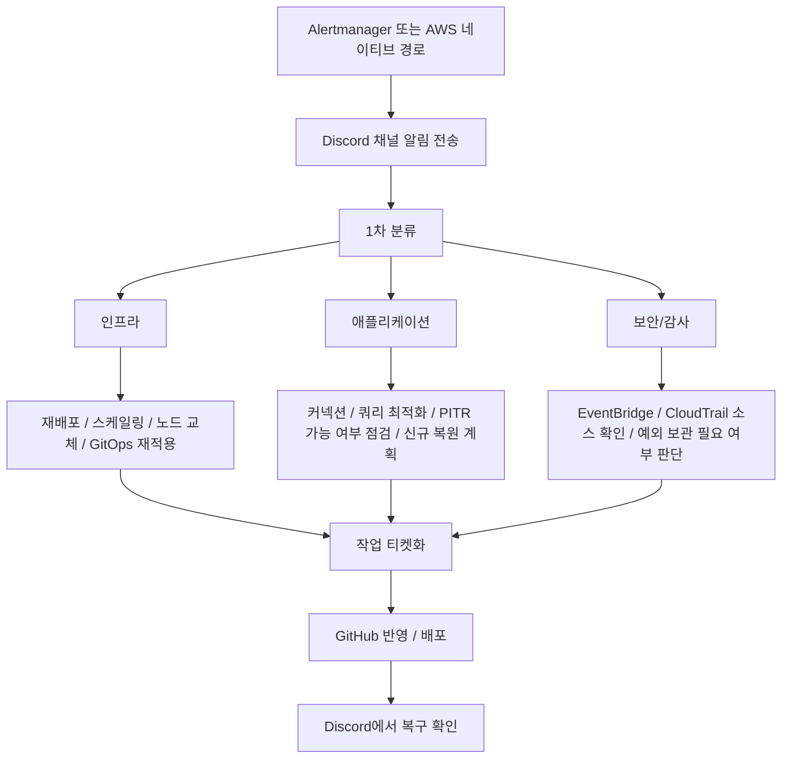

# 장애 대응

Prod 환경은 Multi-AZ 구성으로 EKS 노드, RDS, Redis를 모두 2개 이상의 Availability Zone에 분산합니다. 한쪽 AZ에 장애가 발생해도 다른 쪽이 서비스를 이어받을 수 있도록 설계했습니다.

---

## Multi-AZ 구성

---

## 장애 대응 (Failover)

| 계층 | 장애 시 동작 | 복구 시간 | 데이터 손실 |
|---|---|---|---|
| **EKS** | 다른 AZ에서 Pod 재스케줄링 + Kubernetes self-healing | 즉시~수분 | 없음 |
| **RDS** | Multi-AZ Failover 또는 PITR/스냅샷 기반 신규 복원 후 전환 | 수분 단위 | 없음 또는 최소화 |
| **Redis** | Replica 기반 복구 또는 재구성 | 수초~수분 | 최소 |

Pod는 백업으로 복구하는 대상이 아니라, Kubernetes self-healing, 이미지 재배포, Helm values, GitOps 이력으로 다시 살리는 구조입니다. 상태 저장 데이터는 RDS Automated Backup + PITR + 수동 스냅샷을 기준으로 복구하고, 필요 시 기존 인스턴스를 덮어쓰지 않고 신규 복원 후 전환합니다.

---

## 장애 분류 기준

| 분류 | 주요 징후 | 우선 확인 항목 |
|---|---|---|
| **인프라** | Node NotReady, Pod 재스케줄링, CPU/메모리 포화 | 노드 상태, 오토스케일링, 네트워크 |
| **애플리케이션** | 5xx, P99 상승, CrashLoop | 최근 배포, 애플리케이션 로그, 환경변수, 외부 API |
| **데이터** | DB 연결 포화, 데이터 손상, 잘못된 배치 | 쿼리, 락, PITR 필요 여부 |
| **캐시/세션** | Redis down, 메모리 포화 | Redis 상태, eviction, 의존 기능 영향 |
| **보안/감사** | 권한 변경, 루트 로그인, CloudTrail 이상 | CloudTrail, EventBridge, WAF 이벤트 |

---

## 장애 대응 절차

---

## 복구 수단 기준

- **기본 복구 수단**: RDS Automated Backup + PITR
- **대규모 변경 전 보호**: 수동 스냅샷
- **보조 복구 수단**: staging/prod `pg_dump -> S3`
- **선언형 복구 기준**: GitOps, Helm values, 컨테이너 이미지
- **관측 데이터 보관**: Loki/Tempo S3 backend, Prometheus 로컬 TSDB + Thanos S3 block

---

## 초기 점검 항목

| 항목 | 확인 내용 |
|---|---|
| **최초 장애 시각** | 사건번호 기준 시각 확보 |
| **관련 알람 메시지** | Discord 알림, Alertmanager 또는 AWS 네이티브 경로 확인 |
| **최근 배포 변경점** | ArgoCD Sync 이력, GitHub 반영 내역 확인 |
| **애플리케이션 로그** | 오류 패턴, 공통 예외, 배포 직후 변화 확인 |
| **인프라 이벤트** | 노드, 오토스케일링, 네트워크, Redis 상태 확인 |
| **데이터 상태** | PostgreSQL 연결률, 슬로우 쿼리, PITR 가능 여부 확인 |
| **보안/감사 이벤트** | CloudTrail, EventBridge, WAF 이벤트 확인 |
