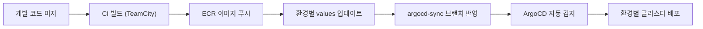

# CI/CD

Playball 배포는 수동 서버 반영이 아니라 `이미지 빌드`, `환경 값 갱신`, `ArgoCD 자동 동기화`로 이어지는 GitOps 방식으로 운영합니다. 최종 기준은 항상 실행 중인 서버가 아니라 Git 저장소에 있는 선언형 설정입니다.

---

## 배포 흐름

---

## 저장소별 배포 책임

| 단계 | 저장소 | 역할 |
|---|---|---|
| **프로비저닝** | 301 | `environments/*` 폴더 기준으로 AWS 기반 인프라 생성 |
| **부트스트랩** | 302 | 클러스터 초기 설치, ArgoCD/ESO/Karpenter 준비 |
| **운영 배포** | 303 | Helm values, Application 정의, 환경별 GitOps 반영 |
| **부하 검증** | 304 / 305 | 배포 후 피크 트래픽 기준 검증 |

---

## 환경 브랜치 전략

아래 브랜치 전략은 `303 Helm / ArgoCD` 저장소 기준입니다. Terraform 저장소(`301`)는 브랜치가 아니라 `environments/*` 폴더 구조로 환경을 나눕니다.

| 환경 | 배포 브랜치 | 의미 |
|---|---|---|
| **Dev** | `argocd-sync/dev` | kubeadm 개발 환경 반영 |
| **Staging** | `argocd-sync/staging` | AWS 검증 환경 반영 |
| **Prod** | `argocd-sync/prod` | 실제 운영 반영 |

애플리케이션 이미지는 `TeamCity`에서 빌드하고, 실제 배포 타이밍은 환경별 `argocd-sync/*` 브랜치 기준으로 결정합니다. ArgoCD는 해당 브랜치를 감시하고, 변경을 감지하면 자동으로 동기화합니다.

---

## 배포 시퀀스

### 1. 인프라 준비

- Terraform으로 EKS, RDS, Redis, 네트워크, 인증서를 준비합니다.
- Bootstrap으로 ESO, Karpenter, ArgoCD, Root App을 설치합니다.

### 2. 애플리케이션 반영

- 개발 코드가 병합되면 TeamCity가 컨테이너 이미지를 빌드해 `ECR`에 푸시합니다.
- TeamCity가 환경별 Helm values의 이미지 태그를 갱신합니다.
- 갱신된 values가 `argocd-sync/*` 브랜치에 반영되면 ArgoCD가 자동 배포합니다.

### 3. 운영 검증

- 배포 후 Grafana 대시보드와 알람 상태를 확인합니다.
- 필요 시 부하 테스트 결과와 장애 복구 기준을 함께 점검합니다.

---

## 롤백과 복구 기준

- **애플리케이션 이상**: 이전 이미지 태그 또는 이전 values 기준으로 되돌립니다.
- **설정 오류**: Helm values / ArgoCD Application 정의를 이전 커밋으로 복원합니다.
- **인프라 이상**: Terraform 상태와 Bootstrap 절차를 기준으로 다시 구성합니다.
- **데이터 이상**: GitOps가 아니라 RDS PITR, 수동 스냅샷, `pg_dump -> S3` 기준으로 복구합니다.

---

## 운영 확인 기준

| 확인 항목 | 기준점 |
|---|---|
| **현재 배포 버전** | values에 기록된 이미지 태그 |
| **배포 성공 여부** | ArgoCD Sync / Health 상태 |
| **서비스 영향** | Grafana 대시보드, Alertmanager, Discord 알림 |
| **복구 가능성** | RDS 백업 상태, PITR 가능 여부, 최근 `pg_dump -> S3` 성공 여부 |
