# K8s 클러스터 구성

> **역할**: Namespace 단위 리소스 배치 · NodePool 매핑 · 클러스터 내부 구조

Playball EKS 클러스터는 두 가지 축으로 워크로드를 격리합니다.

- **Namespace** — 논리적 격리: RBAC 권한 경계, NetworkPolicy 트래픽 제어, 관심사 분리
- **NodePool** — 물리적 격리: 노드 리소스 경합 차단, Spot 중단 영향 범위 제한, 스케일링 독립성

Namespace와 NodePool은 **1:1이 아닙니다**. 여러 Namespace의 Pod가 같은 NodePool에 배치될 수 있고, 이는 의도된 설계입니다. Namespace는 "누가 무엇에 접근할 수 있는가", NodePool은 "어떤 워크로드가 어떤 물리 자원을 쓰는가"를 결정합니다.


---

## Namespace 구성 — 논리적 격리

### apps — 비즈니스 서비스

| Pod | 역할 | 스케일링 |
|-----|------|---------|
| **API-Gateway** | 요청 라우팅, JWT 헤더 주입, Rate Limit, Bot 차단 | KEDA (HTTP req/s) |
| **Auth-Guard** | 인증·인가 처리, 토큰 발급·검증 | KEDA (HTTP req/s) |
| **Queue** | 대기열 관리, 순번 할당·진입 제어 | KEDA (대기열 길이) |
| **Seat** | 좌석 조회·선점(Hold)·해제, 재고 정합성 | KEDA (HTTP req/s) |
| **Order-Core** | 주문 생성·결제 연동·확정 처리 | KEDA (HTTP req/s) |
| **Frontend** | Next.js SSR/CSR 서빙 | KEDA (HTTP req/s) |

**왜 하나의 Namespace인가**: 이 서비스들은 모두 **하나의 사용자 요청 흐름**(대기열 진입 → 좌석 선택 → 결제)을 구성합니다. 같은 Namespace에 두면 NetworkPolicy로 서비스 간 내부 통신을 허용하면서, 외부(monitoring, data 등)로부터의 접근은 차단할 수 있습니다. 배포 파이프라인도 동일한 Helm 차트 구조(`apps/java-service`)를 공유합니다.

**스케일아웃 특성**: 티켓팅 오픈 시 **모든 서비스가 동시에 부하를 받습니다**. KEDA가 서비스별 메트릭(req/s, 대기열 길이)을 기준으로 Pod를 개별 스케일하고, Pod 증가에 따라 Karpenter가 apps NodePool에 노드를 추가합니다.

### istio-system — 서비스메시 컨트롤플레인

| Pod | 역할 | 스케일링 |
|-----|------|---------|
| **istiod** | xDS 설정 배포, mTLS 인증서 관리, 서비스 디스커버리 | HPA (CPU) |
| **Istio Ingress Gateway** | 외부 트래픽 진입점, TLS 종단, VirtualService 라우팅 | HPA (CPU/연결 수) |
| **Rate Limit Service** | 글로벌 Rate Limit (Redis 기반 카운터) | 고정 replica |
| **EnvoyFilter** | Lua 기반 헤더 주입, 커스텀 필터 체인 | (istiod에 의해 배포) |

**왜 분리하는가**: istiod가 죽으면 **새로운 Pod 배포, mTLS 인증서 갱신, 라우팅 변경이 모두 중단**됩니다. apps Namespace와 분리하여 비즈니스 서비스의 배포·RBAC 변경이 메시 컨트롤플레인에 영향을 주지 않도록 합니다. Istio 업그레이드도 apps 배포와 독립적으로 수행할 수 있습니다.

**안정성**: Ingress Gateway는 모든 외부 요청의 단일 진입점이므로, Pod Disruption Budget으로 최소 가용 replica를 보장합니다. istiod는 일시적으로 죽어도 기존 Envoy 사이드카의 설정은 캐싱되어 서비스 통신은 유지됩니다.

### monitoring — 관측성 스택

| Pod | 역할 | 스케일링 |
|-----|------|---------|
| **Prometheus** | 메트릭 수집 (pull), 알림 규칙 평가 | 고정 (StatefulSet) |
| **Alertmanager** | 알림 라우팅·그룹핑, Discord 전파 | 고정 replica |
| **Thanos** | 메트릭 장기 저장 (S3), 글로벌 쿼리 | Sidecar + Store Gateway |
| **Grafana** | 대시보드·시각화 | 고정 replica |
| **Loki** | 로그 수집·인덱싱·쿼리 | 고정 (StatefulSet) |
| **Tempo** | 분산 트레이싱 수집·쿼리 | 고정 (StatefulSet) |
| **OpenTelemetry Collector** | 메트릭·로그·트레이스 수신·가공·전달 | HPA (CPU/큐 깊이) |

**왜 분리하는가**: 관측성은 **장애 상황에서 가장 필요한 도구**입니다. apps Namespace의 서비스가 리소스를 폭발적으로 사용할 때, 같은 권한 경계 안에 있으면 ResourceQuota 경합이나 실수로 인한 영향이 생길 수 있습니다. Namespace를 분리하여 **관측성 전용 ResourceQuota와 LimitRange**를 독립적으로 설정하고, NetworkPolicy로 관측성 Pod에 대한 접근을 제한합니다.

**스케일아웃 특성**: Prometheus·Loki·Tempo는 StatefulSet으로 운영되어 수평 스케일보다 **안정적 재시작과 데이터 보존**이 우선입니다. OTel Collector만 트래픽 비례로 스케일합니다. 이 패턴이 apps의 "요청량 기반 급속 스케일아웃"과 근본적으로 다르기 때문에 분리가 자연스럽습니다.

### security — 정책·감사

| Pod | 역할 | 스케일링 |
|-----|------|---------|
| **Kyverno** | Admission 정책 적용 (Pod 생성/변경 시 검증·변환) | HPA (webhook 부하) |
| **Policy Reporter** | 정책 위반 리포팅·대시보드 | 고정 replica |

**왜 분리하는가**: Kyverno는 **Admission Webhook**으로 동작하여 모든 Namespace의 리소스 생성/변경을 가로챕니다. 특정 Namespace에 종속되면 해당 NS의 RBAC 변경이 클러스터 전체 정책 적용에 영향을 줄 수 있습니다. 독립 Namespace에 두어 **정책 엔진의 권한과 생명주기를 비즈니스 서비스와 완전히 분리**합니다.

**안정성**: Kyverno가 죽으면 Admission Webhook이 동작하지 않아 정책 미적용 상태로 Pod가 생성될 수 있습니다. `failurePolicy: Fail`로 설정하여 Kyverno 장애 시 안전하지 않은 Pod 생성 자체를 차단합니다.

### data — 관리 도구 (Staging 전용)

| Pod | 역할 | 스케일링 |
|-----|------|---------|
| **ClickHouse** | 분석용 OLAP 데이터베이스 | 고정 (StatefulSet) |
| **CloudBeaver** | 웹 기반 DB 관리 (RDS 접근) | 고정 replica |
| **RedisInsight** | Redis 상태 조회·디버깅 | 고정 replica |
| **Kafka-UI** | Kafka 토픽/컨슈머 관리 (도입 시) | 고정 replica |

**왜 분리하는가**: 관리 도구는 **개발/디버깅 목적**이며 Staging에서만 노출됩니다. apps나 monitoring에 섞으면 관리 도구의 보안 취약점이 서비스 Pod에 대한 lateral movement 경로가 될 수 있습니다. Prod에서는 이 Namespace 자체를 배포하지 않고, **Bastion SSM을 통한 CLI 접근만 허용**합니다.

### ai — AI 서비스

| Pod | 역할 | 스케일링 |
|-----|------|---------|
| **AI Defense API** | 악성 입력 탐지·차단 | HPA (req/s) |
| **authz-adapter** | Istio ext_authz 대상, AI 기반 인가 판단 | HPA (req/s) |

**왜 분리하는가**: AI 워크로드는 추론 시 **CPU/메모리 사용 패턴이 불규칙**하고, 모델 업데이트 주기가 비즈니스 서비스와 다릅니다. 별도 Namespace에서 독립적인 ResourceQuota를 적용하고, AI 모델 배포가 서비스 배포 파이프라인에 영향을 주지 않도록 합니다.

### argocd — GitOps 배포

| Pod | 역할 | 스케일링 |
|-----|------|---------|
| **ArgoCD Server** | UI·API, Application 상태 조회 | 고정 replica |
| **Repo Server** | Git 레포 클론·Helm 렌더링 | HPA (동시 sync 수) |
| **Application Controller** | 실제 sync 실행, diff 감지 | 고정 (leader election) |

**왜 분리하는가**: ArgoCD는 **모든 Namespace에 리소스를 배포하는 권한**을 가집니다. 다른 Namespace에 두면 해당 NS의 RBAC이 배포 시스템 전체에 영향을 줄 수 있습니다. 독립 Namespace + 전용 ServiceAccount로 배포 권한을 격리합니다.

**안정성**: ArgoCD가 일시 중단되어도 이미 배포된 서비스는 영향 없습니다(선언적 상태가 클러스터에 이미 적용됨). 새로운 배포만 대기 상태가 됩니다.

### kube-system — 클러스터 핵심

| Pod | 역할 | 스케일링 |
|-----|------|---------|
| **VPC CNI** | Pod 네트워킹, ENI 할당 | DaemonSet (노드당 1개) |
| **CoreDNS** | 클러스터 내부 DNS 해석 | HPA (DNS 쿼리 수) |
| **Karpenter** | NodePool 기반 노드 프로비저닝·회수 | 고정 replica (leader election) |
| **AWS LB Controller** | ALB/NLB 생성·관리 | 고정 replica |

**왜 분리하는가**: EKS 관리형 컴포넌트와 클러스터 운영 필수 요소가 위치합니다. 이 Namespace의 Pod가 죽으면 **네트워킹(CNI), 이름 해석(CoreDNS), 노드 프로비저닝(Karpenter) 자체가 중단**됩니다. 다른 어떤 워크로드보다 높은 우선순위(PriorityClass)를 부여하고, 리소스 요청을 보장하여 eviction 대상에서 제외합니다.

### Namespace ↔ NodePool 매핑

```
Namespace          NodePool        이유
─────────────────────────────────────────────────────────────
apps            → apps           사용자 요청 경로, 동일 트래픽 패턴
istio-system    → apps           Ingress Gateway가 apps와 같은 부하 주기
argocd          → apps           배포 시스템, apps 노드에서 가까울수록 sync 빠름
security        → apps           Admission Webhook, 모든 NS Pod 생성에 관여
ai              → apps           ext_authz로 요청 경로에 포함
data            → apps           경량 관리 도구, Staging 전용
monitoring      → monitoring     관측성 전용 물리 격리
(k6)            → loadtest       부하테스트 전용 물리 격리
kube-system     → (EKS 관리형)    관리형 노드그룹, Karpenter 관할 밖
```

> **핵심**: apps NodePool에는 6개 Namespace의 Pod가 배치됩니다. 이들은 논리적으로는 Namespace로 분리되어 RBAC·NetworkPolicy·ResourceQuota가 각각 적용되지만, **트래픽 패턴이 동일**하므로 물리적으로는 같은 노드를 공유합니다. 반면 monitoring은 부하 패턴이 근본적으로 달라 반드시 물리 분리해야 합니다.

---

## NodePool 분리 (Karpenter) — 물리적 격리

Namespace가 "누가 무엇에 접근하는가"를 제어한다면, NodePool은 **"누가 어떤 물리 자원을 쓰는가"**를 제어합니다. 워크로드 특성이 다른 Pod를 같은 노드에 두면 한쪽의 부하가 다른 쪽의 안정성을 해칩니다.

### apps NodePool

**배치 대상**: apps · istio-system · argocd · security · ai · data Namespace

| 항목 | Staging | Prod |
|------|---------|------|
| 인스턴스 | Spot 다양화 (7종 × 3 AZ = 21+ 풀) | On-Demand |
| 아키텍처 | Graviton arm64 통일 | 동일 |
| 메모리 | ≥ 16GB 보장 | 동일 |

**스케일아웃 흐름**:
1. 티켓팅 오픈 → KEDA가 req/s·대기열 길이 감지 → 서비스별 Pod 증가
2. Pod가 늘어나 기존 노드에 자리가 없으면 → Karpenter가 Pending Pod 감지
3. Karpenter가 apps NodePool 제약 조건(인스턴스 타입·AZ·아키텍처) 내에서 **최적 노드 프로비저닝**
4. 트래픽 감소 → KEDA가 Pod 축소 → 빈 노드를 Karpenter가 **자동 회수** (consolidation)

**안정성 설계**:
- Spot 다양화로 단일 풀 회수 시 영향을 전체의 ~5%(1/21)로 제한
- Multi-AZ 분산으로 AZ 장애 시에도 다른 AZ에서 즉시 노드 확보
- PodDisruptionBudget으로 Spot 회수 시에도 최소 가용 Pod 보장

<!-- 💡 Staging Spot 안정성: 단일 타입(m6g.xlarge) + 단일 AZ 운영 시
     24h 동안 9회+ 중단 발생 → 7종 다양화 + 3 AZ 분산으로 풀 21개 이상 확보,
     중단 빈도 급감. 상세 → [Staging Spot 다양화 트러블슈팅](./operational-troubleshooting/staging-spot) -->

### monitoring NodePool

**배치 대상**: monitoring Namespace 전용

| 항목 | Staging | Prod |
|------|---------|------|
| 인스턴스 | Spot 다양화 (5종 × 3 AZ = 15+ 풀) | On-Demand |
| 아키텍처 | Graviton arm64 통일 | 동일 |
| 메모리 | ≥ 16GB 보장 | 동일 |

**왜 물리 분리하는가 — "장애 때 관측성이 죽으면 안 된다"**

관측성 스택은 **장애 상황에서 가장 필요한 도구**입니다. apps NodePool과 같은 노드에 배치하면:

- 티켓팅 트래픽 급증 → 서비스 Pod가 노드 리소스를 점유 → Prometheus/Loki가 OOM으로 evict
- **장애를 관측해야 할 도구가 장애 때문에 죽는** 역설 발생
- 알림이 안 나가고, 대시보드가 멈추고, 로그가 유실됨

NodePool을 분리하면 서비스 트래픽이 아무리 폭증해도 **monitoring 노드의 리소스는 100% 관측성 전용**으로 유지됩니다.

**스케일아웃 특성 — apps와 근본적으로 다름**:
- Prometheus·Loki·Tempo는 **StatefulSet** — 급속 수평 스케일이 아니라 **안정적 재시작과 데이터 보존**이 우선
- 부하 패턴이 "요청량 비례 급증"이 아니라 "메트릭/로그 수집량에 따른 점진적 증가"
- OTel Collector만 트래픽 비례로 HPA 스케일, 나머지는 고정 replica

이 차이 때문에 apps와 같은 NodePool에 두면 Karpenter의 consolidation 판단이 꼬입니다. apps 트래픽이 빠져 노드를 줄이려는데 StatefulSet이 남아있어 회수가 안 되거나, 반대로 StatefulSet이 있는 노드에 서비스 Pod가 몰려 메모리 경합이 발생합니다.

<!-- 💡 Staging Spot 안정성: monitoring도 다양화 적용 후
     24h 2회 → 0회로 중단 감소. monitoring은 Spot 중단 시 메트릭 유실 위험이 있어
     중단 24h 2회 이상 재발 시 On-Demand 전환 트리거 설정.
     상세 → [Staging Spot 다양화 트러블슈팅](./operational-troubleshooting/staging-spot) -->

### loadtest NodePool

**배치 대상**: k6 부하테스트 Pod 전용

| 항목 | 정책 |
|------|------|
| 인스턴스 | Spot (테스트 종료 시 노드 자동 회수) |
| 스케일링 | 테스트 규모에 따라 Karpenter가 동적 프로비저닝 |

**왜 물리 분리하는가 — "테스트가 실서비스를 오염시키면 안 된다"**

부하테스트는 의도적으로 수천~수만 req/s를 발생시킵니다. 같은 노드에서 돌리면:

- k6가 CPU/메모리를 대량 점유 → 서비스 Pod가 throttle되거나 evict
- **테스트 결과가 왜곡됨** — 느려진 게 백엔드 한계인지 노드 리소스 부족인지 구분 불가
- 관측성 Pod도 영향받아 테스트 중 메트릭/로그 유실 가능

별도 NodePool + Istio Rate Limit 예외 처리로, k6가 생성한 트래픽은 **apps 노드의 서비스만 부하를 받고**, k6 자체의 리소스 소모는 loadtest 노드에서 격리됩니다. 테스트가 끝나면 Pod가 종료되고 Karpenter가 빈 노드를 자동 회수하므로 **비용도 테스트 시간만큼만** 발생합니다.

### NodePool 분리 요약

```mermaid
block-beta
  columns 3

  block:apps["apps NodePool\n(Spot 다양화 / On-Demand)"]:2
    columns 2
    block:ns_apps["apps NS"]
      a1["API-Gateway"]
      a2["Auth-Guard"]
      a3["Queue"]
      a4["Seat"]
      a5["Order-Core"]
      a6["Frontend"]
    end
    block:ns_infra["인프라 NS"]
      b1["istiod"]
      b2["Ingress GW"]
      b3["ArgoCD"]
      b4["Kyverno"]
      b5["AI Defense"]
      b6["CloudBeaver"]
    end
  end

  block:mon["monitoring\nNodePool\n(물리 격리)"]:1
    block:ns_mon["monitoring NS"]
      c1["Prometheus"]
      c2["Alertmanager"]
      c3["Grafana"]
      c4["Loki"]
      c5["Tempo"]
      c6["OTel"]
      c7["Thanos"]
    end
  end

  space
  block:lt["loadtest NodePool\n(테스트 시만 프로비저닝)"]:1
    d1["k6 Runner"]
  end
  space

  apps --"X 장애 전파 차단"--> mon
  lt --"X 리소스 오염 차단"--> apps
```



### Namespace × NodePool 전체 매핑

| Namespace | NodePool | 주요 Pod | 배치 이유 |
|-----------|----------|---------|-----------|
| **apps** | apps | API-Gateway, Auth-Guard, Queue, Seat, Order-Core, Frontend | 사용자 요청 경로, 동일 트래픽 패턴 (티켓팅 오픈 시 동시 급증) |
| **istio-system** | apps | istiod, Ingress Gateway, Rate Limit Service | Ingress Gateway가 apps와 같은 부하 주기, 요청 경로의 첫 홉 |
| **argocd** | apps | ArgoCD Server, Repo Server, Application Controller | 배포 대상이 주로 apps NS, 동일 노드에서 sync 효율 |
| **security** | apps | Kyverno, Policy Reporter | Admission Webhook으로 모든 NS의 Pod 생성에 관여, 경량 |
| **ai** | apps | AI Defense API, authz-adapter | ext_authz로 요청 경로에 포함, apps와 같은 부하 패턴 |
| **data** | apps | ClickHouse, CloudBeaver, RedisInsight, Kafka-UI | Staging 전용 경량 관리 도구, 별도 NodePool 불필요 |
| **monitoring** | **monitoring** | Prometheus, Alertmanager, Thanos, Grafana, Loki, Tempo, OTel | **물리 격리 필수** — 서비스 장애 시 관측성 보존 |
| *(k6)* | **loadtest** | k6 Runner | **물리 격리 필수** — 테스트 부하가 실서비스/관측성 오염 방지 |
| **kube-system** | *(EKS 관리형)* | VPC CNI, CoreDNS, Karpenter, AWS LB Controller | Karpenter 관할 밖, EKS 관리형 노드그룹 |

### 두 가지 격리 축의 역할

| | Namespace (논리적 격리) | NodePool (물리적 격리) |
|---|---|---|
| **제어 대상** | 접근 권한 (RBAC), 네트워크 정책, 리소스 쿼터 | CPU/메모리 경합, Spot 중단 범위, 스케일링 독립성 |
| **분리 기준** | 관심사·책임 (서비스, 관측성, 보안, 배포) | 부하 패턴·안정성 요구 (서비스 vs 관측성 vs 테스트) |
| **장애 격리** | RBAC 오설정·NetworkPolicy 실수의 영향 범위 제한 | 리소스 폭주·노드 회수의 영향 범위를 물리적으로 제한 |
| **1:1 관계?** | 8개 Namespace | 3개 NodePool — **N:1 관계** (여러 NS가 같은 NodePool 공유) |

> **핵심**: Namespace는 "누가 무엇에 접근할 수 있는가", NodePool은 "어떤 워크로드가 어떤 물리 자원을 쓰는가"를 결정합니다. 논리적으로는 8개로 세밀하게 나누되, 물리적으로는 부하 패턴이 다른 3개 경계에서만 자릅니다.

---

## 네트워크 격리

- **CNI** — L3/L4 라우팅, 네트워크 플로우 관측
- **NetworkPolicy default-deny** — 모든 Namespace에 기본 차단, `allow-policies.yaml`로 필요한 통신만 허용
- **Istio mTLS STRICT** — Namespace 내/외 모든 Pod 간 통신 자동 암호화

상세 정책은 [보안 → 인프라 보안](../security/infrastructure-security) 참조.
