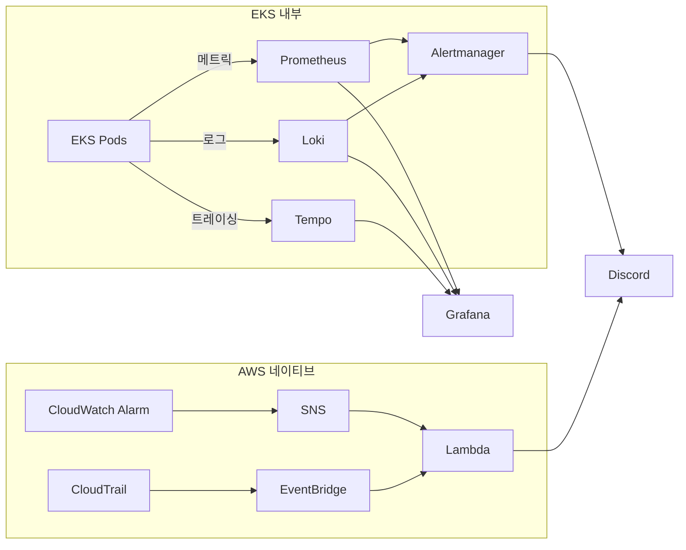

# 모니터링

EKS 내부는 Prometheus, Loki, Tempo로 메트릭, 로그, 트레이싱을 수집하고, Grafana로 통합 시각화합니다. AWS 리소스와 보안 이벤트는 AWS 네이티브 경로를 사용하며, 최종 알림 채널은 Discord로 통합합니다.

---

## 모니터링 스택

| 도구 | 역할 | 대상 |
|---|---|---|
| **Prometheus** | 메트릭 수집 | CPU, Memory, 요청 수, 응답 시간 |
| **Loki** | 로그 수집 | 앱 로그, 에러 로그 |
| **Tempo** | 분산 트레이싱 | 요청 흐름 추적 |
| **Grafana** | 대시보드 | 통합 시각화 |
| **Alertmanager** | EKS 내부 알람 | 임계치 기반 알림 |
| **CloudWatch Alarm → SNS/Lambda** | AWS 리소스 알람 | ALB, RDS 등 AWS 운영 메트릭 |
| **CloudTrail → EventBridge → Lambda** | AWS 감사/보안 이벤트 | 권한 변경, 감사 이상 징후 |

---

## 현재 고정 운영 정책

- **EKS 내부 알림 엔진**: Prometheus/Loki 룰 → Alertmanager → Discord
- **AWS 리소스 알림**: CloudWatch Alarm → SNS/Lambda → Discord
- **AWS 감사/보안 이벤트**: CloudTrail → EventBridge → Lambda → Discord
- **실시간 Critical**: 서비스 중단 또는 복구 가능성 상실 위험 중심
- **실시간 Warning**: 사용자 영향 가능성이 높은 일부 지표만 선택 전송
- **Info**: 기본적으로 실시간 전송하지 않고 대시보드와 주간 리뷰 기준으로 사용

---

## 주요 시스템 알람

> 티켓 오픈 등 고위험 이벤트 구간에는 단기 임계치를 임시로 적용할 수 있습니다.

| 알람 | 조건 | 심각도 | 기본 운영 |
|---|---|---|---|
| **5xx 에러율 증가** | > 1% (5분) / > 3% (5분) | Warning / Critical | 실시간 Discord 전송 |
| **응답 지연(P99)** | > 3초 / > 5초 | Warning / Critical | 실시간 Discord 전송 |
| **Pod CrashLoop** | 재시작 > 3회 (10분) | Critical | Discord (+멘션) |
| **Node NotReady** | Ready 아닌 노드 1개 이상 (5분) | Critical | Discord (+멘션) |
| **클러스터 CPU 사용률** | > 65% / > 80% | Warning / Critical | Warning은 대시보드 확인, Critical만 즉시 대응 |
| **클러스터 메모리 사용률** | > 70% / > 90% | Warning / Critical | Warning은 대시보드 확인, Critical만 즉시 대응 |
| **PostgreSQL 연결 포화** | > 70% / > 90% | Warning / Critical | 실시간 Discord 전송 |
| **RDS 백업/복구 상태 이상** | Backup 실패, PITR 비활성, 수동 스냅샷 미생성, 최근 `pg_dump -> S3` 성공 백업 부재 | Warning / Critical | 실시간 Discord 전송 |
| **Redis 가용성** | `redis_up = 0` | Critical | Discord (+멘션) |
| **Redis 메모리 사용률** | > 80% / > 90% | Warning / Critical | Warning은 대시보드 확인, Critical 구간 중심 대응 |
| **ALB 자체 5xx 응답** | 5분간 5건 이상 | Critical | AWS 네이티브 경로 즉시 전파 |

현재 운영 기준에서 실시간 Warning은 **5xx, API P99, PostgreSQL 연결 포화**만 유지합니다. CPU/메모리 Warning과 Redis 메모리 Warning은 기본적으로 대시보드 확인용입니다.

---

## 복구 가능성 감시

성능 저하와 별도로 "지금 장애가 나면 실제로 복구 가능한가"를 따로 감시합니다.

- **RDS PITR 상태**
- **Automated Backup 정상 여부**
- **예정된 수동 스냅샷 생성 여부**
- **staging/prod `pg_dump -> S3` 최근 성공 여부**
- **Loki/Tempo S3 backend 정상성**
- **Prometheus 로컬 TSDB + Thanos S3 block 업로드 정상성**

---

## 비즈니스 KPI 관측

장애 감지뿐만 아니라 서비스 효과도 운영 지표로 추적합니다. 비즈니스 KPI는 기본적으로 Info 성격으로 운영하며, 2주 이상 기준선이 확보된 뒤에만 상위 단계 알림 전환을 검토합니다.

| 우선순위 | 지표 | 목적 |
|---|---|---|
| **P1** | Hold 성공률 | 좌석 선점 성공률 직접 측정 |
| **P2** | 추천 vs 좌석맵 성공률 비교 | 추천 모드의 실제 효과 측정 |
| **P2** | 추천 운영 상태 (degrade/fallback) | 추천 알고리즘 정상 동작 여부 |
| **P3** | 주문 퍼널 (Hold → 주문 진입) | 전환율 확인 |
| **P3** | 결제 수단별 성공률 | 결제 수단별 원인 분석 |
