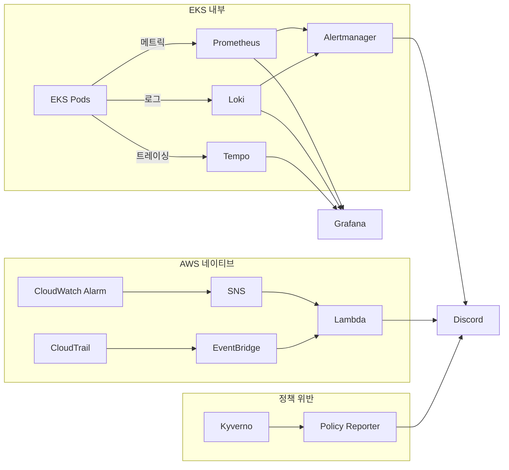

# 모니터링

Playball은 메트릭, 로그, 트레이스를 Grafana 기준으로 통합 확인하고, AWS 리소스와 감사 이벤트는 CloudWatch, CloudTrail, Policy Reporter 경로로 함께 추적합니다.

---

## 모니터링 스택

| 도구 | 역할 | 대상 |
|---|---|---|
| **Prometheus** | 메트릭 수집 | CPU, Memory, 요청 수, 응답 시간 |
| **Loki** | 로그 수집 | 앱 로그, 에러 로그 |
| **Tempo** | 분산 트레이싱 | 요청 흐름 추적 |
| **Thanos** | 장기 메트릭 보관 | Prometheus 장기 메트릭 데이터 |
| **Grafana** | 통합 대시보드 | 메트릭, 로그, 트레이스 시각화 |
| **CloudWatch** | AWS 리소스 상태 확인 | ALB, RDS, ElastiCache, 운영 알람 |
| **CloudTrail** | 운영 변경 추적 | 권한 변경, 감사 이벤트, 보안 이벤트 |
| **Policy Reporter** | 정책 위반 확인 | Kyverno PolicyReport, ClusterPolicyReport |

---

## 주요 관측 대상

| 구분 | 확인 기준 | 주요 도구 |
|---|---|---|
| **애플리케이션 메트릭** | 응답 시간, 5xx 비율, 요청 수, Pod 상태 | Grafana, Prometheus |
| **애플리케이션 로그** | 예외 로그, 인증 실패, WAF 차단, 배포 직후 오류 | Grafana, Loki |
| **분산 추적** | API 요청 흐름, 서비스 간 지연 구간 | Grafana, Tempo |
| **클러스터 상태** | Node 상태, 리소스 사용률, 재시작 수, 오토스케일링 | Grafana, Prometheus |
| **데이터 계층** | RDS 연결률, Redis 상태, 백업/복구 가능성 | Grafana, CloudWatch |
| **운영 변경 추적** | 권한 변경, 보안 이벤트, 감사 이벤트 | CloudTrail, CloudWatch |
| **정책 위반** | Kyverno PolicyReport, ClusterPolicyReport | Policy Reporter |

---

## 운영 확인 기준

| 구분 | 확인 경로 | 목적 |
|---|---|---|
| **서비스 상태 확인** | Grafana | 메트릭, 로그, 트레이스를 한 화면에서 확인 |
| **AWS 리소스 상태 확인** | CloudWatch | ALB, RDS, ElastiCache, 운영 알람 상태 확인 |
| **운영 변경 추적** | CloudTrail | 변경 주체, 시각, API 호출 추적 |
| **정책 위반 확인** | Policy Reporter | 배포 정책 위반 리소스와 위반 유형 확인 |

---

## 데이터 보존과 장기 추적

| 구분 | 운영 기준 | 확인 경로 |
|---|---|---|
| **로그 보관** | Loki 기반 운영 로그 확인, S3 관측 저장소 적재 유지 | Grafana, S3 |
| **트레이스 보관** | Tempo 기반 요청 흐름 추적, S3 관측 저장소 적재 유지 | Grafana, S3 |
| **장기 메트릭 보관** | Thanos 기준 장기 메트릭 조회 유지 | Grafana, S3 |
| **감사 로그 보관** | CloudTrail과 감사 저장소 기준으로 운영 변경 이력 유지 | CloudTrail, S3 |

---

## 비즈니스 KPI 관측

비즈니스 KPI도 Grafana 대시보드로 함께 추적합니다.

| 우선순위 | 지표 | 목적 |
|---|---|---|
| **P1** | Hold 성공률 | 좌석 선점 성공률 직접 측정 |
| **P2** | 추천 vs 좌석맵 성공률 비교 | 추천 모드의 실제 효과 측정 |
| **P2** | 추천 운영 상태 (degrade/fallback) | 추천 알고리즘 정상 동작 여부 |
| **P3** | 주문 퍼널 (Hold → 주문 진입) | 전환율 확인 |
| **P3** | 결제 수단별 성공률 | 결제 수단별 원인 분석 |
