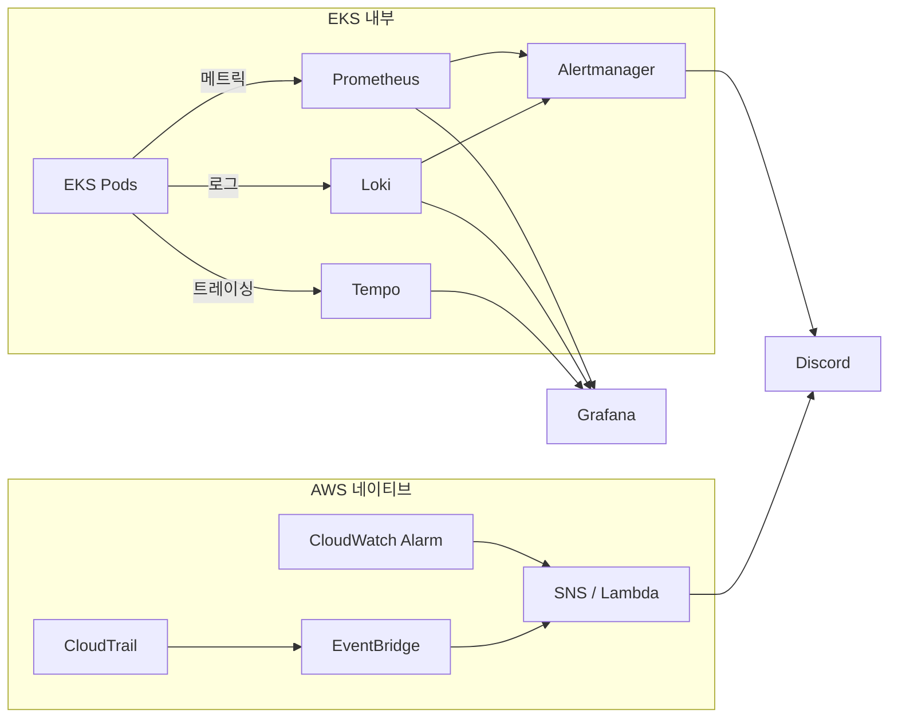

# 모니터링

EKS 내부는 Prometheus, Loki, Tempo로 메트릭, 로그, 트레이싱을 수집하고, Grafana로 통합 시각화합니다. AWS 리소스와 보안 이벤트는 CloudWatch, EventBridge, SNS/Lambda를 통해 알림을 전달합니다. 모든 알림은 Discord로 수신합니다.

---

## 모니터링 스택

| 도구 | 역할 | 대상 |
|---|---|---|
| **Prometheus** | 메트릭 수집 | CPU, Memory, 요청 수, 응답 시간 |
| **Loki** | 로그 수집 | 앱 로그, 에러 로그 |
| **Tempo** | 분산 트레이싱 | 요청 흐름 추적 |
| **Grafana** | 대시보드 | 통합 시각화 |
| **Alertmanager** | EKS 내부 알람 | 임계치 기반 알림 |
| **CloudWatch / EventBridge / SNS-Lambda** | AWS 네이티브 알람 | AWS 리소스, 보안 이벤트 |

---

## 주요 시스템 알람

> 티켓 오픈 등 고위험 이벤트 구간에는 단기 임계치를 임시로 적용할 수 있습니다.

| 알람 | 조건 | 심각도 | 알림 |
|---|---|---|---|
| **5xx 에러율 증가** | > 1% (5분) / > 3% (5분) | Warning / Critical | Discord |
| **응답 지연(P99)** | > 3초 / > 5초 | Warning / Critical | Discord |
| **Pod CrashLoop** | 재시작 > 3회 (10분) | Critical | Discord (+멘션) |
| **Node NotReady** | Ready 아닌 노드 1개 이상 (5분) | Critical | Discord (+멘션) |
| **클러스터 CPU 사용률** | > 65% / > 80% | Warning / Critical | Discord |
| **클러스터 메모리 사용률** | > 70% / > 90% | Warning / Critical | Discord |
| **PostgreSQL 연결 포화** | > 70% / > 90% | Warning / Critical | Discord |
| **RDS 백업/복구 상태 이상** | Backup 실패, PITR 비활성, 수동 스냅샷 미생성 | Warning / Critical | Discord |
| **Redis 메모리 사용률** | > 80% / > 90% | Warning / Critical | Discord |

---

## 비즈니스 KPI 관측

장애 감지뿐만 아니라 서비스 효과도 운영 지표로 추적합니다.

| 우선순위 | 지표 | 목적 |
|---|---|---|
| **P1** | Hold 성공률 | 좌석 선점 성공률 직접 측정 |
| **P2** | 추천 vs 좌석맵 성공률 비교 | 추천 모드의 실제 효과 측정 |
| **P2** | 추천 운영 상태 (degrade/fallback) | 추천 알고리즘 정상 동작 여부 |
| **P3** | 주문 퍼널 (Hold → 주문 진입) | 전환율 확인 |
| **P3** | 결제 수단별 성공률 | 결제 수단별 원인 분석 |
