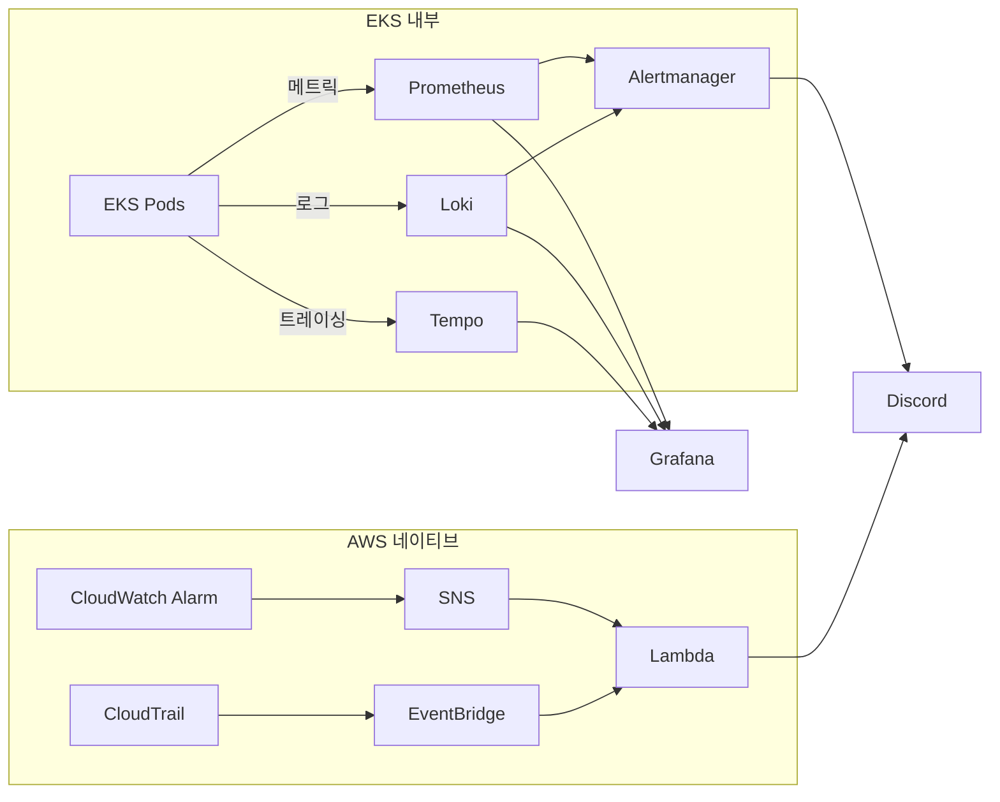

# 모니터링

운영 기준은 EKS 내부 경로와 AWS 네이티브 경로를 분리하고, 최종 알림 채널은 Discord로 통합합니다.

---

## 모니터링 스택

| 도구 | 역할 | 대상 |
|---|---|---|
| **Prometheus** | 메트릭 수집 | CPU, Memory, 요청 수, 응답 시간 |
| **Loki** | 로그 수집 | 앱 로그, 에러 로그 |
| **Tempo** | 분산 트레이싱 | 요청 흐름 추적 |
| **Thanos** | 장기 메트릭 보관 | Prometheus block 장기 저장 |
| **Grafana** | 대시보드 | 통합 시각화 |
| **Alertmanager** | EKS 내부 알람 | 임계치 기반 알림 |
| **CloudWatch Alarm → SNS/Lambda** | AWS 리소스 알람 | ALB, RDS 등 AWS 운영 메트릭 |
| **CloudTrail → EventBridge → Lambda** | AWS 감사/보안 이벤트 | 권한 변경, 감사 이상 징후 |

---

## 알람 단계

| 단계 | 의미 | 채널 | 멘션 | 대응 시간 |
|---|---|---|---|---|
| **Critical** | 서비스 장애/중단 위험 | `#alerts-critical` | 운영 멘션 | 5분 이내 |
| **Warning** | 성능 저하, 장애 전조 | `#alerts-warning` | 없음 | 30분 이내 |
| **Info** | 참고성 이벤트, 추세 공유 | `#alerts-info` | 없음 | 확인만 |

보안/감사 이벤트는 `#alerts-security-critical`, `#alerts-security-warning`, `#alerts-security-info` 채널로 분리 운영합니다.

---

## 전파 구조

| 영역 | 파이프라인 | 최종 채널 |
|---|---|---|
| **EKS 내부 메트릭/로그** | Prometheus/Loki 룰 → Alertmanager → Discord | 운영 채널 또는 보안/감사 채널 |
| **AWS 리소스 운영 메트릭** | CloudWatch Alarm → SNS/Lambda → Discord | 운영 채널 |
| **AWS 감사/보안 이벤트** | CloudTrail → EventBridge → Lambda → Discord | 보안/감사 채널 |
| **노드 상태 / Spot interruption** | 전용 인프라 경로 | `#staging-eks-spot`, `#prod-eks-spot` |

---

## 운영 알림 기준

| 알람 | 조건 | 심각도 | 참고 경로 |
|---|---|---|---|
| **5xx 에러율 증가** | > 1% (5분) / > 3% (5분) | Warning / Critical | Grafana `애플리케이션 모니터링 (Spring Boot)` |
| **응답 지연(P99)** | > 3초 / > 5초 | Warning / Critical | Grafana `애플리케이션 모니터링 (Spring Boot)` |
| **Pod CrashLoop** | 재시작 > 3회 (10분) | Critical | Grafana `K8s 운영 현황판 (Pods)` |
| **Node NotReady** | Ready 아닌 노드 1개 이상 (5분) | Critical | Grafana `K8s 운영 현황판 (k9s 스타일)` |
| **클러스터 CPU 사용률** | > 65% / > 80% | Warning / Critical | Grafana `K8s 운영 현황판 (k9s 스타일)` |
| **클러스터 메모리 사용률** | > 70% / > 90% | Warning / Critical | Grafana `K8s 운영 현황판 (k9s 스타일)` |
| **PostgreSQL 연결 포화** | > 70% / > 90% | Warning / Critical | Grafana `Database - RDS PostgreSQL` |
| **RDS 백업/복구 상태 이상** | Backup 실패, PITR 비활성, 수동 스냅샷 미생성, 최근 `pg_dump -> S3` 성공 백업 부재 | Warning / Critical | Grafana `운영 알람 현황`, CloudWatch |
| **Redis 가용성** | `redis_up = 0` | Critical | Grafana `Cache & Queue - ElastiCache Redis` |
| **Redis 메모리 사용률** | > 80% / > 90% | Warning / Critical | Grafana `Cache & Queue - ElastiCache Redis` |
| **ALB 자체 5xx 응답** | 5분간 5건 이상 | Critical | CloudWatch `ALB` |

---

## 보안/감사 알림 기준

| 알람 | 조건 | 심각도 | 참고 경로 |
|---|---|---|---|
| **매크로/봇 탐지 수** | > 50건 (5분) / > 200건 (5분) | Warning / Critical | Grafana `Lua WAF 보안 정책` |
| **차단 IP 수** | > 100건 (5분) / > 500건 (5분) | Warning / Critical | Grafana `Rate Limit 모니터링` |
| **인증 실패율** | > 30% (5분) / > 50% (5분) | Warning / Critical | Grafana `Loki Kubernetes Logs`, `애플리케이션 모니터링 (Spring Boot)` |
| **WAF 차단 이벤트(403/429)** | > 200건 (15분) / > 1000건 (15분) | Warning / Critical | Grafana `Istio WAF 모니터링`, `Rate Limit 모니터링` |
| **Kyverno 정책 위반** | privileged, latest 태그, 리소스 제한, 필수 라벨, ArgoCD 관리 라벨, probe 위반 감지 | Info | `Policy Reporter UI`, Grafana `security-ops` |

---

## 복구 가능성 알림 기준

| 항목 | 기준 | 단계 | 참고 경로 |
|---|---|---|---|
| **RDS 백업 실패 / PITR 비활성 / 예정된 수동 스냅샷 미생성 / 최근 dump 백업 부재** | 1회 이상 감지 | Warning | Grafana `운영 알람 현황`, CloudWatch |
| **복구 가능성 상실** | PITR 불가, 자동백업 실패 지속, dump 백업 부재 지속 | Critical | Grafana `운영 알람 현황`, CloudWatch |
| **Loki / Tempo S3 backend 이상** | 객체 저장소 접근 실패, 적재 실패 | Warning | Grafana, S3 버킷 |
| **Thanos block 업로드 이상** | block 업로드 실패, object storage secret 이상 | Warning | Grafana, S3 버킷 |

---

## 비즈니스 KPI 관측

비즈니스 KPI도 Grafana 대시보드로 함께 추적합니다.

| 우선순위 | 지표 | 목적 |
|---|---|---|
| **P1** | Hold 성공률 | 좌석 선점 성공률 직접 측정 |
| **P2** | 추천 vs 좌석맵 성공률 비교 | 추천 모드의 실제 효과 측정 |
| **P2** | 추천 운영 상태 (degrade/fallback) | 추천 알고리즘 정상 동작 여부 |
| **P3** | 주문 퍼널 (Hold → 주문 진입) | 전환율 확인 |
| **P3** | 결제 수단별 성공률 | 결제 수단별 원인 분석 |
