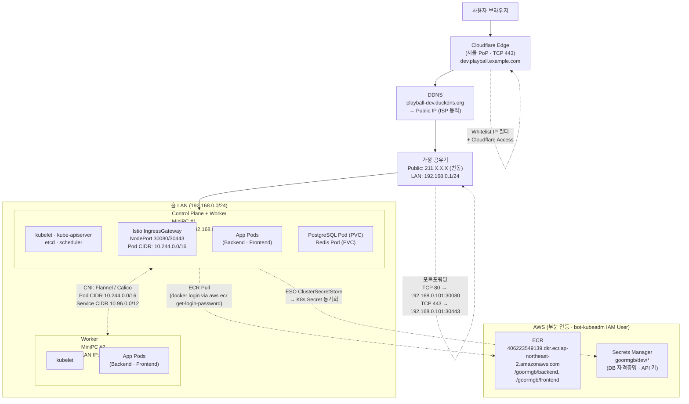

# 아우터 아키텍처 - Dev

> **역할**: Dev(On-Prem) 환경의 네트워크·외부 진입·AWS 연동 구조 (IP·리소스 세부 포함)

Dev는 **On-Premise MiniPC 2대에 kubeadm으로 구성한 클러스터**입니다. AWS VPC가 없는 대신 가정용 공유기 LAN 위에서 동작하고, 필요한 AWS 서비스(ECR·Secrets Manager)는 `bot-kubeadm` IAM User로 pulling/syncing합니다.

---

## 네트워크 토폴로지 (상세)



---

## 네트워크 주소 체계

| 구분 | 범위 | 설명 |
|------|------|------|
| **공유기 LAN** | `192.168.0.0/24` | 가정용 공유기 기본 대역 (게이트웨이 `192.168.0.1`) |
| **MiniPC #1** (Control Plane + Worker) | `192.168.0.101` | kube-apiserver, etcd, scheduler, Istio IngressGateway |
| **MiniPC #2** (Worker) | `192.168.0.102` | 앱 Pod 분산 배치 |
| **Pod CIDR** (kubeadm 기본 Flannel) | `10.244.0.0/16` | Pod 네트워크 (노드당 `/24` 할당) |
| **Service CIDR** (kubeadm 기본) | `10.96.0.0/12` | ClusterIP 범위 |
| **공유기 Public IP** | ISP 동적 할당 | DDNS(`duckdns.org` 등)로 도메인 매핑 |

---

## 외부 진입 경로 (Edge → Pod)

```
사용자
  ↓  HTTPS (TCP 443)
Cloudflare Edge (서울 PoP · Proxied · whitelist IP 필터)
  ↓  HTTPS (Origin: DDNS 도메인)
DDNS (playball-dev.duckdns.org → 공유기 Public IP)
  ↓
가정 공유기 (포트포워딩 443 → 192.168.0.101:30443)
  ↓
MiniPC #1 NodePort (30443)
  ↓
Istio IngressGateway Pod
  ↓  mTLS + OAuth
앱 Pod
```

| 단계 | 리소스 | 세부 |
|------|--------|------|
| Edge | Cloudflare Proxy | `dev.playball.example.com` 오렌지 구름(Proxied) · [Chrome QUIC 대응](./operational-troubleshooting/chrome-quic) |
| 접근 제어 | Cloudflare Access / WAF 룰 | 팀 whitelist IP만 통과 |
| DNS | DDNS | `playball-dev.duckdns.org` → 공유기 Public IP (5분 주기 갱신) |
| NAT | 가정 공유기 | 443/tcp, 80/tcp 포트포워딩 → 192.168.0.101 |
| NodePort | Istio IngressGateway Service | 30080 (HTTP) / 30443 (HTTPS) |
| Ingress | Istio IngressGateway Pod | mTLS 강제 + Google OAuth (whitelist IP 2차 필터) |

---

## kubeadm 클러스터 구성

| 항목 | 값 |
|------|-----|
| 노드 수 | 2대 (MiniPC) |
| 역할 | MiniPC #1: Control Plane + Worker (tainted removed) / MiniPC #2: Worker |
| Kubernetes 버전 | 1.30 |
| CRI | containerd |
| CNI | Flannel (Pod CIDR 10.244.0.0/16) |
| kube-proxy 모드 | iptables |
| etcd | stacked (Control Plane과 동일 노드) |
| 스토리지 | **local-path-provisioner** (PVC는 노드 로컬 디스크에 바인딩) |

> 단일 Control Plane 구성이라 Control Plane 다운 시 클러스터 관리 불가 — **Dev 환경 전용 수준의 HA**.

---

## 클러스터 내부 주요 워크로드

| 네임스페이스 | 워크로드 | 비고 |
|--------------|----------|------|
| `istio-system` | Istio IngressGateway, istiod | NodePort 30080/30443 노출 |
| `backend` | 백엔드 앱 Pod | Deployment · HPA 미적용 (Dev 고정 replica) |
| `frontend` | 프론트 앱 Pod | 정적 Next.js |
| `data` | PostgreSQL Pod (PVC 20GB) · Redis Pod (PVC 5GB) | local-path PVC |
| `external-secrets` | ESO (External Secrets Operator) | Secrets Manager 동기화 |
| `monitoring` | Prometheus · Grafana · Loki · Tempo | 경량 구성 · 로컬 디스크 저장 |
| `argocd` | Argo CD | GitOps 동기화 |

---

## AWS 연동 (부분)

On-Prem은 **IRSA 불가** — IAM User `bot-kubeadm` 의 장기 자격증명으로 접근:

| 리소스 | 접근 방식 | 용도 |
|--------|-----------|------|
| **ECR** | `aws ecr get-login-password` → kubelet `imagePullSecrets` | 컨테이너 이미지 Pull (Staging/Prod와 동일 레지스트리) |
| **Secrets Manager** | ESO `ClusterSecretStore` | DB 자격증명 · API 키 K8s Secret으로 동기화 |

| IAM User | 권한 |
|----------|------|
| `bot-kubeadm` | `AmazonEC2ContainerRegistryReadOnly` + Secrets Manager `GetSecretValue` (리소스 `goormgb/dev/*` 한정) |

> `bot-kubeadm` Access Key는 초기 `kubeadm` 부트스트랩 시 노드에 주입 · Secrets Manager에 재저장 없음 (On-Prem 단일 의존점).

---

## 구성 요소 정리

| 구성 | 역할 |
|------|------|
| **Cloudflare Proxy** | Chrome QUIC/UDP를 HTTP/2(TCP)로 변환해 공유기 NAT 안정성 확보 ([트러블슈팅](./operational-troubleshooting/chrome-quic)) + 팀 전용 whitelist IP 필터 |
| **DDNS (duckdns.org)** | 공유기 Public IP가 ISP 정책상 변동 → 도메인 매핑 유지 |
| **가정 공유기** | 포트포워딩으로 외부 진입점 제공 · 443/80만 개방 |
| **kubeadm 클러스터** | MiniPC 2대 · CP+Worker / Worker |
| **PostgreSQL Pod · Redis Pod** | 클러스터 내부 데이터 저장 (local-path PVC) |
| **Istio IngressGateway** | 내부 라우팅 + whitelist + OAuth |
| **bot-kubeadm IAM User** | IRSA 불가한 On-Prem에서 ECR Pull + AWS 리소스 접근용 단일 User |
| **ESO (ClusterSecretStore)** | AWS Secrets Manager → K8s Secret 자동 동기화 |

---

## 왜 On-Prem인가

- **비용 제약**: AWS EKS 상시 운영 비용 부담 회피
- **개발 감각**: 로컬 클러스터를 만지며 K8s 운영 경험 축적
- **Staging/Prod 재현성**: ECR·Secrets 경로는 AWS와 동일하게 유지

---

[← 인프라 아키텍처 개요](./architecture) · [EKS 아우터 아키텍처 →](./outer-architecture-eks)
