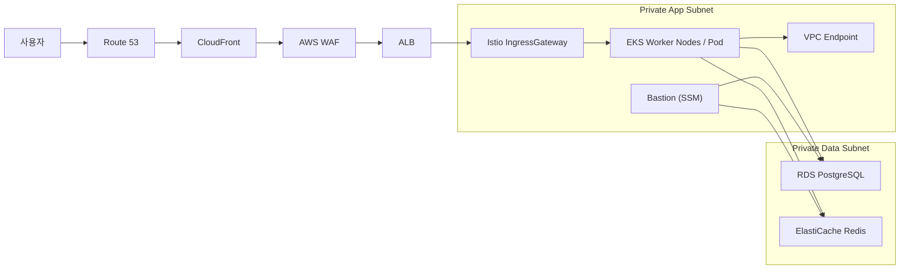

# 아우터 아키텍처 - EKS 요약

AWS EKS 기반 아우터 아키텍처는 외부 진입 경로와 내부 워크로드, 데이터 계층의 경계를 분리해 서비스 안정성과 복구 가능성을 함께 확보하는 구조입니다. 외부 요청은 `Route 53`, `CloudFront`, `AWS WAF`, `ALB`를 거쳐 클러스터 내부 `Istio IngressGateway`로 들어오고, 애플리케이션은 Private App Subnet에서 처리되며 데이터 계층은 별도 Private Data Subnet에 배치됩니다.

---

## 핵심 구조

---

## 설계 요점

| 항목 | 설명 |
|------|------|
| 외부 진입 단일화 | 모든 외부 요청은 `CloudFront -> WAF -> ALB -> Istio` 경로로 통과 |
| 네트워크 경계 분리 | Public Subnet은 외부 진입만 담당하고, 애플리케이션과 데이터는 Private Subnet으로 분리 |
| 데이터 계층 보호 | RDS와 Redis는 Private Data Subnet에 두고 인터넷 라우트를 두지 않음 |
| Multi-AZ 구성 | ALB, EKS, RDS, Redis를 2개 AZ에 분산 배치해 단일 AZ 장애에 대비 |
| NAT 비용 절감 | ECR, S3, Secrets Manager, STS, SSM은 VPC Endpoint로 연결해 NAT 의존을 줄임 |
| 운영 접근 제한 | 운영자는 Bastion을 `AWS Systems Manager Session Manager`로만 접속하고 SSH 포트는 열지 않음 |

---

## 외부 진입 경로

| 단계 | 역할 |
|------|------|
| Route 53 | 서비스 도메인을 CloudFront로 연결 |
| CloudFront | 엣지 캐시, TLS 종단, 외부 진입점 일원화 |
| AWS WAF | 공통 웹 공격 패턴과 요청 폭주 차단 |
| ALB | 인터넷 진입 요청을 VPC 내부 Ingress로 전달 |
| Istio IngressGateway | 클러스터 내부 라우팅과 애플리케이션 진입 제어 |

---

## 내부 리소스 배치

| 계층 | 구성 |
|------|------|
| App Layer | EKS Worker Node, 애플리케이션 Pod, Istio IngressGateway |
| Data Layer | RDS PostgreSQL, ElastiCache Redis |
| 운영 Layer | Bastion, VPC Endpoint, ArgoCD, 관측 스택 |

---

## 이 구조를 선택한 이유

- 예매 오픈 시점의 급격한 요청 증가에 대비해 외부 진입과 내부 처리 계층을 분리했습니다.
- 데이터 계층을 별도 서브넷에 격리해 서비스 장애와 보안 사고가 데이터 영역으로 확산되지 않도록 구성했습니다.
- 운영자는 Bastion과 SSM만 통해 접속하도록 제한해 관리 경로를 줄였습니다.
- VPC Endpoint를 적극적으로 사용해 프라이빗 경로를 유지하고 NAT 트래픽 비용을 줄였습니다.
- Staging과 Prod는 같은 네트워크 골격을 사용해 검증 환경과 운영 환경의 차이를 최소화했습니다.

---

[← 아우터 아키텍처 - EKS](./outer-architecture-eks)
