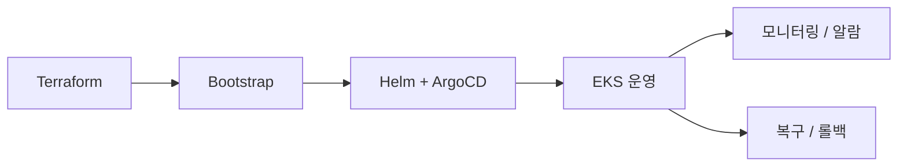

# 인프라 개요

Playball의 클라우드 인프라는 서비스가 안정적으로 동작하도록 자원 구성, 배포 자동화, 고가용성, 관측, 복구 기준을 갖추고 있습니다. `CloudFront`, `EKS`, `RDS`, `ElastiCache`, `ArgoCD`, `Karpenter`를 기반으로 운영하고, 상태 확인과 장애 분석은 `Grafana`, `Policy Reporter`, `CloudTrail`, `CloudWatch`를 기준으로 수행합니다.

---

## 서비스 특성

| 항목 | 내용 |
|---|---|
| **트래픽 집중** | 티켓 오픈 시점에 대량 요청이 짧은 시간에 집중 |
| **실시간 경쟁** | 대기열, 좌석 선점, 결제 단계에서 동시성 제어가 중요 |
| **가용성 요구** | 배포 오류, 노드 장애, DB 문제에도 서비스 흐름이 빠르게 복구되어야 함 |
| **운영 추적성** | 장애 분석, 감사 추적, 복구 판단을 위한 로그·메트릭·이력 관리가 필요 |

---

## 인프라 구성 목적

| 항목 | 내용 |
|---|---|
| **서비스 연속성** | 배포 이후에도 서비스가 지속적으로 동작하도록 인프라 구조와 운영 기준을 함께 설계 |
| **환경 분리** | Dev, Staging, Prod를 목적에 따라 분리해 변경 영향과 검증 범위를 분리 |
| **자동화 운영** | Terraform, Helm, ArgoCD, CI/CD 기준으로 인프라와 배포 과정을 자동화 |
| **고가용성** | 장애가 발생해도 서비스가 이어지도록 Multi-AZ, 오토스케일링, 선언형 복구 기준을 구성 |
| **서비스 특성 반영** | 티켓 오픈 시점의 급격한 요청 증가를 전제로 확장, 보호, 복구 기준을 설계 |
| **관측과 복구** | 메트릭, 로그, 트레이스, 백업, 장애 대응 절차를 하나의 운영 기준으로 관리 |

---

## 구성 범위

| 구분 | 내용 |
|---|---|
| **환경 운영** | Dev, Staging, Prod 분리 운영 |
| **프로비저닝** | Terraform 기반 AWS 인프라 생성 |
| **클러스터 부트스트랩** | ESO, ArgoCD, Karpenter, DB 초기화 |
| **배포 방식** | Helm + ArgoCD 기반 GitOps |
| **고가용성 / 확장** | Multi-AZ, KEDA, HPA, Karpenter |
| **장애 대응** | 배포 복구 검증, GitOps 재적용, RDS PITR, `pg_dump -> S3` |
| **운영 정책** | 모니터링 알람, 로그 및 데이터베이스 보관/백업, 장애 대응 절차 |
| **관측 체계** | Prometheus, Loki, Tempo, Thanos, Grafana, Alertmanager |

---

## 운영 흐름

서비스 요청은 `CloudFront`와 `EKS`를 거쳐 애플리케이션으로 전달되고, 운영 데이터는 `RDS`와 `ElastiCache`에서 처리합니다. 배포는 `ArgoCD` 기준으로 반영하고, 상태 확인과 장애 분석은 `Grafana`, `Policy Reporter`, `CloudTrail`, `CloudWatch`를 기준으로 수행합니다.

---

## 사용 기술

| 영역 | 기술 |
|---|---|
| **클라우드** | AWS EKS, RDS PostgreSQL, ElastiCache Redis, CloudFront, ALB, Route53, ACM |
| **프로비저닝** | Terraform |
| **배포** | Helm, ArgoCD, TeamCity, ECR |
| **오토스케일링** | KEDA, HPA, Karpenter |
| **시크릿/권한** | External Secrets Operator, IRSA, AWS IAM Identity Center SSO |
| **관측성** | Prometheus, Alertmanager, Loki, Tempo, Thanos, Grafana |
