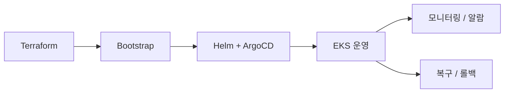

# 인프라 개요

Playball 인프라는 `Dev`, `Staging`, `Prod` 환경을 분리해 운영하며, AWS 기반 운영 환경에서는 `EKS`, `RDS`, `ElastiCache`, `ArgoCD`, `Karpenter`, `Prometheus`, `Loki`, `Tempo`를 중심으로 구성했습니다.

---

## 인프라 구성 목적

| 항목 | 내용 |
|---|---|
| **환경 분리** | Dev, Staging, Prod를 목적에 따라 분리해 변경 영향과 검증 범위를 나눔 |
| **선언형 운영** | Terraform, Helm, ArgoCD 기준으로 인프라와 배포 구성을 코드로 관리 |
| **트래픽 대응** | 티켓 오픈 시점의 급격한 요청 증가를 KEDA, HPA, Karpenter로 대응 |
| **복구 기준 분리** | 애플리케이션 복구는 GitOps, 데이터 복구는 RDS PITR과 `pg_dump -> S3` 기준으로 분리 |
| **관측 일원화** | 메트릭, 로그, 트레이스를 Grafana 기반으로 통합 확인 |

---

## 구성 범위

| 구분 | 내용 |
|---|---|
| **환경 운영** | Dev, Staging, Prod 분리 운영 |
| **프로비저닝** | Terraform 기반 AWS 인프라 생성 |
| **클러스터 부트스트랩** | ESO, ArgoCD, Karpenter, DB 초기화 |
| **배포 방식** | Helm + ArgoCD 기반 GitOps |
| **트래픽 대응** | KEDA, HPA, Karpenter |
| **장애 대응** | Multi-AZ, 배포 복구 검증, RDS PITR, `pg_dump -> S3` |
| **관측 체계** | Prometheus, Loki, Tempo, Grafana, Alertmanager |

---

## 운영 흐름

---

## 사용 기술

| 영역 | 기술 |
|---|---|
| **클라우드** | AWS EKS, RDS PostgreSQL, ElastiCache Redis, ALB, Route53, ACM |
| **프로비저닝** | Terraform |
| **배포** | Helm, ArgoCD, TeamCity, ECR |
| **오토스케일링** | KEDA, HPA, Karpenter |
| **시크릿/권한** | External Secrets Operator, IRSA, AWS IAM Identity Center SSO |
| **관측성** | Prometheus, Alertmanager, Loki, Tempo, Thanos, Grafana |
