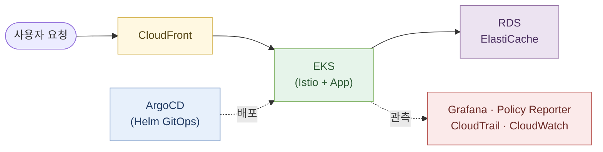

# 인프라 개요

Playball의 클라우드 인프라는 **티켓팅 서비스 특성에 맞춰 설계된 운영 체계**입니다. 서비스는 `CloudFront`, `EKS`, `Istio Mesh`, `RDS`, `ElastiCache`, `ArgoCD`, `Karpenter/KEDA`를 기반으로 운영하고, 상태 확인과 장애 분석은 `Grafana`, `Policy Reporter`, `CloudTrail`, `CloudWatch`를 기준으로 수행합니다.

---

## 운영 흐름

사용자 요청부터 배포·관측까지의 전체 흐름입니다. 이후 각 섹션은 이 뼈대의 **설계 근거**와 **세부 기술**을 설명합니다.

---

## 티켓팅 서비스 특성 × 인프라 대응

**피크 집중 · 가용성 · 보안 · 비용 · 추적성** 5가지 티켓팅 플랫폼의 특성을 고려하며 인프라를 구성하였습니다.

| 특성            | 상황                                          | 우리의 인프라 대응                                                                                                                                                                                                                            |
| --------------- | --------------------------------------------- | --------------------------------------------------------------------------------------------------------------------------------------------------------------------------------------------------------------------------------------------- |
| **트래픽 집중** | 티켓 오픈 시점에 대량 요청이 짧은 시간에 집중 | **KEDA Cron Scaler**(피크 선제 스케일) + **Karpenter**(노드 동적 확장) + **HPA**(CPU/Memory) + **Istio Rate Limit** + CloudFront 엣지 캐싱 — 부하테스트 기반 튜닝                                                                             |
| **가용성 요구** | 배포·노드·DB 장애 내성                        | **Multi-AZ EKS / RDS / Redis**(복제본 + 자동 장애조치) + **ArgoCD GitOps 재배포** + RDS PITR + `pg_dump → S3` 보조 백업 + PDB + Terraform IaC                                                                                                 |
| **보안 요구**   | 매크로 방어 · 모의해킹 지적 반영              | **7축 보안 체계**(클라이언트 · Gateway/mTLS · 봇 대응 · 백엔드 · 데이터 · 인프라 · 접근 제어) + IAM Identity Center SSO 최소권한 + CloudTrail 감사                                                                                            |
| **비용 효율**   | Staging 장기 운영 + 포트폴리오 규모 제약      | **Staging Spot 중심**(Karpenter Spot 다양화로 중단 내성 확보) + **공통 인프라 공유**(kube-prometheus-stack · Istio · Grafana 공용) + **Loki/Tempo S3 lifecycle**(장기 로그 자동 expiry) + ElastiCache 단일 인스턴스(네임스페이스 분리로 대체) |
| **운영 추적성** | 장애 분석 · 감사 · 복구 판단                  | **3 시그널 통합 관측**(Prometheus+Thanos / Loki / Tempo→Grafana) + CloudTrail(API 감사) + Policy Reporter(정책 위반) + EventBridge·Lambda → Discord 알림                                                                                      |

> 이 5가지 특성 밑에 깔린 더 근본적인 원칙은 **"팀이 빠르게 소통하며 협업할 수 있는 환경을 만드는 것"** 입니다. 초기부터 실제 API·데이터를 주고받으며 일하고, CloudBeaver·RedisInsight·Kafka-UI·Grafana 등의 인프라 툴로 \*\*누구나 같은 상태를 시각적으로 확인\*\*하며 로컬 만큼 편한 환경을 구축하고자 했습니다. 또한 Bastion SSM 사전 연습 환경을 구축 등 각 환경의 특성을 팀 전체가 공유\*\*하고 이해할 수 있도록 했습니다.
>
> (실시간 경쟁·동시성 제어는 [백엔드 시스템 아키텍처](../development/system-architecture)에서 전담)

---

## 레포 구성 (3-레포 분리)

운영 단계를 저장소 단위로 분리해 **"인프라 준비 → 클러스터 부트스트랩 → 선언형 배포"** 를 독립적으로 관리합니다.

| 레포              | 담당 단계                             | 주요 내용                                                                                                      |
| ----------------- | ------------------------------------- | -------------------------------------------------------------------------------------------------------------- |
| **301 Terraform** | 프로비저닝                            | AWS 리소스(VPC, EKS, RDS, Redis, CDN, IAM 등) 선언적 관리 — `stacks/` + `environments/{dev,staging,prod}` 분리 |
| **302 Bootstrap** | 클러스터 초기 설치                    | EKS/kubeadm에 ESO, Karpenter, ArgoCD, Root App, DB 초기화를 1회성으로 주입                                     |
| **303 Helm**      | GitOps 방식의 선언형 Helm/Values 관리 | Helm 차트 + ArgoCD Application + `argocd-sync/*` 브랜치 기반 지속 배포                                         |

상세한 상호작용과 다이어그램은 [인프라 아키텍처](./architecture) 문서 참조.

---

## 사용 기술

> 버전은 실제 Staging/Prod에 적용된 차트·서비스 기준입니다. (괄호 안은 Helm 차트 버전)

| 영역            | 기술 · 버전                                                                                                                                                                          |
| --------------- | ------------------------------------------------------------------------------------------------------------------------------------------------------------------------------------ |
| **클라우드**    | AWS EKS `1.35`, RDS PostgreSQL `16`, ElastiCache Redis `7`, CloudFront, ALB, Route53, ACM                                                                                            |
| **메쉬**        | Istio `1.29.1` (base / istiod / gateway)                                                                                                                                             |
| **IaC**         | Terraform                                                                                                                                                                            |
| **CI/CD**       | **백엔드**: TeamCity(빌드·테스트) → ECR(환경별 이미지 저장소 `staging/playball/web/*`, `prod/...`)   **프론트엔드**: GitHub Actions → Vercel(자동 배포)                                 |
| **배포**        | **Helm**, **ArgoCD** (argo-helm, `argocd-sync/*` 브랜치 기반 GitOps) — Dev도 On-Prem에서 동일 ECR Pull로 환경 재현성 확보                                                            |
| **스케일링**    | Karpenter `1.11.1`, KEDA `2.19.0`, HPA (k8s 내장), Metrics Server `3.13.0`                                                                                                           |
| **권한·시크릿** | External Secrets Operator `2.3.0`, IRSA, AWS IAM Identity Center SSO                                                                                                                 |
| **관측성**      | kube-prometheus-stack `83.4.0` (Prometheus · Alertmanager · Grafana 분리 `10.5.15`), Loki `6.55.0`, Tempo `1.24.4`, Thanos (kube-prom-stack 포함), OpenTelemetry Collector `0.150.0` |
| **정책·보안**   | Kyverno `3.7.1`, Policy Reporter `3.7.3`                                                                                                                                             |
| **운영 확인**   | CloudTrail, CloudWatch, Discord (알림 전파)                                                                                                                                          |
