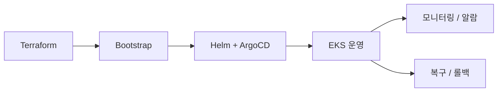

# 인프라 개요

Playball 인프라는 `Dev`, `Staging`, `Prod` 환경을 분리해 운영하며, AWS 기반 운영 환경에서는 `EKS`, `RDS`, `ElastiCache`, `ArgoCD`, `Karpenter`, `Prometheus`, `Loki`, `Tempo`를 중심으로 구성했습니다.

---

## 구성 범위

| 구분 | 내용 |
|---|---|
| **환경 운영** | Dev, Staging, Prod 분리 운영 |
| **프로비저닝** | Terraform 기반 AWS 인프라 생성 |
| **클러스터 부트스트랩** | ESO, ArgoCD, Karpenter, DB 초기화 |
| **배포 방식** | Helm + ArgoCD 기반 GitOps |
| **트래픽 대응** | KEDA, HPA, Karpenter |
| **장애 대응** | Multi-AZ, GitOps 롤백, RDS PITR, `pg_dump -> S3` |
| **관측 체계** | Prometheus, Loki, Tempo, Grafana, Alertmanager |

---

## 운영 흐름

---

## 인프라 문서 구성

| 문서 | 내용 |
|---|---|
| **환경 구성** | 환경별 차이와 운영 목적 |
| **인프라 아키텍처** | 저장소 역할 분리와 전체 구조 |
| **배포/GitOps** | 선언형 배포 흐름과 반영 기준 |
| **트래픽 대응** | 피크 트래픽 대응 방식 |
| **장애 대응** | 고가용성, 백업, 복구 기준 |
| **GitOps 롤백** | 설정 오류 복구 테스트 결과 |
| **모니터링** | 메트릭, 로그, 트레이스, 알람 체계 |
